# 内核文件系统设计

## 目录

<!-- TOC -->

- [内核文件系统设计](#内核文件系统设计)
    - [目录](#目录)
    - [1. 概述](#1-概述)
    - [2. 分布式文件系统架构](#2-分布式文件系统架构)
        - [2.1 客户端架构](#21-客户端架构)
        - [2.2 元数据服务](#22-元数据服务)
        - [2.3 数据存储](#23-数据存储)
        - [2.4 核心VFS函数分析与现代内核接口](#24-核心vfs函数分析与现代内核接口)
    - [3. 内核客户端实现](#3-内核客户端实现)
        - [3.1 VFS接口](#31-vfs接口)
        - [3.2 文件操作](#32-文件操作)
        - [3.3 目录操作](#33-目录操作)
    - [4. 网络通信](#4-网络通信)
        - [4.1 协议设计](#41-协议设计)
        - [4.2 连接管理](#42-连接管理)
    - [5. 缓存机制](#5-缓存机制)
        - [5.1 元数据缓存](#51-元数据缓存)
        - [5.2 数据缓存](#52-数据缓存)
    - [6. 一致性保证](#6-一致性保证)
    - [7. 错误处理](#7-错误处理)
    - [8. 性能优化](#8-性能优化)
    - [9. 调试和监控](#9-调试和监控)
    - [10. 总结](#10-总结)
    - [11. 内核模块实现](#11-内核模块实现)
        - [11.1 模块初始化](#111-模块初始化)
        - [11.2 内核配置](#112-内核配置)
        - [11.3 编译构建](#113-编译构建)
    - [12. 实际部署示例](#12-实际部署示例)
        - [12.1 模块加载](#121-模块加载)
        - [12.2 文件系统挂载](#122-文件系统挂载)
        - [12.3 性能调优](#123-性能调优)
    - [13. 与现有文件系统对比](#13-与现有文件系统对比)
        - [13.1 与NFS对比](#131-与nfs对比)
        - [13.2 与CIFS对比](#132-与cifs对比)
        - [13.3 与分布式文件系统对比](#133-与分布式文件系统对比)
    - [14. 最终总结与展望](#14-最终总结与展望)
        - [14.1 文档完整性总结](#141-文档完整性总结)
        - [14.2 技术创新点](#142-技术创新点)
        - [14.3 实际应用价值](#143-实际应用价值)
        - [14.4 发展路线图](#144-发展路线图)
        - [14.5 社区贡献](#145-社区贡献)
        - [14.6 结语](#146-结语)

<!-- /TOC -->

## 1. 概述

本文档详细介绍了分布式文件系统内核客户端的设计与实现。文档基于Linux内核6.x版本的VFS（虚拟文件系统）架构，采用现代的`fs_context_operations`挂载机制和完整的VFS接口实现。

### 1.1 技术特性

- 基于现代Linux内核VFS架构
- 使用`fs_context_operations`和`get_tree`挂载机制
- 支持完整的POSIX文件系统语义
- 分布式架构，支持多节点数据存储
- 高性能缓存机制
- 强一致性保证

### 1.2 系统架构

系统采用客户端-服务端架构：
- 内核客户端：运行在用户机器内核空间，提供VFS接口
- 元数据服务：管理文件系统命名空间和权限
- 数据存储节点：存储实际文件数据

#### 1.2.1 整体架构图

以下是分布式文件系统的完整架构图，展示了从用户空间到分布式存储集群的完整数据流和控制流：

```mermaid
graph TB

    subgraph "User Space - 用户空间"
        A[Applications - 用户程序]
        A1[glibc - 系统调用库]
    end

    subgraph "Kernel Space - 内核空间"
        subgraph "VFS Layer - 虚拟文件系统层"
            B[System Calls - 系统调用入口]
            B1[vfs_open, vfs_read, vfs_write]
            B2[vfs_mkdir, vfs_create, vfs_unlink]
            B3[vfs_lookup, vfs_rename, vfs_symlink]
            B4[vfs_getattr, vfs_setattr, vfs_listxattr]
            B5[vfs_fsync, vfs_fallocate]
            
            C[super_operations - 超级块操作]
            C1[alloc_inode, destroy_inode, write_super]
            C2[put_super, sync_fs, statfs]
            
            D[inode_operations - inode操作]
            D1[lookup, create, mkdir, rmdir]
            D2[unlink, symlink, rename, setattr]
            D3[getattr, listxattr, setxattr, removexattr]
            
            E[dentry_operations - 目录项操作]
            E1[d_revalidate, d_weak_revalidate, d_hash]
            E2[d_compare, d_delete, d_release, d_prune]
            E3[d_iput, d_dname, d_automount, d_manage]
            
            F[file_operations - 文件操作]
            F1[open, release, read, write]
            F2[llseek, mmap, fsync, flush]
            F3[lock, flock, splice_read, splice_write]
            
            G[address_space_operations - 地址空间操作]
            G1[readpage, readpages, writepage, writepages]
            G2[write_begin, write_end, bmap, invalidatepage]
            G3[releasepage, freepage, direct_IO, migratepage]
        end
        
        subgraph "Your Custom FS Module - 您的文件系统模块"
            H[super.c - 文件系统挂载和卸载]
            I[inode.c - inode生命周期管理]
            J[dir.c - 目录操作实现]
            K[file.c - 文件读写实现]
            L[addr.c - 页面缓存管理]
            M[metadata.c - 元数据同步]
            N[client.c - 分布式通信客户端]
            O[cache.c - 本地缓存策略]
            P[locks.c - 分布式锁管理]
            Q[xattr.c - 扩展属性]
            R1[consistency.c - 一致性保证]
            R2[recovery.c - 故障恢复]
            R3[lease.c - 租约管理]
            R4[security.c - 权限控制]
            S1[dentry.c - 目录项缓存管理]
            S2[namei.c - 路径解析和查找]
            S3[symlink.c - 符号链接处理]
            S4[dcache.c - dentry缓存优化]
        end
        
        subgraph "Network & Protocol Layer - 网络协议层"
            T1[network.c - 网络通信抽象]
            T2[protocol.c - 自定义协议实现]
            T3[connection.c - 连接池管理]
            T4[auth.c - 认证授权]
            T5[crypto.c - 加密传输]
            T6[serialization.c - 序列化反序列化]
            T7[rpc.c - RPC框架]
        end
        
        subgraph "Page Cache & Memory Management - 页面缓存与内存管理"
            X[Page Cache - 页面缓存]
            Y[Buffer Cache - 缓冲区缓存]
            Z1[Writeback Subsystem - 写回子系统]
            Z2[Readahead Subsystem - 预读子系统]
            Z3[Memory Reclaim - 内存回收]
            Z4[Dirty Page Tracking - 脏页跟踪]
        end
        
        subgraph "Kernel Infrastructure - 内核基础设施"
            AA[Workqueue - 工作队列]
            BB[Timer - 定时器]
            CC[RCU - 读-复制-更新]
            DD[Spinlock和Mutex - 锁机制]
            EE1[Completion - 完成量]
            EE2[Wait Queue - 等待队列]
        end
    end

    subgraph "Your Distributed Storage Cluster - 您的分布式存储集群"
        FF[Metadata Servers - 元数据服务器]
        GG[Data Servers - 数据服务器]
        HH[Coordination Service - 协调服务etcd]
        II[Configuration Service - 配置服务]
        JJ[Load Balancer - 负载均衡器]
        KK[Monitoring Service - 监控服务]
    end

    %% 用户空间到内核的调用链
    A --> A1
    A1 --> B

    %% 系统调用到VFS操作的映射
    B --> B1
    B --> B2
    B --> B3
    B --> B4
    B --> B5

    %% VFS到具体操作结构体的分发
    B1 --> F
    B2 --> D
    B3 --> D
    B4 --> D
    B5 --> F
    B --> C
    B --> E
    B --> G

    %% VFS操作结构体到具体接口的展开
    C --> C1
    C --> C2
    D --> D1
    D --> D2
    D --> D3
    E --> E1
    E --> E2
    E --> E3
    F --> F1
    F --> F2
    F --> F3
    G --> G1
    G --> G2
    G --> G3

    %% VFS操作到您的文件系统模块的映射
    C1 --> H
    C2 --> H
    D1 --> I
    D1 --> J
    D2 --> I
    D2 --> J
    D3 --> I
    D3 --> Q
    E1 --> S1
    E1 --> S2
    E2 --> S1
    E2 --> S4
    E3 --> S1
    E3 --> S3
    F1 --> K
    F2 --> K
    F3 --> K
    G1 --> L
    G2 --> L
    G3 --> L

    %% 您的文件系统内部模块交互
    H --> N
    I <--> M
    J <--> M
    K <--> M
    L <--> M
    M <--> N
    S1 <--> M
    S2 <--> M
    S3 <--> I
    S4 <--> O

    %% dentry操作相关交互
    S1 <--> S4
    S2 --> S1
    S2 <--> I
    S3 --> S2
    J --> S2

    %% 缓存层交互
    I <--> O
    J <--> O
    K <--> O
    L <--> O
    L <--> X
    K <--> X
    L --> Z1
    K --> Z2
    O --> Z3
    L --> Z4

    %% 其他核心功能
    K <--> P
    I <--> Q
    J <--> Q
    M --> R1
    N --> R2
    M <--> R3
    I --> R4
    J --> R4

    %% 网络协议层交互
    N <--> T1
    T1 --> T2
    T1 --> T3
    N --> T4
    T2 --> T5
    T2 --> T6
    N --> T7

    %% 内核基础设施使用
    N --> AA
    O --> BB
    I --> CC
    M --> DD
    N --> EE1
    P --> EE2

    %% 与分布式集群的通信
    T1 <--> FF
    T1 <--> GG
    T1 <--> HH
    T1 <--> II
    T3 <--> JJ
    R2 <--> KK

    %% 数据流向
    L -.->|脏页写回| GG
    X -.->|页面刷新| L
    Z1 -.->|批量写入| GG
    GG -.->|数据返回| Z2

    %% 元数据流向
    M -.->|元数据请求| FF
    FF -.->|元数据响应| M
    R1 -.->|一致性检查| FF
    FF -.->|一致性通知| R1
    R3 -.->|租约请求| FF
    FF -.->|租约授予| R3

    %% 控制流向
    R2 -.->|故障检测| HH
    HH -.->|故障通知| R2
    H -.->|配置获取| II
    II -.->|配置更新| H
    T4 -.->|认证请求| FF
    FF -.->|认证响应| T4

    %% 负载均衡
    JJ -.->|路由决策| T1
    T1 -.->|负载统计| JJ

    %% 监控数据流
    KK -.->|监控数据收集| N
    KK -.->|性能指标| O
    KK -.->|错误统计| R2

    %% 样式设置
    classDef userSpace fill:#e1f5fe
    classDef customFS fill:#f3e5f5
    classDef network fill:#e8f5e8
    classDef protocol fill:#fff3e0
    classDef metadata fill:#ffebee
    classDef dataServer fill:#e8f5e8
    classDef coordination fill:#fff8e1
    classDef cache fill:#f1f8e9
    classDef localCache fill:#fce4ec

    class A,A1 userSpace
    class H customFS
    class N network
    class T1 protocol
    class FF metadata
    class GG dataServer
    class HH coordination
    class X cache
    class O localCache
    class S1,S2,S3,S4 customFS
```

```mermaid
graph TB

    subgraph "User Space - 用户空间"
        UA[Applications\n应用程序]
        UB[glibc\nceph用户工具]
        UC[ceph-fuse\n用户空间客户端可选]
    end

    subgraph "Kernel Space - 内核空间"
        subgraph "VFS Layer - 虚拟文件系统层"
            VB[System Calls\nsys_open/read/write/mkdir等]
            VB1[vfs_open\nvfs_read\nvfs_write]
            VB2[vfs_mkdir\nvfs_create\nvfs_unlink]
            VB3[vfs_lookup\nvfs_rename\nvfs_symlink]
            VB4[vfs_getattr\nvfs_setattr\nvfs_listxattr]
            VB5[vfs_fsync\nvfs_fallocate]
            
            VC[super_operations\nceph_super_ops]
            VC1[ceph_alloc_inode\nceph_destroy_inode\nceph_write_super]
            VC2[ceph_put_super\nceph_sync_fs\nceph_statfs]
            
            VD[inode_operations\nceph_inode_ops]
            VD1[ceph_lookup\nceph_create\nceph_mkdir\nceph_rmdir]
            VD2[ceph_unlink\nceph_symlink\nceph_rename\nceph_setattr]
            VD3[ceph_getattr\nceph_listxattr\nceph_setxattr\nceph_removexattr]
            
            VE[dentry_operations\nceph_dentry_ops]
            VE1[ceph_d_revalidate\nceph_d_delete\nceph_d_release]
            VE2[ceph_d_prune\nceph_d_hash\nceph_d_compare]
            
            VF[file_operations\nceph_file_ops]
            VF1[ceph_open\nceph_release\nceph_read\nceph_write]
            VF2[ceph_llseek\nceph_mmap\nceph_fsync\nceph_flush]
            VF3[ceph_lock\nceph_flock\nceph_splice_read]
            
            VG[address_space_operations\nceph_aops]
            VG1[ceph_readpage\nceph_readpages\nceph_writepage\nceph_writepages]
            VG2[ceph_write_begin\nceph_write_end\nceph_invalidatepage]
            VG3[ceph_releasepage\nceph_direct_IO\nceph_migratepage]
        end
        
        subgraph "CephFS Kernel Client - CephFS内核客户端"
            CH[super.c\nceph文件系统挂载]
            CI[inode.c\nceph inode管理]
            CJ[dir.c\nceph目录操作]
            CK[file.c\nceph文件I/O]
            CL[addr.c\nceph页面缓存]
            CM[mds_client.c\nMDS元数据客户端]
            CN[osd_client.c\nOSD数据客户端]
            CO[caps.c\nceph能力缓存]
            CP[locks.c\nceph文件锁]
            CQ[xattr.c\nceph扩展属性]
            CR1[snap.c\nceph快照管理]
            CR2[quota.c\nceph配额管理]
            CS1[dcache.c\nceph目录缓存]
            CS2[debugfs.c\nceph调试接口]
            CS3[export.c\nceph NFS导出]
            CS4[ioctl.c\nceph特殊控制]
        end
        
        subgraph "LibCeph - Ceph核心库"
            LC1[messenger.c\nceph消息传递]
            LC2[mon_client.c\nMonitor客户端]
            LC3[osdmap.c\nOSD映射管理]
            LC4[crush.c\nCRUSH算法]
            LC5[auth.c\nceph认证]
            LC6[crypto.c\nceph加密]
            LC7[decode.c\nceph协议解码]
            LC8[pagelist.c\nceph页面列表]
        end
        
        subgraph "Page Cache & Memory Management - 页面缓存管理"
            PX[Page Cache\nLinux页面缓存]
            PY[Buffer Cache\n缓冲区缓存]
            PZ1[Writeback\nceph写回机制]
            PZ2[Readahead\nceph预读机制]
            PZ3[Memory Reclaim\n内存回收]
            PZ4[Dirty Tracking\nceph脏页跟踪]
        end
        
        subgraph "Kernel Infrastructure - 内核基础设施"
            KI1[Workqueue\nceph工作队列]
            KI2[Timer\nceph定时器]
            KI3[RCU\nRCU同步机制]
            KI4[Mutex/Spinlock\nceph锁机制]
            KI5[Completion\n完成同步]
            KI6[Wait Queue\nceph等待队列]
        end
    end

    subgraph "Ceph Storage Cluster - Ceph存储集群"
        CMON[Ceph Monitors\nMON集群]
        CMDS[Ceph MDS\n元数据服务器]
        COSD[Ceph OSDs\n对象存储守护进程]
        CMGR[Ceph Manager\n管理守护进程]
        CRGW[Ceph RGW\n对象网关可选]
    end

    %% 用户空间到内核调用
    UA --> UB
    UB --> VB
    UC -.->|备用路径| UB

    %% 系统调用分发
    VB --> VB1
    VB --> VB2
    VB --> VB3
    VB --> VB4
    VB --> VB5

    %% VFS到操作结构体
    VB1 --> VF
    VB2 --> VD
    VB3 --> VD
    VB4 --> VD
    VB5 --> VF
    VB --> VC
    VB --> VE
    VB --> VG

    %% 操作结构体展开
    VC --> VC1
    VC --> VC2
    VD --> VD1
    VD --> VD2
    VD --> VD3
    VE --> VE1
    VE --> VE2
    VF --> VF1
    VF --> VF2
    VF --> VF3
    VG --> VG1
    VG --> VG2
    VG --> VG3

    %% VFS到CephFS模块映射
    VC1 --> CH
    VC2 --> CH
    VD1 --> CI
    VD1 --> CJ
    VD2 --> CI
    VD2 --> CJ
    VD3 --> CI
    VD3 --> CQ
    VE1 --> CS1
    VE2 --> CS1
    VF1 --> CK
    VF2 --> CK
    VF3 --> CK
    VG1 --> CL
    VG2 --> CL
    VG3 --> CL

    %% CephFS内部模块交互
    CH --> CM
    CH --> CN
    CI <--> CM
    CI <--> CO
    CJ <--> CM
    CK <--> CN
    CK <--> CO
    CL <--> CN
    CL <--> CO
    CS1 <--> CM
    CR1 <--> CM
    CR2 <--> CM

    %% CephFS与LibCeph交互
    CM <--> LC1
    CM <--> LC2
    CN <--> LC1
    CN <--> LC3
    CN <--> LC4
    CH --> LC5
    CK --> LC6
    CL --> LC8
    CM --> LC7
    CN --> LC7

    %% 页面缓存交互
    CI <--> CO
    CJ <--> CO
    CK <--> CO
    CL <--> CO
    CL <--> PX
    CK <--> PX
    CL --> PZ1
    CK --> PZ2
    CO --> PZ3
    CL --> PZ4

    %% 内核基础设施使用
    CM --> KI1
    CN --> KI1
    CO --> KI2
    CI --> KI3
    CM --> KI4
    CN --> KI4
    LC1 --> KI5
    CM --> KI6
    CN --> KI6

    %% 与Ceph集群通信
    LC2 <--> CMON
    CM <--> CMDS
    CN <--> COSD
    LC2 <--> CMGR
    
    %% 数据流
    CL -.->|数据写入| COSD
    PX -.->|页面刷新| CL
    PZ1 -.->|批量写入| COSD
    COSD -.->|数据读取| PZ2
    CN -.->|对象操作| COSD

    %% 元数据流
    CM -.->|元数据请求| CMDS
    CMDS -.->|元数据响应| CM
    CO -.->|能力续租| CMDS
    CMDS -.->|能力授予| CO
    CR1 -.->|快照操作| CMDS
    CR2 -.->|配额查询| CMDS

    %% 集群管理流
    LC2 -.->|集群状态| CMON
    CMON -.->|OSD映射| LC3
    LC3 -.->|CRUSH计算| LC4
    LC5 -.->|认证请求| CMON
    CMON -.->|认证响应| LC5

    %% 监控和调试
    CS2 -.->|调试信息| CMGR
    CMGR -.->|性能指标| CS2
    CS4 -.->|控制命令| CMDS
    CS3 -.->|NFS导出| CMDS

    %% 样式定义
    classDef userSpace fill:#e1f5fe
    classDef vfsLayer fill:#f3e5f5
    classDef cephFS fill:#e8f5e8
    classDef libCeph fill:#fff3e0
    classDef cephCluster fill:#ffebee
    classDef pageCache fill:#f1f8e9
    classDef kernel fill:#fce4ec

    class UA,UB,UC userSpace
    class VB,VC,VD,VE,VF,VG vfsLayer
    class CH,CI,CJ,CK,CL,CM,CN,CO,CP,CQ,CR1,CR2,CS1,CS2,CS3,CS4 cephFS
    class LC1,LC2,LC3,LC4,LC5,LC6,LC7,LC8 libCeph
    class CMON,CMDS,COSD,CMGR,CRGW cephCluster
    class PX,PY,PZ1,PZ2,PZ3,PZ4 pageCache
    class KI1,KI2,KI3,KI4,KI5,KI6 kernel
```





#### 1.2.2 架构说明

**用户空间层**：
- 应用程序通过标准的文件系统API（如open、read、write等）访问文件
- glibc将这些调用转换为系统调用

**VFS层**：
- 内核的虚拟文件系统层，提供统一的文件系统接口
- 将通用的文件操作分发到具体的文件系统实现

**文件系统模块**：
- 实现分布式文件系统的核心逻辑
- 包含缓存管理、网络通信、一致性保证等关键组件

**网络协议层**：
- 处理与远程存储集群的通信
- 提供加密、压缩、认证等功能

**分布式存储集群**：
- 由多个服务组件构成，提供高可用的存储服务
- 包含元数据服务、数据服务、协调服务等

## 2. 分布式文件系统架构

分布式文件系统的架构设计直接决定了系统的性能、可靠性和可扩展性。本章详细介绍系统的三层架构设计。

### 2.1 客户端架构

#### 2.1.1 内核客户端设计

内核客户端是用户应用与分布式存储系统的桥梁，负责：

- **VFS接口实现**：提供标准POSIX文件系统接口
- **本地缓存管理**：元数据和数据的智能缓存
- **网络通信**：与远程服务的高效通信
- **一致性保证**：维护分布式环境下的数据一致性

```c
/* 客户端主要数据结构 */
struct myfs_client {
    struct super_block *sb;          /* 超级块 */
    struct myfs_server_list servers; /* 服务器列表 */
    struct myfs_connection_pool pool; /* 连接池 */
    struct myfs_cache_manager cache;  /* 缓存管理器 */
    struct workqueue_struct *wq;     /* 工作队列 */
    
    /* 客户端配置 */
    unsigned long cache_timeout;     /* 缓存超时时间 */
    unsigned int max_connections;    /* 最大连接数 */
    unsigned int rsize;              /* 读取块大小 */
    unsigned int wsize;              /* 写入块大小 */
    
    /* 统计信息 */
    atomic64_t read_bytes;           /* 读取字节数 */
    atomic64_t write_bytes;          /* 写入字节数 */
    atomic_t active_requests;        /* 活跃请求数 */
};
```

#### 2.1.2 多层缓存架构

客户端实现三级缓存机制：

1. **页面缓存**：利用内核页面缓存进行数据缓存
2. **元数据缓存**：缓存inode、dentry等元数据信息
3. **属性缓存**：缓存文件属性和权限信息

```c
/* 缓存层次结构 */
struct myfs_cache_hierarchy {
    /* 第一级：页面缓存 (内核管理) */
    struct address_space *page_cache;
    
    /* 第二级：元数据缓存 */
    struct myfs_metadata_cache {
        struct radix_tree_root inode_cache;
        struct radix_tree_root dentry_cache;
        spinlock_t lock;
        unsigned long timeout;
    } metadata_cache;
    
    /* 第三级：属性缓存 */
    struct myfs_attr_cache {
        struct hash_table attrs;
        struct timer_list cleanup_timer;
        unsigned long lifetime;
    } attr_cache;
};
```

### 2.2 元数据服务

#### 2.2.1 元数据服务器设计

元数据服务器负责管理整个文件系统的命名空间：

- **命名空间管理**：维护目录树结构
- **权限控制**：处理访问控制和权限检查
- **文件定位**：提供文件到数据服务器的映射
- **一致性协调**：协调多客户端的并发访问

```c
/* 元数据服务器通信协议 */
enum myfs_metadata_op {
    MYFS_META_LOOKUP,       /* 查找文件/目录 */
    MYFS_META_CREATE,       /* 创建文件/目录 */
    MYFS_META_DELETE,       /* 删除文件/目录 */
    MYFS_META_RENAME,       /* 重命名 */
    MYFS_META_GETATTR,      /* 获取属性 */
    MYFS_META_SETATTR,      /* 设置属性 */
    MYFS_META_READDIR,      /* 读取目录 */
    MYFS_META_LOCK,         /* 文件锁操作 */
    MYFS_META_LEASE,        /* 租约管理 */
};

/* 元数据请求结构 */
struct myfs_metadata_request {
    enum myfs_metadata_op op;    /* 操作类型 */
    __u64 parent_ino;            /* 父目录inode */
    char name[MYFS_NAME_MAX];    /* 文件名 */
    struct myfs_iattr attrs;     /* 文件属性 */
    __u32 flags;                 /* 操作标志 */
};

/* 元数据响应结构 */
struct myfs_metadata_response {
    __s32 error;                 /* 错误码 */
    struct myfs_inode_info inode; /* inode信息 */
    struct myfs_file_location location; /* 文件位置 */
    __u64 lease_id;              /* 租约ID */
    __u32 lease_timeout;         /* 租约超时 */
};
```

#### 2.2.2 分布式元数据架构

支持多个元数据服务器以提高可用性和性能：

```c
/* 元数据分片策略 */
struct myfs_metadata_shard {
    __u32 shard_id;              /* 分片ID */
    __u64 hash_range_start;      /* 哈希范围起始 */
    __u64 hash_range_end;        /* 哈希范围结束 */
    struct myfs_server primary;  /* 主服务器 */
    struct myfs_server *replicas; /* 副本服务器 */
    int replica_count;           /* 副本数量 */
};

/* 根据路径计算分片 */
static __u32 myfs_calculate_shard(const char *path)
{
    __u64 hash = jhash(path, strlen(path), MYFS_HASH_SEED);
    return hash % MYFS_METADATA_SHARDS;
}
```

### 2.3 数据存储

#### 2.3.1 数据服务器架构

数据服务器专门负责文件数据的存储和检索：

- **块级存储**：将文件分割为固定大小的块进行存储
- **副本管理**：维护数据的多个副本以确保可靠性
- **负载均衡**：在多个数据服务器间分布数据
- **故障恢复**：检测和恢复损坏的数据块

```c
/* 数据块描述符 */
struct myfs_data_block {
    __u64 block_id;              /* 块ID */
    __u64 file_id;               /* 文件ID */
    __u64 offset;                /* 文件内偏移 */
    __u32 size;                  /* 块大小 */
    __u32 checksum;              /* 校验和 */
    struct myfs_server *servers; /* 存储服务器列表 */
    int replica_count;           /* 副本数量 */
    unsigned long timestamp;     /* 时间戳 */
};

/* 文件布局信息 */
struct myfs_file_layout {
    __u64 file_size;             /* 文件总大小 */
    __u32 block_size;            /* 块大小 */
    __u32 stripe_count;          /* 条带数量 */
    __u32 replica_count;         /* 副本数量 */
    struct myfs_data_block *blocks; /* 数据块数组 */
    int block_count;             /* 块数量 */
};
```

#### 2.3.2 数据一致性策略

实现强一致性的数据写入策略：

```c
/* 数据写入策略 */
enum myfs_write_policy {
    MYFS_WRITE_ASYNC,           /* 异步写入 */
    MYFS_WRITE_SYNC,            /* 同步写入 */
    MYFS_WRITE_MAJORITY,        /* 多数副本确认 */
    MYFS_WRITE_ALL,             /* 所有副本确认 */
};

/* 写入请求结构 */
struct myfs_write_request {
    __u64 file_id;              /* 文件ID */
    __u64 offset;               /* 写入偏移 */
    __u32 length;               /* 写入长度 */
    const void *data;           /* 数据缓冲区 */
    enum myfs_write_policy policy; /* 写入策略 */
    __u32 checksum;             /* 数据校验和 */
    struct completion *done;     /* 完成信号 */
};

/* 实现写入一致性检查 */
static int myfs_verify_write_consistency(struct myfs_write_request *req)
{
    struct myfs_data_block *block;
    int confirmed_replicas = 0;
    int required_replicas;
    int i;
    
    block = myfs_find_data_block(req->file_id, req->offset);
    if (!block)
        return -ENOENT;
    
    /* 根据策略确定需要确认的副本数 */
    switch (req->policy) {
    case MYFS_WRITE_MAJORITY:
        required_replicas = (block->replica_count / 2) + 1;
        break;
    case MYFS_WRITE_ALL:
        required_replicas = block->replica_count;
        break;
    default:
        required_replicas = 1;
        break;
    }
    
    /* 检查各个副本的写入状态 */
    for (i = 0; i < block->replica_count; i++) {
        if (myfs_check_replica_written(&block->servers[i], req)) {
            confirmed_replicas++;
        }
    }
    
    return confirmed_replicas >= required_replicas ? 0 : -EIO;
}
```

#### 2.3.3 存储优化特性

数据服务器提供多种优化特性：

- **数据压缩**：减少网络传输和存储开销
- **重复数据删除**：避免存储重复内容
- **智能缓存**：预测性数据预取
- **负载感知调度**：根据服务器负载分配请求

```c
/* 存储优化配置 */
struct myfs_storage_config {
    bool compression_enabled;    /* 启用压缩 */
    bool dedup_enabled;          /* 启用去重 */
    bool cache_enabled;          /* 启用缓存 */
    __u32 compression_algorithm; /* 压缩算法 */
    __u32 cache_size_mb;         /* 缓存大小(MB) */
    __u32 prefetch_window;       /* 预取窗口大小 */
};
```

## 2.4 核心VFS函数分析与现代内核接口适配

### 2.4.1 关键VFS函数概览

分布式文件系统内核模块需要实现大量VFS接口函数。这些函数按功能可分为以下几个主要类别：

#### 2.4.1.1 系统调用层面 (System Call Layer)

VFS层提供的系统调用接口是用户空间程序与文件系统交互的入口点：

```c
/* 现代内核中的关键系统调用入口函数 */
SYSCALL_DEFINE3(open, const char __user *, filename, int, flags, umode_t, mode);
SYSCALL_DEFINE4(openat, int, dfd, const char __user *, filename, int, flags, umode_t, mode);
SYSCALL_DEFINE3(read, unsigned int, fd, char __user *, buf, size_t, count);
SYSCALL_DEFINE3(write, unsigned int, fd, const char __user *, buf, size_t, count);
SYSCALL_DEFINE4(mkdirat, int, dfd, const char __user *, pathname, umode_t, mode);
SYSCALL_DEFINE2(mkdir, const char __user *, pathname, umode_t, mode);
```

#### 2.4.1.2 VFS核心接口函数

我们需要了解并适配的核心VFS函数：

##### **A. 路径解析与查找函数**

```c
/**
 * vfs_path_lookup - 现代路径查找接口
 * @dfd: 起始目录文件描述符 
 * @name: 要查找的路径名
 * @flags: 查找标志 (LOOKUP_FOLLOW等)
 * @path: 返回的路径结构
 * 
 * 功能：在内核中解析路径名，返回对应的path结构
 * 返回值：成功返回0，失败返回负错误码
 * 现代改进：相比老版本的path_lookup，增加了更好的错误处理和安全检查
 */
int vfs_path_lookup(struct dentry *dentry, struct vfsmount *mnt,
                   const char *name, unsigned int flags, struct path *path);

/**
 * lookup_one_len - 单组件查找
 * @name: 文件名（单个组件，不含路径分隔符）
 * @base: 父目录dentry
 * @len: 文件名长度
 * 
 * 功能：在指定目录中查找单个文件名组件
 * 返回值：成功返回dentry指针，失败返回ERR_PTR
 * 应用：主要用于文件系统内部的名称查找
 */
struct dentry *lookup_one_len(const char *name, struct dentry *base, int len);

/**
 * lookup_one_len_unlocked - 无锁单组件查找
 * @name: 文件名
 * @base: 父目录dentry  
 * @len: 文件名长度
 * 
 * 功能：无锁版本的单组件查找，性能更好
 * 返回值：成功返回dentry指针，失败返回ERR_PTR
 * 新特性：Linux 4.5+引入，避免了目录inode锁争用
 */
struct dentry *lookup_one_len_unlocked(const char *name, struct dentry *base, int len);
```

##### **B. 文件操作核心函数**

```c
/**
 * vfs_open - 现代文件打开接口
 * @path: 文件路径结构
 * @file: 文件结构指针
 * @cred: 凭证结构
 * 
 * 功能：打开指定路径的文件，现代内核的标准文件打开接口
 * 返回值：成功返回0，失败返回负错误码
 * 优化点：相比老版本dentry_open，提供更好的错误处理和安全检查
 */
int vfs_open(const struct path *path, struct file *file, const struct cred *cred);

/**
 * vfs_read - VFS层读取接口
 * @file: 文件结构指针
 * @buf: 用户缓冲区
 * @count: 要读取的字节数
 * @pos: 文件位置指针
 * 
 * 功能：从文件读取数据到用户空间缓冲区
 * 返回值：实际读取的字节数，错误时返回负值
 * 重要性：这是read系统调用的内核实现入口
 */
ssize_t vfs_read(struct file *file, char __user *buf, size_t count, loff_t *pos);

/**
 * vfs_write - VFS层写入接口  
 * @file: 文件结构指针
 * @buf: 用户数据缓冲区
 * @count: 要写入的字节数
 * @pos: 文件位置指针
 * 
 * 功能：将用户空间数据写入文件
 * 返回值：实际写入的字节数，错误时返回负值
 * 重要性：这是write系统调用的内核实现入口
 */
ssize_t vfs_write(struct file *file, const char __user *buf, size_t count, loff_t *pos);

/**
 * vfs_iter_read - 现代迭代器读取接口
 * @file: 文件结构指针
 * @iter: I/O向量迭代器
 * @ppos: 文件位置指针
 * 
 * 功能：使用迭代器进行读取，支持向量化I/O
 * 返回值：实际读取的字节数，错误时返回负值
 * 新特性：Linux 3.16+引入，支持异步I/O和零拷贝
 */
ssize_t vfs_iter_read(struct file *file, struct iov_iter *iter, loff_t *ppos);

/**
 * vfs_iter_write - 现代迭代器写入接口
 * @file: 文件结构指针
 * @iter: I/O向量迭代器
 * @ppos: 文件位置指针
 * 
 * 功能：使用迭代器进行写入，支持向量化I/O
 * 返回值：实际写入的字节数，错误时返回负值  
 * 新特性：Linux 3.16+引入，是现代高性能I/O的基础
 */
ssize_t vfs_iter_write(struct file *file, struct iov_iter *iter, loff_t *ppos);
```

##### **C. 目录操作函数**

```c
/**
 * vfs_mkdir - VFS层目录创建接口
 * @mnt_userns: 挂载用户命名空间
 * @dir: 父目录inode
 * @dentry: 要创建的目录dentry
 * @mode: 目录权限模式
 * 
 * 功能：在指定父目录下创建新目录
 * 返回值：成功返回0，失败返回负错误码
 * 现代改进：相比老版本的mkdir，增加了用户命名空间支持
 */
int vfs_mkdir(struct user_namespace *mnt_userns, struct inode *dir,
              struct dentry *dentry, umode_t mode);

/**
 * vfs_rmdir - VFS层目录删除接口
 * @mnt_userns: 挂载用户命名空间
 * @dir: 父目录inode  
 * @dentry: 要删除的目录dentry
 * 
 * 功能：删除指定目录
 * 返回值：成功返回0，失败返回负错误码
 * 安全检查：确保目录为空且有删除权限
 */
int vfs_rmdir(struct user_namespace *mnt_userns, struct inode *dir,
              struct dentry *dentry);

/**
 * vfs_create - VFS层文件创建接口
 * @mnt_userns: 挂载用户命名空间
 * @dir: 父目录inode
 * @dentry: 要创建的文件dentry
 * @mode: 文件权限模式
 * @want_excl: 是否要求独占创建
 * 
 * 功能：在指定目录下创建新文件
 * 返回值：成功返回0，失败返回负错误码
 * 现代改进：增加了独占创建标志支持
 */
int vfs_create(struct user_namespace *mnt_userns, struct inode *dir,
               struct dentry *dentry, umode_t mode, bool want_excl);

/**
 * vfs_unlink - VFS层文件删除接口
 * @mnt_userns: 挂载用户命名空间
 * @dir: 父目录inode
 * @dentry: 要删除的文件dentry
 * @delegated_inode: 委托的inode指针
 * 
 * 功能：删除指定文件
 * 返回值：成功返回0，失败返回负错误码
 * 委托机制：支持NFS风格的文件删除委托
 */
int vfs_unlink(struct user_namespace *mnt_userns, struct inode *dir,
               struct dentry *dentry, struct inode **delegated_inode);
```

##### **D. 属性操作函数**

```c
/**
 * vfs_getattr - VFS层属性获取接口
 * @path: 文件路径结构
 * @stat: 返回的属性结构
 * @request_mask: 请求的属性掩码
 * @flags: 获取标志
 * 
 * 功能：获取文件或目录的属性信息
 * 返回值：成功返回0，失败返回负错误码
 * 优化：支持选择性属性获取，减少不必要的开销
 */
int vfs_getattr(const struct path *path, struct kstat *stat,
                u32 request_mask, unsigned int flags);

/**
 * vfs_setattr - VFS层属性设置接口
 * @mnt_userns: 挂载用户命名空间
 * @dentry: 目标文件dentry
 * @attr: 要设置的属性
 * 
 * 功能：设置文件或目录的属性
 * 返回值：成功返回0，失败返回负错误码
 * 包含：权限、时间戳、大小等属性的修改
 */
int vfs_setattr(struct user_namespace *mnt_userns, struct dentry *dentry,
                struct iattr *attr);

/**
 * vfs_getxattr - 扩展属性获取
 * @mnt_userns: 挂载用户命名空间
 * @dentry: 目标文件dentry
 * @name: 属性名称
 * @value: 属性值缓冲区
 * @size: 缓冲区大小
 * 
 * 功能：获取文件的扩展属性
 * 返回值：属性值长度，错误时返回负值
 * 应用：安全标签、访问控制列表等
 */
ssize_t vfs_getxattr(struct user_namespace *mnt_userns, struct dentry *dentry,
                     const char *name, void *value, size_t size);

/**
 * vfs_setxattr - 扩展属性设置
 * @mnt_userns: 挂载用户命名空间
 * @dentry: 目标文件dentry
 * @name: 属性名称
 * @value: 属性值
 * @size: 属性值大小
 * @flags: 设置标志
 * 
 * 功能：设置文件的扩展属性
 * 返回值：成功返回0，失败返回负错误码
 * 权限：需要相应的扩展属性设置权限
 */
int vfs_setxattr(struct user_namespace *mnt_userns, struct dentry *dentry,
                 const char *name, const void *value, size_t size, int flags);
```

##### **E. 同步和文件系统操作**

```c
/**
 * vfs_fsync_range - 范围同步接口
 * @file: 文件结构指针
 * @start: 同步起始偏移
 * @end: 同步结束偏移
 * @datasync: 是否只同步数据（不包括元数据）
 * 
 * 功能：将指定范围的文件数据同步到存储设备
 * 返回值：成功返回0，失败返回负错误码
 * 优化：相比全文件同步，范围同步可以减少I/O开销
 */
int vfs_fsync_range(struct file *file, loff_t start, loff_t end, int datasync);

/**
 * vfs_fsync - 全文件同步接口
 * @file: 文件结构指针
 * @datasync: 是否只同步数据
 * 
 * 功能：将整个文件的数据同步到存储设备
 * 返回值：成功返回0，失败返回负错误码
 * 实现：通常调用vfs_fsync_range(file, 0, LLONG_MAX, datasync)
 */
static inline int vfs_fsync(struct file *file, int datasync)
{
    return vfs_fsync_range(file, 0, LLONG_MAX, datasync);
}

/**
 * vfs_fallocate - 文件空间预分配
 * @file: 文件结构指针
 * @mode: 分配模式（FALLOC_FL_*标志）
 * @offset: 分配起始偏移
 * @len: 分配长度
 * 
 * 功能：为文件预分配存储空间
 * 返回值：成功返回0，失败返回负错误码
 * 模式：支持保留空间、打洞、零填充等多种模式
 */
long vfs_fallocate(struct file *file, int mode, loff_t offset, loff_t len);
```

### 2.4.2 现代内核接口变化分析

#### 2.4.2.1 挂载机制的重大变革

**传统挂载机制 (Linux < 5.1):**

```c
/* 旧的挂载接口 - 已弃用 */
struct file_system_type {
    const char *name;
    int fs_flags;
    struct dentry *(*mount)(struct file_system_type *, int,
                           const char *, void *);
    void (*kill_sb)(struct super_block *);
    // ...其他字段
};

/* 旧方式的问题：
 * 1. 参数解析在mount函数内部进行，错误处理复杂
 * 2. 不支持增量配置和重新配置
 * 3. 安全检查和权限验证分散在各处
 * 4. 不支持现代容器化需求
 */
```

**现代挂载机制 (Linux 5.1+):**

```c
/* 新的fs_context机制 */
struct file_system_type {
    const char *name;
    int fs_flags;
    int (*init_fs_context)(struct fs_context *fc);  /* 新接口 */
    const struct fs_parameter_spec *parameters;     /* 参数规范 */
    void (*kill_sb)(struct super_block *);
    // ...其他字段
};

struct fs_context_operations {
    void (*free)(struct fs_context *fc);
    int (*dup)(struct fs_context *fc, struct fs_context *src_fc);
    int (*parse_param)(struct fs_context *fc, struct fs_parameter *param);
    int (*parse_monolithic)(struct fs_context *fc, void *data);
    int (*get_tree)(struct fs_context *fc);
    int (*reconfigure)(struct fs_context *fc);
};

/* 新机制的优势：
 * 1. 结构化的参数解析和验证
 * 2. 更好的错误报告机制
 * 3. 支持增量配置和重新挂载
 * 4. 改进的安全性和权限检查
 * 5. 更好的容器和命名空间支持
 */
```

#### 2.4.2.2 路径查找机制的演进

**传统路径查找的问题:**

```c
/* 旧的路径查找方式 */
int path_lookup(const char *path, unsigned flags, struct nameidata *nd);

/* 问题：
 * 1. nameidata结构复杂，容易出错
 * 2. 锁争用严重，性能不佳
 * 3. RCU支持不完善
 * 4. 安全检查不够完善
 */
```

**现代路径查找的改进:**

```c
/* 现代查找机制 */
struct filename *getname(const char __user *filename);
int filename_lookup(int dfd, struct filename *name, unsigned flags,
                   struct path *path, struct path *root);

/* RCU优化的查找 */
static int lookup_fast(struct nameidata *nd, struct path *path);
static int lookup_slow(struct nameidata *nd, struct path *path);

/* 改进点：
 * 1. 更好的RCU支持，减少锁争用
 * 2. 路径缓存优化
 * 3. 改进的安全检查
 * 4. 更好的错误处理
 * 5. 支持AT_*标志的现代接口
 */
```

#### 2.4.2.3 I/O接口的现代化

**传统I/O接口:**
```c
/* 旧的文件操作接口 */
struct file_operations {
    ssize_t (*read)(struct file *, char __user *, size_t, loff_t *);
    ssize_t (*write)(struct file *, const char __user *, size_t, loff_t *);
    ssize_t (*aio_read)(struct kiocb *, const struct iovec *, 
                       unsigned long, loff_t);
    ssize_t (*aio_write)(struct kiocb *, const struct iovec *, 
                        unsigned long, loff_t);
    // ...
};
```

**现代I/O接口:**
```c
/* 新的统一迭代器接口 */
struct file_operations {
    ssize_t (*read_iter)(struct kiocb *, struct iov_iter *);
    ssize_t (*write_iter)(struct kiocb *, struct iov_iter *);
    // 旧接口已弃用或成为后备选项
};

/* iov_iter的优势：
 * 1. 统一的向量化I/O接口
 * 2. 支持多种数据源（用户空间、内核空间、页面等）
 * 3. 零拷贝优化
 * 4. 更好的异步I/O支持
 * 5. 简化的错误处理
 */
```

#### 2.4.2.4 属性获取机制的优化

**传统属性获取:**
```c
/* 旧的getattr接口 */
struct inode_operations {
    int (*getattr)(struct vfsmount *mnt, struct dentry *dentry,
                   struct kstat *stat);
};
```

**现代属性获取:**
```c
/* 新的选择性属性获取 */
struct inode_operations {
    int (*getattr)(struct user_namespace *mnt_userns,
                   const struct path *path, struct kstat *stat,
                   u32 request_mask, unsigned int query_flags);
};

/* STATX_*掩码定义 */
#define STATX_TYPE          0x00000001U  /* 文件类型 */
#define STATX_MODE          0x00000002U  /* 文件模式 */
#define STATX_NLINK         0x00000004U  /* 硬链接数 */
#define STATX_UID           0x00000008U  /* 用户ID */
#define STATX_GID           0x00000010U  /* 组ID */
#define STATX_ATIME         0x00000020U  /* 访问时间 */
#define STATX_MTIME         0x00000040U  /* 修改时间 */
#define STATX_CTIME         0x00000080U  /* 状态变更时间 */
#define STATX_INO           0x00000100U  /* Inode号 */
#define STATX_SIZE          0x00000200U  /* 文件大小 */
#define STATX_BLOCKS        0x00000400U  /* 块数 */
#define STATX_BASIC_STATS   0x000007ffU  /* 基本统计信息 */
#define STATX_BTIME         0x00000800U  /* 创建时间 */

/* 优势：
 * 1. 按需获取属性，减少不必要的开销
 * 2. 支持扩展属性（如创建时间）
 * 3. 更好的性能优化机会
 * 4. 向前兼容性
 */
```

#### 2.4.2.5 用户命名空间支持

**现代内核的重要特性 - 用户命名空间支持:**

```c
/* 大多数操作现在都需要用户命名空间参数 */
struct inode_operations {
    int (*create)(struct user_namespace *mnt_userns, struct inode *,
                  struct dentry *, umode_t, bool);
    int (*mkdir)(struct user_namespace *mnt_userns, struct inode *,
                 struct dentry *, umode_t);
    int (*setattr)(struct user_namespace *mnt_userns, struct dentry *,
                   struct iattr *);
    // ...更多操作
};

/* 用途：
 * 1. 容器化支持
 * 2. 改进的权限映射
 * 3. 安全隔离
 * 4. 多租户支持
 */
```

### 3. 内核客户端实现

#### 3.1 VFS接口实现

本节详细介绍分布式文件系统内核模块中各个VFS操作结构体的具体实现。这些实现基于现代Linux内核6.x版本的接口，采用最新的VFS标准。

##### 3.1.1 文件系统注册与上下文管理

###### A. 文件系统类型注册

```c
/* 文件系统参数定义 */
static const struct fs_parameter_spec myfs_fs_parameters[] = {
    fsparam_string("server",        OPT_SERVER),
    fsparam_u32   ("port",          OPT_PORT),
    fsparam_u32   ("cache_timeout", OPT_CACHE_TIMEOUT),
    fsparam_u32   ("rsize",         OPT_RSIZE),
    fsparam_u32   ("wsize",         OPT_WSIZE),
    fsparam_flag  ("hard",          OPT_HARD),
    fsparam_flag  ("soft",          OPT_SOFT),
    fsparam_string("sec",           OPT_SEC),
    {}
};

/* 挂载选项枚举 */
enum myfs_param {
    OPT_SERVER,
    OPT_PORT,
    OPT_CACHE_TIMEOUT,
    OPT_RSIZE,
    OPT_WSIZE,
    OPT_HARD,
    OPT_SOFT,
    OPT_SEC,
};

/* 文件系统类型定义 */
static struct file_system_type myfs_fs_type = {
    .owner          = THIS_MODULE,
    .name           = "myfs",
    .init_fs_context = myfs_init_fs_context,
    .parameters     = myfs_fs_parameters,
    .kill_sb        = kill_anon_super,
    .fs_flags       = FS_RENAME_DOES_D_MOVE | FS_BINARY_MOUNTDATA,
};
```

###### B. 文件系统上下文操作

```c
/* 文件系统上下文操作 */
static const struct fs_context_operations myfs_context_ops = {
    .free           = myfs_free_fc,
    .parse_param    = myfs_parse_param,
    .get_tree       = myfs_get_tree,
    .reconfigure    = myfs_reconfigure,
};

/* 释放文件系统上下文 */
static void myfs_free_fc(struct fs_context *fc)
{
    struct myfs_fs_context *ctx = fc->fs_private;
    
    if (ctx) {
        kfree(ctx->server);
        kfree(ctx->sec);
        kfree(ctx);
    }
}

/* 解析挂载参数 */
static int myfs_parse_param(struct fs_context *fc, struct fs_parameter *param)
{
    struct myfs_fs_context *ctx = fc->fs_private;
    struct fs_parse_result result;
    int opt;
    
    opt = fs_parse(fc, myfs_fs_parameters, param, &result);
    if (opt < 0)
        return opt;
    
    switch (opt) {
    case OPT_SERVER:
        kfree(ctx->server);
        ctx->server = param->string;
        param->string = NULL;
        break;
        
    case OPT_PORT:
        ctx->port = result.uint_32;
        if (ctx->port == 0 || ctx->port > 65535)
            return invalf(fc, "myfs: Invalid port number %u", ctx->port);
        break;
        
    case OPT_CACHE_TIMEOUT:
        ctx->cache_timeout = result.uint_32;
        break;
        
    case OPT_RSIZE:
        ctx->rsize = result.uint_32;
        if (ctx->rsize < 1024 || ctx->rsize > MYFS_MAX_RSIZE)
            return invalf(fc, "myfs: Invalid rsize %u", ctx->rsize);
        break;
        
    case OPT_WSIZE:
        ctx->wsize = result.uint_32;
        if (ctx->wsize < 1024 || ctx->wsize > MYFS_MAX_WSIZE)
            return invalf(fc, "myfs: Invalid wsize %u", ctx->wsize);
        break;
        
    case OPT_HARD:
        ctx->flags |= MYFS_MOUNT_HARD;
        ctx->flags &= ~MYFS_MOUNT_SOFT;
        break;
        
    case OPT_SOFT:
        ctx->flags |= MYFS_MOUNT_SOFT;
        ctx->flags &= ~MYFS_MOUNT_HARD;
        break;
        
    case OPT_SEC:
        kfree(ctx->sec);
        ctx->sec = param->string;
        param->string = NULL;
        break;
        
    default:
        return -EINVAL;
    }
    
    return 0;
}

/* 初始化文件系统上下文 */
static int myfs_init_fs_context(struct fs_context *fc)
{
    struct myfs_fs_context *ctx;
    
    ctx = kzalloc(sizeof(struct myfs_fs_context), GFP_KERNEL);
    if (!ctx)
        return -ENOMEM;
    
    /* 设置默认值 */
    ctx->server = NULL;
    ctx->port = MYFS_DEFAULT_PORT;
    ctx->cache_timeout = MYFS_DEFAULT_CACHE_TIMEOUT;
    ctx->rsize = MYFS_DEFAULT_RSIZE;
    ctx->wsize = MYFS_DEFAULT_WSIZE;
    ctx->flags = MYFS_MOUNT_HARD;
    
    fc->fs_private = ctx;
    fc->ops = &myfs_context_ops;
    
    return 0;
}

/* 文件系统上下文数据结构 */
struct myfs_fs_context {
    char *server;                    /* 服务器地址 */
    unsigned int port;               /* 端口号 */
    unsigned long cache_timeout;     /* 缓存超时时间 */
    unsigned int rsize;              /* 读取块大小 */
    unsigned int wsize;              /* 写入块大小 */
    unsigned long flags;             /* 挂载标志 */
    char *sec;                       /* 安全选项 */
};
```

##### 3.1.2 超级块操作实现

```c
/* 超级块操作结构 */
static const struct super_operations myfs_super_ops = {
    .alloc_inode    = myfs_alloc_inode,
    .free_inode     = myfs_free_inode,
    .write_inode    = myfs_write_inode,
    .evict_inode    = myfs_evict_inode,
    .put_super      = myfs_put_super,
    .sync_fs        = myfs_sync_fs,
    .freeze_fs      = myfs_freeze_fs,
    .unfreeze_fs    = myfs_unfreeze_fs,
    .statfs         = myfs_statfs,
    .show_options   = myfs_show_options,
};

/* 分配inode */
static struct inode *myfs_alloc_inode(struct super_block *sb)
{
    struct myfs_inode_info *inode_info;
    
    inode_info = alloc_inode_sb(sb, myfs_inode_cachep, GFP_KERNEL);
    if (!inode_info)
        return NULL;
    
    /* 初始化分布式文件系统特有的inode信息 */
    inode_info->cache_validity = 0;
    inode_info->cache_change_attribute = 0;
    inode_info->attr_gencount = 0;
    inode_info->layout = NULL;
    INIT_LIST_HEAD(&inode_info->open_files);
    mutex_init(&inode_info->commit_mutex);
    rwlock_init(&inode_info->cache_lock);
    atomic_set(&inode_info->data_updates, 0);
    
    return &inode_info->vfs_inode;
}

/* 释放inode */
static void myfs_free_inode(struct inode *inode)
{
    struct myfs_inode_info *inode_info = MYFS_I(inode);
    
    /* 清理分布式文件系统特有的资源 */
    myfs_clear_inode_layout(inode_info);
    mutex_destroy(&inode_info->commit_mutex);
    
    kmem_cache_free(myfs_inode_cachep, inode_info);
}

/* 写入inode到存储 */
static int myfs_write_inode(struct inode *inode, struct writeback_control *wbc)
{
    struct myfs_inode_info *inode_info = MYFS_I(inode);
    int error = 0;
    
    /* 检查inode是否需要写入 */
    if (!inode_info->cache_validity)
        return 0;
    
    /* 同步inode属性到元数据服务器 */
    error = myfs_sync_inode_attr(inode);
    if (error) {
        myfs_mark_inode_dirty(inode);
        return error;
    }
    
    /* 清除脏标记 */
    clear_bit(MYFS_INO_INVALID_ATTR, &inode_info->cache_validity);
    
    return 0;
}

/* 清理inode */
static void myfs_evict_inode(struct inode *inode)
{
    struct myfs_inode_info *inode_info = MYFS_I(inode);
    
    truncate_inode_pages_final(&inode->i_data);
    clear_inode(inode);
    
    /* 释放inode对应的布局信息 */
    myfs_clear_inode_layout(inode_info);
    
    /* 通知元数据服务器inode被释放 */
    if (inode->i_nlink == 0) {
        myfs_remove_inode(inode);
    }
}

/* 卸载超级块 */
static void myfs_put_super(struct super_block *sb)
{
    struct myfs_sb_info *sbi = MYFS_SB(sb);
    
    /* 停止所有后台工作 */
    cancel_delayed_work_sync(&sbi->cache_cleaner);
    
    /* 断开客户端连接 */
    myfs_disconnect_client(sbi->client);
    
    /* 释放超级块资源 */
    kfree(sbi);
    sb->s_fs_info = NULL;
}

/* 同步文件系统 */
static int myfs_sync_fs(struct super_block *sb, int wait)
{
    struct myfs_sb_info *sbi = MYFS_SB(sb);
    int error = 0;
    
    /* 刷新所有脏inode */
    error = sync_inodes_sb(sb);
    if (error)
        return error;
    
    /* 同步元数据到服务器 */
    if (wait) {
        error = myfs_commit_metadata(sbi->client);
    }
    
    return error;
}

/* 冻结文件系统 */
static int myfs_freeze_fs(struct super_block *sb)
{
    struct myfs_sb_info *sbi = MYFS_SB(sb);
    
    /* 停止所有写入操作 */
    down_write(&sbi->freeze_rwsem);
    
    /* 刷新所有脏数据 */
    sync_inodes_sb(sb);
    
    return 0;
}

/* 解冻文件系统 */
static int myfs_unfreeze_fs(struct super_block *sb)
{
    struct myfs_sb_info *sbi = MYFS_SB(sb);
    
    /* 恢复写入操作 */
    up_write(&sbi->freeze_rwsem);
    
    return 0;
}

/* 获取文件系统统计信息 */
static int myfs_statfs(struct dentry *dentry, struct kstatfs *buf)
{
    struct super_block *sb = dentry->d_sb;
    struct myfs_sb_info *sbi = MYFS_SB(sb);
    struct myfs_fsstat fsstat;
    int error;
    
    error = myfs_do_statfs(sbi->client, &fsstat);
    if (error)
        return error;
    
    buf->f_type = MYFS_SUPER_MAGIC;
    buf->f_bsize = sb->s_blocksize;
    buf->f_blocks = fsstat.total_blocks;
    buf->f_bfree = fsstat.free_blocks;
    buf->f_bavail = fsstat.avail_blocks;
    buf->f_files = fsstat.total_files;
    buf->f_ffree = fsstat.free_files;
    buf->f_namelen = MYFS_MAX_FILENAME_LEN;
    buf->f_fsid.val[0] = (u32)sbi->fsid;
    buf->f_fsid.val[1] = (u32)(sbi->fsid >> 32);
    
    return 0;
}

/* 显示挂载选项 */
static int myfs_show_options(struct seq_file *m, struct dentry *root)
{
    struct myfs_sb_info *sbi = MYFS_SB(root->d_sb);
    
    seq_printf(m, ",server=%s", sbi->server);
    seq_printf(m, ",port=%u", sbi->port);
    seq_printf(m, ",rsize=%u", sbi->rsize);
    seq_printf(m, ",wsize=%u", sbi->wsize);
    seq_printf(m, ",cache_timeout=%lu", sbi->cache_timeout);
    
    if (sbi->flags & MYFS_MOUNT_HARD)
        seq_puts(m, ",hard");
    else
        seq_puts(m, ",soft");
    
    if (sbi->sec)
        seq_printf(m, ",sec=%s", sbi->sec);
    
    return 0;
}
```

##### 3.1.3 文件操作实现

```c
/* 文件操作结构 */
static const struct file_operations myfs_file_ops = {
    .llseek         = generic_file_llseek,
    .read_iter      = myfs_file_read_iter,
    .write_iter     = myfs_file_write_iter,
    .mmap           = myfs_file_mmap,
    .open           = myfs_file_open,
    .release        = myfs_file_release,
    .fsync          = myfs_file_fsync,
    .flush          = myfs_file_flush,
    .lock           = myfs_file_lock,
    .flock          = myfs_file_flock,
    .splice_read    = generic_file_splice_read,
    .splice_write   = iter_file_splice_write,
    .fallocate      = myfs_file_fallocate,
    .setlease       = simple_nosetlease,
};

/* 异步读取操作 */
static ssize_t myfs_file_read_iter(struct kiocb *iocb, struct iov_iter *iter)
{
    struct file *file = iocb->ki_filp;
    struct inode *inode = file_inode(file);
    struct myfs_inode_info *inode_info = MYFS_I(inode);
    ssize_t result;
    
    /* 检查读取权限 */
    if (!(file->f_mode & FMODE_READ))
        return -EBADF;
    
    /* 更新访问时间 */
    if (!(iocb->ki_flags & IOCB_NOATIME))
        file_accessed(file);
    
    /* 直接I/O路径 */
    if (iocb->ki_flags & IOCB_DIRECT) {
        result = myfs_direct_read_iter(iocb, iter);
        goto out;
    }
    
    /* 缓存I/O路径 */
    result = generic_file_read_iter(iocb, iter);
    
    /* 更新统计信息 */
    if (result > 0) {
        myfs_update_read_stats(inode_info, result);
    }
    
out:
    return result;
}

/* 异步写入操作 */
static ssize_t myfs_file_write_iter(struct kiocb *iocb, struct iov_iter *iter)
{
    struct file *file = iocb->ki_filp;
    struct inode *inode = file_inode(file);
    struct myfs_inode_info *inode_info = MYFS_I(inode);
    ssize_t result;
    
    /* 检查写入权限 */
    if (!(file->f_mode & FMODE_WRITE))
        return -EBADF;
    
    /* 获取inode锁 */
    inode_lock(inode);
    
    /* 检查文件大小限制 */
    result = generic_write_checks(iocb, iter);
    if (result <= 0)
        goto out_unlock;
    
    /* 直接I/O路径 */
    if (iocb->ki_flags & IOCB_DIRECT) {
        result = myfs_direct_write_iter(iocb, iter);
        goto out_unlock;
    }
    
    /* 缓存I/O路径 */
    result = generic_file_write_iter(iocb, iter);
    
    /* 更新统计信息 */
    if (result > 0) {
        myfs_update_write_stats(inode_info, result);
    }
    
out_unlock:
    inode_unlock(inode);
    return result;
}

/* 内存映射操作 */
static int myfs_file_mmap(struct file *file, struct vm_area_struct *vma)
{
    struct inode *inode = file_inode(file);
    int error;
    
    /* 检查权限 */
    error = generic_file_mmap(file, vma);
    if (error)
        return error;
    
    /* 设置VM操作 */
    vma->vm_ops = &myfs_file_vm_ops;
    
    /* 预读取页面 */
    if (vma->vm_flags & VM_READ) {
        myfs_readahead_mmap(file, vma);
    }
    
    return 0;
}

/* 文件打开操作 */
static int myfs_file_open(struct inode *inode, struct file *file)
{
    struct myfs_inode_info *inode_info = MYFS_I(inode);
    struct myfs_file_info *file_info;
    int error = 0;
    
    /* 分配文件私有数据 */
    file_info = kzalloc(sizeof(struct myfs_file_info), GFP_KERNEL);
    if (!file_info)
        return -ENOMEM;
    
    /* 初始化文件信息 */
    file_info->inode = inode;
    file_info->flags = file->f_flags;
    INIT_LIST_HEAD(&file_info->lru);
    mutex_init(&file_info->commit_mutex);
    
    /* 添加到打开文件列表 */
    spin_lock(&inode_info->open_files_lock);
    list_add(&file_info->inode_list, &inode_info->open_files);
    spin_unlock(&inode_info->open_files_lock);
    
    file->private_data = file_info;
    
    /* 发送打开请求到服务器 */
    error = myfs_do_open(inode, file_info);
    if (error) {
        myfs_file_release(inode, file);
        return error;
    }
    
    return 0;
}

/* 文件关闭操作 */
static int myfs_file_release(struct inode *inode, struct file *file)
{
    struct myfs_inode_info *inode_info = MYFS_I(inode);
    struct myfs_file_info *file_info = file->private_data;
    
    if (!file_info)
        return 0;
    
    /* 刷新脏页 */
    if (file->f_mode & FMODE_WRITE) {
        filemap_write_and_wait(inode->i_mapping);
    }
    
    /* 从打开文件列表中移除 */
    spin_lock(&inode_info->open_files_lock);
    list_del(&file_info->inode_list);
    spin_unlock(&inode_info->open_files_lock);
    
    /* 发送关闭请求到服务器 */
    myfs_do_close(file_info);
    
    /* 释放文件信息 */
    mutex_destroy(&file_info->commit_mutex);
    kfree(file_info);
    file->private_data = NULL;
    
    return 0;
}

/* 文件同步操作 */
static int myfs_file_fsync(struct file *file, loff_t start, loff_t end, int datasync)
{
    struct inode *inode = file_inode(file);
    struct myfs_file_info *file_info = file->private_data;
    int error;
    
    /* 同步页面缓存 */
    error = file_write_and_wait_range(file, start, end);
    if (error)
        return error;
    
    /* 同步inode元数据 */
    if (!datasync) {
        mutex_lock(&inode->i_mutex);
        error = myfs_sync_inode_attr(inode);
        mutex_unlock(&inode->i_mutex);
        if (error)
            return error;
    }
    
    /* 强制提交到服务器 */
    return myfs_commit_file(file_info);
}

/* 文件刷新操作 */
static int myfs_file_flush(struct file *file, fl_owner_t id)
{
    struct inode *inode = file_inode(file);
    
    /* 检查是否是最后一个写者 */
    if ((file->f_mode & FMODE_WRITE) == 0)
        return 0;
    
    /* 刷新脏页 */
    return filemap_write_and_wait(inode->i_mapping);
}

/* 文件锁操作 */
static int myfs_file_lock(struct file *file, int cmd, struct file_lock *fl)
{
    struct inode *inode = file_inode(file);
    struct myfs_file_info *file_info = file->private_data;
    
    /* 本地锁处理 */
    if (fl->fl_flags & FL_POSIX) {
        return posix_lock_file(file, fl, NULL);
    }
    
    /* 分布式锁处理 */
    return myfs_distributed_lock(file_info, cmd, fl);
}

/* flock锁操作 */
static int myfs_file_flock(struct file *file, int cmd, struct file_lock *fl)
{
    return locks_lock_file_wait(file, fl);
}

/* 文件预分配操作 */
static long myfs_file_fallocate(struct file *file, int mode, loff_t offset, loff_t len)
{
    struct inode *inode = file_inode(file);
    struct myfs_file_info *file_info = file->private_data;
    
    /* 检查模式支持 */
    if (mode & ~(FALLOC_FL_KEEP_SIZE | FALLOC_FL_PUNCH_HOLE | FALLOC_FL_ZERO_RANGE))
        return -EOPNOTSUPP;
    
    /* 发送预分配请求到服务器 */
    return myfs_do_fallocate(file_info, mode, offset, len);
}
```

##### 3.1.4 地址空间操作实现

```c
/* 地址空间操作结构 */
static const struct address_space_operations myfs_aops = {
    .readpage       = myfs_readpage,
    .readpages      = myfs_readpages,
    .writepage      = myfs_writepage,
    .writepages     = myfs_writepages,
    .write_begin    = myfs_write_begin,
    .write_end      = myfs_write_end,
    .set_page_dirty = myfs_set_page_dirty,
    .invalidatepage = myfs_invalidatepage,
    .releasepage    = myfs_releasepage,
    .direct_IO      = myfs_direct_IO,
    .launder_page   = myfs_launder_page,
    .error_remove_page = generic_error_remove_page,
};

/* 读取单个页面 */
static int myfs_readpage(struct file *file, struct page *page)
{
    struct inode *inode = page->mapping->host;
    struct myfs_readpage_data *rdata;
    int error = 0;
    
    /* 分配读取数据结构 */
    rdata = kzalloc(sizeof(struct myfs_readpage_data), GFP_KERNEL);
    if (!rdata)
        return -ENOMEM;
    
    /* 初始化读取请求 */
    rdata->page = page;
    rdata->inode = inode;
    rdata->offset = page_file_offset(page);
    rdata->len = PAGE_SIZE;
    
    /* 发送读取请求 */
    error = myfs_do_readpage(rdata);
    if (error) {
        unlock_page(page);
        goto out;
    }
    
    /* 标记页面为最新 */
    SetPageUptodate(page);
    unlock_page(page);
    
out:
    kfree(rdata);
    return error;
}

/* 批量读取页面 */
static int myfs_readpages(struct file *file, struct address_space *mapping,
                         struct list_head *pages, unsigned nr_pages)
{
    struct inode *inode = mapping->host;
    struct myfs_readpages_data *rdata;
    int error = 0;
    
    /* 检查页面数量 */
    if (nr_pages == 0)
        return 0;
    
    /* 分配批量读取数据结构 */
    rdata = kzalloc(sizeof(struct myfs_readpages_data), GFP_KERNEL);
    if (!rdata)
        return -ENOMEM;
    
    /* 初始化批量读取请求 */
    rdata->inode = inode;
    rdata->pages = pages;
    rdata->nr_pages = nr_pages;
    
    /* 发送批量读取请求 */
    error = myfs_do_readpages(rdata);
    
    kfree(rdata);
    return error;
}

/* 写入单个页面 */
static int myfs_writepage(struct page *page, struct writeback_control *wbc)
{
    struct inode *inode = page->mapping->host;
    struct myfs_writepage_data *wdata;
    int error = 0;
    
    /* 分配写入数据结构 */
    wdata = kzalloc(sizeof(struct myfs_writepage_data), GFP_NOFS);
    if (!wdata) {
        redirty_page_for_writepage(wbc, page);
        unlock_page(page);
        return -ENOMEM;
    }
    
    /* 初始化写入请求 */
    wdata->page = page;
    wdata->inode = inode;
    wdata->offset = page_file_offset(page);
    wdata->len = PAGE_SIZE;
    wdata->wbc = wbc;
    
    /* 发送写入请求 */
    error = myfs_do_writepage(wdata);
    if (error) {
        myfs_redirty_page_for_writepage(wbc, page);
        unlock_page(page);
    }
    
    kfree(wdata);
    return error;
}

/* 批量写入页面 */
static int myfs_writepages(struct address_space *mapping,
                          struct writeback_control *wbc)
{
    struct inode *inode = mapping->host;
    struct myfs_inode_info *inode_info = MYFS_I(inode);
    int error = 0;
    
    /* 检查是否需要写入 */
    if (wbc->nr_to_write <= 0)
        return 0;
    
    /* 增加写入统计 */
    atomic_inc(&inode_info->data_updates);
    
    /* 执行批量写入 */
    error = myfs_do_writepages(mapping, wbc);
    
    /* 减少写入统计 */
    atomic_dec(&inode_info->data_updates);
    
    return error;
}

/* 开始写入操作 */
static int myfs_write_begin(struct file *file, struct address_space *mapping,
                           loff_t pos, unsigned len, unsigned flags,
                           struct page **pagep, void **fsdata)
{
    struct inode *inode = mapping->host;
    struct page *page;
    pgoff_t index;
    int error = 0;
    
    index = pos >> PAGE_SHIFT;
    
    /* 获取页面 */
    page = grab_cache_page_write_begin(mapping, index, flags);
    if (!page)
        return -ENOMEM;
    
    *pagep = page;
    
    /* 检查页面是否需要读取 */
    if (!PageUptodate(page) && len != PAGE_SIZE) {
        error = myfs_readpage(file, page);
        if (error) {
            unlock_page(page);
            put_page(page);
            return error;
        }
        lock_page(page);
        if (!PageUptodate(page)) {
            unlock_page(page);
            put_page(page);
            return -EIO;
        }
    }
    
    return 0;
}

/* 结束写入操作 */
static int myfs_write_end(struct file *file, struct address_space *mapping,
                         loff_t pos, unsigned len, unsigned copied,
                         struct page *page, void *fsdata)
{
    struct inode *inode = mapping->host;
    loff_t last_pos = pos + copied;
    
    /* 更新页面状态 */
    if (copied < len) {
        zero_user(page, pos + copied, len - copied);
    }
    
    SetPageUptodate(page);
    set_page_dirty(page);
    
    /* 更新文件大小 */
    if (last_pos > inode->i_size) {
        i_size_write(inode, last_pos);
        mark_inode_dirty(inode);
    }
    
    unlock_page(page);
    put_page(page);
    
    return copied;
}

/* 设置页面脏标记 */
static int myfs_set_page_dirty(struct page *page)
{
    struct address_space *mapping = page->mapping;
    struct inode *inode;
    
    if (!mapping)
        return !TestSetPageDirty(page);
    
    inode = mapping->host;
    
    /* 设置页面脏标记 */
    if (!TestSetPageDirty(page)) {
        __inc_node_page_state(page, NR_FILE_DIRTY);
        __inc_zone_page_state(page, NR_ZONE_WRITE_PENDING);
        task_dirty_inc(current);
        task_io_account_write(PAGE_SIZE);
    }
    
    /* 标记inode为脏 */
    mark_inode_dirty(inode);
    
    return 1;
}

/* 无效化页面 */
static void myfs_invalidatepage(struct page *page, unsigned int offset,
                               unsigned int length)
{
    /* 如果是完整页面无效化，释放私有数据 */
    if (offset == 0 && length == PAGE_SIZE) {
        myfs_release_page_private(page);
    }
}

/* 释放页面 */
static int myfs_releasepage(struct page *page, gfp_t gfp)
{
    /* 检查页面是否可以释放 */
    if (PagePrivate(page)) {
        if (!(gfp & __GFP_DIRECT_RECLAIM))
            return 0;
        
        myfs_release_page_private(page);
    }
    
    return 1;
}

/* 直接I/O操作 */
static ssize_t myfs_direct_IO(struct kiocb *iocb, struct iov_iter *iter)
{
    struct file *file = iocb->ki_filp;
    struct inode *inode = file_inode(file);
    loff_t pos = iocb->ki_pos;
    ssize_t result;
    
    /* 检查对齐要求 */
    if (pos & (inode->i_sb->s_blocksize - 1))
        return -EINVAL;
    
    /* 执行直接I/O */
    if (iov_iter_rw(iter) == READ) {
        result = myfs_direct_read(iocb, iter);
    } else {
        result = myfs_direct_write(iocb, iter);
    }
    
    return result;
}

/* 清理页面 */
static int myfs_launder_page(struct page *page)
{
    struct address_space *mapping = page->mapping;
    
    if (PageDirty(page)) {
        return myfs_writepage(page, NULL);
    }
    
    return 0;
}
```

##### 3.1.5 目录操作实现

```c
/* 目录文件操作结构 */
static const struct file_operations myfs_dir_ops = {
    .llseek         = generic_file_llseek,
    .read           = generic_read_dir,
    .iterate_shared = myfs_readdir,
    .open           = myfs_dir_open,
    .release        = myfs_dir_release,
    .fsync          = myfs_dir_fsync,
    .unlocked_ioctl = myfs_dir_ioctl,
    .compat_ioctl   = compat_ptr_ioctl,
};

/* 目录读取操作（现代内核使用iterate_shared） */
static int myfs_readdir(struct file *file, struct dir_context *ctx)
{
    struct inode *inode = file_inode(file);
    struct myfs_inode_info *inode_info = MYFS_I(inode);
    struct myfs_readdir_data *rdata;
    int error = 0;
    
    /* 检查目录有效性 */
    if (!S_ISDIR(inode->i_mode))
        return -ENOTDIR;
    
    /* 分配读取目录数据结构 */
    rdata = kzalloc(sizeof(struct myfs_readdir_data), GFP_KERNEL);
    if (!rdata)
        return -ENOMEM;
    
    /* 初始化读取请求 */
    rdata->inode = inode;
    rdata->ctx = ctx;
    rdata->offset = ctx->pos;
    
    /* 检查缓存 */
    if (myfs_dir_cache_valid(inode_info)) {
        error = myfs_readdir_from_cache(rdata);
    } else {
        /* 从服务器获取目录内容 */
        error = myfs_do_readdir(rdata);
        if (error == 0) {
            /* 更新目录缓存 */
            myfs_update_dir_cache(inode_info, rdata);
        }
    }
    
    kfree(rdata);
    return error;
}

/* READDIR_PLUS操作 - 一次性获取目录项和属性 */
static int myfs_readdir_plus(struct file *file, struct dir_context *ctx)
{
    struct inode *inode = file_inode(file);
    struct myfs_readdir_plus_data *rpdata;
    int error = 0;
    
    /* 分配READDIR_PLUS数据结构 */
    rpdata = kzalloc(sizeof(struct myfs_readdir_plus_data), GFP_KERNEL);
    if (!rpdata)
        return -ENOMEM;
    
    /* 初始化增强读取请求 */
    rpdata->inode = inode;
    rpdata->ctx = ctx;
    rpdata->offset = ctx->pos;
    rpdata->include_attrs = true;
    
    /* 发送READDIR_PLUS请求 */
    error = myfs_do_readdir_plus(rpdata);
    if (error == 0) {
        /* 批量更新属性缓存 */
        myfs_batch_update_attr_cache(rpdata);
    }
    
    kfree(rpdata);
    return error;
}

/* 目录打开操作 */
static int myfs_dir_open(struct inode *inode, struct file *file)
{
    struct myfs_inode_info *inode_info = MYFS_I(inode);
    struct myfs_dir_info *dir_info;
    
    /* 分配目录私有数据 */
    dir_info = kzalloc(sizeof(struct myfs_dir_info), GFP_KERNEL);
    if (!dir_info)
        return -ENOMEM;
    
    /* 初始化目录信息 */
    dir_info->inode = inode;
    dir_info->last_cookie = 0;
    INIT_LIST_HEAD(&dir_info->cache_list);
    mutex_init(&dir_info->cache_mutex);
    
    file->private_data = dir_info;
    
    return 0;
}

/* 目录关闭操作 */
static int myfs_dir_release(struct inode *inode, struct file *file)
{
    struct myfs_dir_info *dir_info = file->private_data;
    
    if (dir_info) {
        /* 清理目录缓存 */
        myfs_clear_dir_cache(dir_info);
        mutex_destroy(&dir_info->cache_mutex);
        kfree(dir_info);
        file->private_data = NULL;
    }
    
    return 0;
}

/* 目录同步操作 */
static int myfs_dir_fsync(struct file *file, loff_t start, loff_t end, int datasync)
{
    struct inode *inode = file_inode(file);
    
    /* 同步目录元数据 */
    return myfs_sync_dir_metadata(inode);
}

/* 目录控制操作 */
static long myfs_dir_ioctl(struct file *file, unsigned int cmd, unsigned long arg)
{
    struct inode *inode = file_inode(file);
    
    switch (cmd) {
    case MYFS_IOC_REFRESH_DIR:
        /* 刷新目录缓存 */
        return myfs_refresh_dir_cache(inode);
    case MYFS_IOC_GET_DIR_STATS:
        /* 获取目录统计信息 */
        return myfs_get_dir_stats(inode, (void __user *)arg);
    default:
        return -ENOTTY;
    }
}
```

##### 3.1.6 inode操作实现

```c
/* 目录inode操作实现 */

/* 查找操作 */
static struct dentry *myfs_lookup(struct inode *dir, struct dentry *dentry,
                                 unsigned int flags)
{
    struct myfs_lookup_data *ldata;
    struct inode *inode = NULL;
    int error;
    
    /* 分配查找数据结构 */
    ldata = kzalloc(sizeof(struct myfs_lookup_data), GFP_KERNEL);
    if (!ldata)
        return ERR_PTR(-ENOMEM);
    
    /* 初始化查找请求 */
    ldata->dir = dir;
    ldata->name = dentry->d_name.name;
    ldata->len = dentry->d_name.len;
    ldata->flags = flags;
    
    /* 执行查找操作 */
    error = myfs_do_lookup(ldata);
    if (error == 0 && ldata->found) {
        /* 创建inode */
        inode = myfs_iget(dir->i_sb, &ldata->attrs);
        if (IS_ERR(inode)) {
            error = PTR_ERR(inode);
            inode = NULL;
        }
    }
    
    kfree(ldata);
    
    if (error && error != -ENOENT)
        return ERR_PTR(error);
    
    return d_splice_alias(inode, dentry);
}

/* 创建文件操作 */
static int myfs_create(struct user_namespace *mnt_userns, struct inode *dir,
                      struct dentry *dentry, umode_t mode, bool excl)
{
    struct myfs_create_data *cdata;
    struct inode *inode;
    int error;
    
    /* 分配创建数据结构 */
    cdata = kzalloc(sizeof(struct myfs_create_data), GFP_KERNEL);
    if (!cdata)
        return -ENOMEM;
    
    /* 初始化创建请求 */
    cdata->dir = dir;
    cdata->name = dentry->d_name.name;
    cdata->len = dentry->d_name.len;
    cdata->mode = mode;
    cdata->exclusive = excl;
    cdata->mnt_userns = mnt_userns;
    
    /* 执行创建操作 */
    error = myfs_do_create(cdata);
    if (error)
        goto out;
    
    /* 创建本地inode */
    inode = myfs_iget(dir->i_sb, &cdata->attrs);
    if (IS_ERR(inode)) {
        error = PTR_ERR(inode);
        goto out;
    }
    
    /* 关联dentry和inode */
    d_instantiate(dentry, inode);
    
out:
    kfree(cdata);
    return error;
}

/* 创建目录操作 */
static int myfs_mkdir(struct user_namespace *mnt_userns, struct inode *dir,
                     struct dentry *dentry, umode_t mode)
{
    struct myfs_mkdir_data *mdata;
    struct inode *inode;
    int error;
    
    /* 分配创建目录数据结构 */
    mdata = kzalloc(sizeof(struct myfs_mkdir_data), GFP_KERNEL);
    if (!mdata)
        return -ENOMEM;
    
    /* 初始化创建目录请求 */
    mdata->dir = dir;
    mdata->name = dentry->d_name.name;
    mdata->len = dentry->d_name.len;
    mdata->mode = mode | S_IFDIR;
    mdata->mnt_userns = mnt_userns;
    
    /* 执行创建目录操作 */
    error = myfs_do_mkdir(mdata);
    if (error)
        goto out;
    
    /* 创建目录inode */
    inode = myfs_iget(dir->i_sb, &mdata->attrs);
    if (IS_ERR(inode)) {
        error = PTR_ERR(inode);
        goto out;
    }
    
    /* 关联dentry和inode */
    d_instantiate(dentry, inode);
    
    /* 增加父目录链接数 */
    inc_nlink(dir);
    
out:
    kfree(mdata);
    return error;
}

/* 删除文件操作 */
static int myfs_unlink(struct inode *dir, struct dentry *dentry)
{
    struct myfs_unlink_data *udata;
    struct inode *inode = d_inode(dentry);
    int error;
    
    /* 分配删除数据结构 */
    udata = kzalloc(sizeof(struct myfs_unlink_data), GFP_KERNEL);
    if (!udata)
        return -ENOMEM;
    
    /* 初始化删除请求 */
    udata->dir = dir;
    udata->inode = inode;
    udata->name = dentry->d_name.name;
    udata->len = dentry->d_name.len;
    
    /* 执行删除操作 */
    error = myfs_do_unlink(udata);
    if (error == 0) {
        /* 更新inode状态 */
        drop_nlink(inode);
        mark_inode_dirty(inode);
    }
    
    kfree(udata);
    return error;
}

/* 删除目录操作 */
static int myfs_rmdir(struct inode *dir, struct dentry *dentry)
{
    struct myfs_rmdir_data *rdata;
    struct inode *inode = d_inode(dentry);
    int error;
    
    /* 检查目录是否为空 */
    if (!myfs_dir_is_empty(inode))
        return -ENOTEMPTY;
    
    /* 分配删除目录数据结构 */
    rdata = kzalloc(sizeof(struct myfs_rmdir_data), GFP_KERNEL);
    if (!rdata)
        return -ENOMEM;
    
    /* 初始化删除目录请求 */
    rdata->dir = dir;
    rdata->inode = inode;
    rdata->name = dentry->d_name.name;
    rdata->len = dentry->d_name.len;
    
    /* 执行删除目录操作 */
    error = myfs_do_rmdir(rdata);
    if (error == 0) {
        /* 更新目录状态 */
        clear_nlink(inode);
        drop_nlink(dir);
        mark_inode_dirty(inode);
        mark_inode_dirty(dir);
    }
    
    kfree(rdata);
    return error;
}

/* 创建符号链接操作 */
static int myfs_symlink(struct user_namespace *mnt_userns, struct inode *dir,
                       struct dentry *dentry, const char *symname)
{
    struct myfs_symlink_data *sdata;
    struct inode *inode;
    int error;
    
    /* 分配符号链接数据结构 */
    sdata = kzalloc(sizeof(struct myfs_symlink_data), GFP_KERNEL);
    if (!sdata)
        return -ENOMEM;
    
    /* 初始化符号链接请求 */
    sdata->dir = dir;
    sdata->name = dentry->d_name.name;
    sdata->len = dentry->d_name.len;
    sdata->symname = symname;
    sdata->mnt_userns = mnt_userns;
    
    /* 执行创建符号链接操作 */
    error = myfs_do_symlink(sdata);
    if (error)
        goto out;
    
    /* 创建符号链接inode */
    inode = myfs_iget(dir->i_sb, &sdata->attrs);
    if (IS_ERR(inode)) {
        error = PTR_ERR(inode);
        goto out;
    }
    
    /* 关联dentry和inode */
    d_instantiate(dentry, inode);
    
out:
    kfree(sdata);
    return error;
}

/* 重命名操作 */
static int myfs_rename(struct user_namespace *mnt_userns, struct inode *old_dir,
                      struct dentry *old_dentry, struct inode *new_dir,
                      struct dentry *new_dentry, unsigned int flags)
{
    struct myfs_rename_data *rdata;
    int error;
    
    /* 检查重命名标志支持 */
    if (flags & ~(RENAME_NOREPLACE | RENAME_EXCHANGE))
        return -EINVAL;
    
    /* 分配重命名数据结构 */
    rdata = kzalloc(sizeof(struct myfs_rename_data), GFP_KERNEL);
    if (!rdata)
        return -ENOMEM;
    
    /* 初始化重命名请求 */
    rdata->old_dir = old_dir;
    rdata->old_name = old_dentry->d_name.name;
    rdata->old_len = old_dentry->d_name.len;
    rdata->new_dir = new_dir;
    rdata->new_name = new_dentry->d_name.name;
    rdata->new_len = new_dentry->d_name.len;
    rdata->flags = flags;
    rdata->mnt_userns = mnt_userns;
    
    /* 执行重命名操作 */
    error = myfs_do_rename(rdata);
    
    kfree(rdata);
    return error;
}

/* 原子打开操作 */
static int myfs_atomic_open(struct inode *dir, struct dentry *dentry,
                           struct file *file, unsigned open_flags,
                           umode_t create_mode)
{
    struct myfs_atomic_open_data *aodata;
    struct inode *inode = NULL;
    int error;
    
    /* 检查是否支持原子打开 */
    if (!(open_flags & O_CREAT))
        return -ENOENT;
    
    /* 分配原子打开数据结构 */
    aodata = kzalloc(sizeof(struct myfs_atomic_open_data), GFP_KERNEL);
    if (!aodata)
        return -ENOMEM;
    
    /* 初始化原子打开请求 */
    aodata->dir = dir;
    aodata->name = dentry->d_name.name;
    aodata->len = dentry->d_name.len;
    aodata->open_flags = open_flags;
    aodata->create_mode = create_mode;
    
    /* 执行原子打开操作 */
    error = myfs_do_atomic_open(aodata);
    if (error)
        goto out;
    
    /* 创建inode */
    inode = myfs_iget(dir->i_sb, &aodata->attrs);
    if (IS_ERR(inode)) {
        error = PTR_ERR(inode);
        goto out;
    }
    
    /* 关联dentry和inode */
    d_instantiate(dentry, inode);
    
    /* 完成文件打开 */
    error = finish_open(file, dentry, generic_file_open);
    
out:
    kfree(aodata);
    return error;
}

/* 临时文件创建操作 */
static int myfs_tmpfile(struct user_namespace *mnt_userns, struct inode *dir,
                       struct file *file, umode_t mode)
{
    struct myfs_tmpfile_data *tdata;
    struct inode *inode;
    int error;
    
    /* 分配临时文件数据结构 */
    tdata = kzalloc(sizeof(struct myfs_tmpfile_data), GFP_KERNEL);
    if (!tdata)
        return -ENOMEM;
    
    /* 初始化临时文件请求 */
    tdata->dir = dir;
    tdata->mode = mode;
    tdata->mnt_userns = mnt_userns;
    
    /* 执行临时文件创建操作 */
    error = myfs_do_tmpfile(tdata);
    if (error)
        goto out;
    
    /* 创建临时文件inode */
    inode = myfs_iget(dir->i_sb, &tdata->attrs);
    if (IS_ERR(inode)) {
        error = PTR_ERR(inode);
        goto out;
    }
    
    /* 设置为临时文件 */
    d_tmpfile(file, inode);
    
out:
    kfree(tdata);
    return error;
}
```

##### 3.1.7 扩展属性操作实现

```c
/* 获取扩展属性操作 */
static ssize_t myfs_getxattr(struct dentry *dentry, struct inode *inode,
                             const char *name, void *buffer, size_t size)
{
    struct myfs_getxattr_data *gdata;
    ssize_t result;
    
    /* 分配获取扩展属性数据结构 */
    gdata = kzalloc(sizeof(struct myfs_getxattr_data), GFP_KERNEL);
    if (!gdata)
        return -ENOMEM;
    
    /* 初始化获取扩展属性请求 */
    gdata->inode = inode;
    gdata->name = name;
    gdata->buffer = buffer;
    gdata->size = size;
    
    /* 执行获取扩展属性操作 */
    result = myfs_do_getxattr(gdata);
    
    kfree(gdata);
    return result;
}

/* 设置扩展属性操作 */
static int myfs_setxattr(struct dentry *dentry, struct inode *inode,
                        const char *name, const void *value,
                        size_t size, int flags)
{
    struct myfs_setxattr_data *sdata;
    int error;
    
    /* 分配设置扩展属性数据结构 */
    sdata = kzalloc(sizeof(struct myfs_setxattr_data), GFP_KERNEL);
    if (!sdata)
        return -ENOMEM;
    
    /* 初始化设置扩展属性请求 */
    sdata->inode = inode;
    sdata->name = name;
    sdata->value = value;
    sdata->size = size;
    sdata->flags = flags;
    
    /* 执行设置扩展属性操作 */
    error = myfs_do_setxattr(sdata);
    
    kfree(sdata);
    return error;
}

/* 列出扩展属性操作 */
static ssize_t myfs_listxattr(struct dentry *dentry, char *buffer, size_t size)
{
    struct inode *inode = d_inode(dentry);
    struct myfs_listxattr_data *ldata;
    ssize_t result;
    
    /* 分配列出扩展属性数据结构 */
    ldata = kzalloc(sizeof(struct myfs_listxattr_data), GFP_KERNEL);
    if (!ldata)
        return -ENOMEM;
    
    /* 初始化列出扩展属性请求 */
    ldata->inode = inode;
    ldata->buffer = buffer;
    ldata->size = size;
    
    /* 执行列出扩展属性操作 */
    result = myfs_do_listxattr(ldata);
    
    kfree(ldata);
    return result;
}

/* 删除扩展属性操作 */
static int myfs_removexattr(struct dentry *dentry, const char *name)
{
    struct inode *inode = d_inode(dentry);
    struct myfs_removexattr_data *rdata;
    int error;
    
    /* 分配删除扩展属性数据结构 */
    rdata = kzalloc(sizeof(struct myfs_removexattr_data), GFP_KERNEL);
    if (!rdata)
        return -ENOMEM;
    
    /* 初始化删除扩展属性请求 */
    rdata->inode = inode;
    rdata->name = name;
    
    /* 执行删除扩展属性操作 */
    error = myfs_do_removexattr(rdata);
    
    kfree(rdata);
    return error;
}
```

##### 3.1.8 权限和ACL操作实现

```c
/* 权限检查操作 */
static int myfs_permission(struct user_namespace *mnt_userns, struct inode *inode,
                          int mask)
{
    struct myfs_security_context *sec_ctx;
    int error;
    
    /* 获取安全上下文 */
    sec_ctx = myfs_get_security_context(inode);
    if (!sec_ctx)
        return 0;
    
    /* 执行安全策略检查 */
    error = myfs_check_security_policy(sec_ctx, mask);
    
    return error;
}

/* 获取ACL操作 */
static struct posix_acl *myfs_get_acl(struct inode *inode, int type, bool rcu)
{
    struct myfs_get_acl_data *gdata;
    struct posix_acl *acl;
    
    /* RCU模式下不支持 */
    if (rcu)
        return ERR_PTR(-ECHILD);
    
    /* 分配获取ACL数据结构 */
    gdata = kzalloc(sizeof(struct myfs_get_acl_data), GFP_KERNEL);
    if (!gdata)
        return ERR_PTR(-ENOMEM);
    
    /* 初始化获取ACL请求 */
    gdata->inode = inode;
    gdata->type = type;
    
    /* 执行获取ACL操作 */
    acl = myfs_do_get_acl(gdata);
    
    kfree(gdata);
    return acl;
}

/* 设置ACL操作 */
static int myfs_set_acl(struct user_namespace *mnt_userns, struct inode *inode,
                       struct posix_acl *acl, int type)
{
    struct myfs_set_acl_data *sdata;
    int error;
    
    /* 分配设置ACL数据结构 */
    sdata = kzalloc(sizeof(struct myfs_set_acl_data), GFP_KERNEL);
    if (!sdata)
        return -ENOMEM;
    
    /* 初始化设置ACL请求 */
    sdata->inode = inode;
    sdata->acl = acl;
    sdata->type = type;
    sdata->mnt_userns = mnt_userns;
    
    /* 执行设置ACL操作 */
    error = myfs_do_set_acl(sdata);
    
    kfree(sdata);
    return error;
}
```

##### 3.1.9 符号链接操作实现

```c
/* 符号链接inode操作 */
static const struct inode_operations myfs_symlink_inode_ops = {
    .get_link       = myfs_get_link,
    .setattr        = myfs_setattr,
    .getattr        = myfs_getattr,
    .listxattr      = myfs_listxattr,
};

/* 获取符号链接内容 */
static const char *myfs_get_link(struct dentry *dentry, struct inode *inode,
                                struct delayed_call *done)
{
    struct myfs_symlink_data *ldata;
    char *link_data;
    
    if (!dentry)
        return ERR_PTR(-ECHILD);
    
    /* 分配符号链接数据结构 */
    ldata = kzalloc(sizeof(struct myfs_symlink_data), GFP_KERNEL);
    if (!ldata)
        return ERR_PTR(-ENOMEM);
    
    /* 初始化符号链接请求 */
    ldata->inode = inode;
    
    /* 执行获取符号链接操作 */
    link_data = myfs_do_get_link(ldata);
    if (IS_ERR(link_data)) {
        kfree(ldata);
        return link_data;
    }
    
    /* 设置清理函数 */
    set_delayed_call(done, kfree_link, link_data);
    
    kfree(ldata);
    return link_data;
}

/* 符号链接清理函数 */
static void kfree_link(void *p)
{
    kfree(p);
}
```

#### 3.1.10 现代内核高级VFS接口实现

```c
/* ============ IOMAP操作实现 ============ */

/* iomap操作结构 - 现代内核推荐的块映射接口 */
static const struct iomap_ops myfs_iomap_ops = {
    .iomap_begin    = myfs_iomap_begin,
    .iomap_end      = myfs_iomap_end,
};

/* 开始iomap操作 */
static int myfs_iomap_begin(struct inode *inode, loff_t offset, loff_t length,
                           unsigned flags, struct iomap *iomap, struct iomap *srcmap)
{
    struct myfs_inode_info *inode_info = MYFS_I(inode);
    struct myfs_iomap_data *data;
    int error = 0;
    
    /* 分配iomap数据结构 */
    data = kzalloc(sizeof(struct myfs_iomap_data), GFP_KERNEL);
    if (!data)
        return -ENOMEM;
    
    /* 初始化iomap请求 */
    data->inode = inode;
    data->offset = offset;
    data->length = length;
    data->flags = flags;
    
    /* 获取块映射信息 */
    error = myfs_get_block_mapping(data);
    if (error)
        goto out;
    
    /* 填充iomap结构 */
    iomap->offset = data->map_offset;
    iomap->length = data->map_length;
    iomap->type = data->map_type;
    iomap->flags = data->map_flags;
    
    if (data->map_type == IOMAP_MAPPED) {
        iomap->addr = data->physical_addr;
        iomap->bdev = inode->i_sb->s_bdev;
    } else if (data->map_type == IOMAP_HOLE) {
        iomap->addr = IOMAP_NULL_ADDR;
    }
    
    /* 保存私有数据 */
    iomap->private = data;
    
    return 0;
    
out:
    kfree(data);
    return error;
}

/* 结束iomap操作 */
static int myfs_iomap_end(struct inode *inode, loff_t offset, loff_t length,
                         ssize_t written, unsigned flags, struct iomap *iomap)
{
    struct myfs_iomap_data *data = iomap->private;
    int error = 0;
    
    if (!data)
        return 0;
    
    /* 处理写入完成 */
    if (written > 0 && (flags & IOMAP_WRITE)) {
        error = myfs_iomap_write_end(data, written);
    }
    
    /* 清理资源 */
    kfree(data);
    iomap->private = NULL;
    
    return error;
}

/* ============ 异步I/O支持 ============ */

/* 异步请求结构 */
struct myfs_async_req {
    struct myfs_msg_header header;  /* 消息头 */
    void *request_data;             /* 请求数据 */
    size_t request_len;             /* 请求长度 */
    
    /* 回调函数 */
    void (*callback)(struct myfs_async_req *req, int error, void *response);
    void *callback_data;            /* 回调数据 */
    
    /* 状态管理 */
    struct list_head list;          /* 链表节点 */
    struct timer_list timeout;      /* 超时定时器 */
    atomic_t state;                 /* 请求状态 */
};

/* 异步发送请求 */
static int myfs_send_async_request(struct myfs_connection *conn,
                                  struct myfs_async_req *req)
{
    __u64 msg_id;
    int error;
    
    /* 分配消息ID */
    msg_id = atomic64_inc_return(&conn->protocol->next_msg_id);
    req->header.msg_id = msg_id;
    req->header.flags |= MYFS_MSG_FLAG_ASYNC;
    
    /* 添加到异步请求跟踪 */
    error = myfs_track_async_request(conn->protocol, req);
    if (error)
        return error;
    
    /* 异步发送 */
    return myfs_queue_send(conn, req->request_data, req->request_len);
}

/* 批量请求处理 */
static int myfs_batch_requests(struct myfs_connection *conn,
                              struct myfs_async_req **reqs, int count)
{
    struct myfs_batch_header batch_header;
    struct iovec *iov;
    int total_len = 0;
    int i, error;
    
    /* 准备批量头 */
    batch_header.magic = MYFS_BATCH_MAGIC;
    batch_header.count = count;
    batch_header.total_len = 0;
    
    /* 分配iovec数组 */
    iov = kmalloc_array(count + 1, sizeof(struct iovec), GFP_KERNEL);
    if (!iov)
        return -ENOMEM;
    
    /* 设置批量头 */
    iov[0].iov_base = &batch_header;
    iov[0].iov_len = sizeof(batch_header);
    total_len += sizeof(batch_header);
    
    /* 设置各个请求 */
    for (i = 0; i < count; i++) {
        iov[i + 1].iov_base = reqs[i]->request_data;
        iov[i + 1].iov_len = reqs[i]->request_len;
        total_len += reqs[i]->request_len;
    }
    
    batch_header.total_len = total_len;
    
    /* 发送批量请求 */
    error = myfs_sendmsg_iovec(conn, iov, count + 1);
    
    kfree(iov);
    return error;
}
```

### 4.2 连接管理

#### 4.2.1 连接池设计

为了提高性能和资源利用率，实现连接池管理多个并发连接。

```c
/* 连接状态 */
enum myfs_conn_state {
    MYFS_CONN_INIT,                 /* 初始化 */
    MYFS_CONN_CONNECTING,           /* 连接中 */
    MYFS_CONN_CONNECTED,            /* 已连接 */
    MYFS_CONN_ERROR,                /* 错误状态 */
    MYFS_CONN_CLOSED,               /* 已关闭 */
};

/* 连接结构 */
struct myfs_connection {
    struct socket *sock;            /* 套接字 */
    struct sockaddr_storage addr;   /* 服务器地址 */
    enum myfs_conn_state state;     /* 连接状态 */
    spinlock_t state_lock;          /* 状态锁 */
    
    /* 发送接收队列 */
    struct list_head send_queue;    /* 发送队列 */
    struct list_head recv_queue;    /* 接收队列 */
    spinlock_t queue_lock;          /* 队列锁 */
    
    /* 工作线程 */
    struct task_struct *send_task;  /* 发送线程 */
    struct task_struct *recv_task;  /* 接收线程 */
    
    /* 统计信息 */
    atomic64_t bytes_sent;          /* 发送字节数 */
    atomic64_t bytes_recv;          /* 接收字节数 */
    atomic_t active_requests;       /* 活跃请求数 */
    
    /* 协议处理 */
    struct myfs_protocol *protocol; /* 协议处理器 */
    
    /* 引用计数 */
    atomic_t refcount;              /* 引用计数 */
    struct rcu_head rcu;            /* RCU头 */
};

/* 连接池 */
struct myfs_connection_pool {
    struct list_head connections;   /* 连接列表 */
    spinlock_t pool_lock;           /* 池锁 */
    atomic_t conn_count;            /* 连接数量 */
    int max_connections;            /* 最大连接数 */
    
    /* 负载均衡 */
    atomic_t next_conn;             /* 下一个连接索引 */
    
    /* 服务器信息 */
    struct sockaddr_storage server_addr; /* 服务器地址 */
    int server_port;                /* 服务器端口 */
    
    /* 重连参数 */
    struct delayed_work reconnect_work; /* 重连工作 */
    int reconnect_delay;            /* 重连延迟 */
    int max_reconnect_attempts;     /* 最大重连尝试次数 */
};

/* 创建连接 */
static struct myfs_connection *myfs_create_connection(
    struct myfs_connection_pool *pool)
{
    struct myfs_connection *conn;
    int error;
    
    conn = kzalloc(sizeof(struct myfs_connection), GFP_KERNEL);
    if (!conn)
        return ERR_PTR(-ENOMEM);
    
    /* 初始化连接 */
    conn->state = MYFS_CONN_INIT;
    spin_lock_init(&conn->state_lock);
    spin_lock_init(&conn->queue_lock);
    INIT_LIST_HEAD(&conn->send_queue);
    INIT_LIST_HEAD(&conn->recv_queue);
    atomic_set(&conn->refcount, 1);
    atomic_set(&conn->active_requests, 0);
    atomic64_set(&conn->bytes_sent, 0);
    atomic64_set(&conn->bytes_recv, 0);
    
    /* 创建套接字 */
    error = sock_create_kern(&init_net, AF_INET, SOCK_STREAM, 
                            IPPROTO_TCP, &conn->sock);
    if (error) {
        kfree(conn);
        return ERR_PTR(error);
    }
    
    /* 设置套接字选项 */
    myfs_setup_socket_options(conn->sock);
    
    /* 初始化协议处理器 */
    conn->protocol = myfs_create_protocol();
    if (IS_ERR(conn->protocol)) {
        sock_release(conn->sock);
        kfree(conn);
        return ERR_CAST(conn->protocol);
    }
    
    return conn;
}

/* 连接到服务器 */
static int myfs_connect_to_server(struct myfs_connection *conn,
                                 struct sockaddr_storage *addr)
{
    int error;
    
    spin_lock(&conn->state_lock);
    if (conn->state != MYFS_CONN_INIT) {
        spin_unlock(&conn->state_lock);
        return -EINVAL;
    }
    conn->state = MYFS_CONN_CONNECTING;
    spin_unlock(&conn->state_lock);
    
    /* 连接服务器 */
    error = kernel_connect(conn->sock, (struct sockaddr *)addr, 
                          sizeof(*addr), 0);
    if (error) {
        spin_lock(&conn->state_lock);
        conn->state = MYFS_CONN_ERROR;
        spin_unlock(&conn->state_lock);
        return error;
    }
    
    /* 更新状态 */
    spin_lock(&conn->state_lock);
    conn->state = MYFS_CONN_CONNECTED;
    memcpy(&conn->addr, addr, sizeof(*addr));
    spin_unlock(&conn->state_lock);
    
    /* 启动工作线程 */
    conn->send_task = kthread_run(myfs_send_worker, conn, "myfs-send");
    if (IS_ERR(conn->send_task)) {
        error = PTR_ERR(conn->send_task);
        goto error_close;
    }
    
    conn->recv_task = kthread_run(myfs_recv_worker, conn, "myfs-recv");
    if (IS_ERR(conn->recv_task)) {
        error = PTR_ERR(conn->recv_task);
        kthread_stop(conn->send_task);
        goto error_close;
    }
    
    return 0;
    
error_close:
    spin_lock(&conn->state_lock);
    conn->state = MYFS_CONN_ERROR;
    spin_unlock(&conn->state_lock);
    kernel_sock_shutdown(conn->sock, SHUT_RDWR);
    return error;
}

/* 获取连接（负载均衡） */
static struct myfs_connection *myfs_get_connection(
    struct myfs_connection_pool *pool)
{
    struct myfs_connection *conn = NULL;
    struct myfs_connection *tmp;
    int target_index, current_index = 0;
    
    /* 简单轮询负载均衡 */
    target_index = atomic_inc_return(&pool->next_conn) % 
                   atomic_read(&pool->conn_count);
    
    rcu_read_lock();
    list_for_each_entry_rcu(tmp, &pool->connections, list) {
        if (current_index == target_index) {
            if (tmp->state == MYFS_CONN_CONNECTED && 
                atomic_inc_not_zero(&tmp->refcount)) {
                conn = tmp;
            }
            break;
        }
        current_index++;
    }
    rcu_read_unlock();
    
    /* 如果没有找到可用连接，尝试创建新连接 */
    if (!conn && atomic_read(&pool->conn_count) < pool->max_connections) {
        conn = myfs_create_and_add_connection(pool);
    }
    
    return conn;
}

/* 发送工作线程 */
static int myfs_send_worker(void *data)
{
    struct myfs_connection *conn = data;
    struct myfs_send_req *req;
    int error;
    
    while (!kthread_should_stop()) {
        /* 等待发送请求 */
        wait_event_interruptible(conn->send_wait,
            !list_empty(&conn->send_queue) || kthread_should_stop());
        
        if (kthread_should_stop())
            break;
        
        /* 处理发送队列 */
        spin_lock(&conn->queue_lock);
        while (!list_empty(&conn->send_queue)) {
            req = list_first_entry(&conn->send_queue, 
                                  struct myfs_send_req, list);
            list_del(&req->list);
            spin_unlock(&conn->queue_lock);
            
            /* 发送数据 */
            error = myfs_do_send(conn, req->data, req->len);
            if (error) {
                pr_err("myfs: send error: %d\n", error);
                myfs_handle_connection_error(conn, error);
            }
            
            /* 完成发送请求 */
            if (req->done)
                complete(req->done);
            kfree(req);
            
            spin_lock(&conn->queue_lock);
        }
        spin_unlock(&conn->queue_lock);
    }
    
    return 0;
}

/* 接收工作线程 */
static int myfs_recv_worker(void *data)
{
    struct myfs_connection *conn = data;
    struct myfs_msg_header header;
    void *msg_data;
    int error;
    
    while (!kthread_should_stop()) {
        /* 接收消息头 */
        error = myfs_recv_exact(conn, &header, sizeof(header));
        if (error) {
            if (error != -EAGAIN) {
                pr_err("myfs: recv header error: %d\n", error);
                myfs_handle_connection_error(conn, error);
            }
            continue;
        }
        
        /* 验证消息头 */
        if (header.magic != MYFS_PROTOCOL_MAGIC) {
            pr_err("myfs: invalid magic number\n");
            myfs_handle_connection_error(conn, -EPROTO);
            continue;
        }
        
        /* 接收消息体 */
        if (header.msg_len > 0) {
            msg_data = kmalloc(header.msg_len, GFP_KERNEL);
            if (!msg_data) {
                myfs_handle_connection_error(conn, -ENOMEM);
                continue;
            }
            
            error = myfs_recv_exact(conn, msg_data, header.msg_len);
            if (error) {
                kfree(msg_data);
                myfs_handle_connection_error(conn, error);
                continue;
            }
        } else {
            msg_data = NULL;
        }
        
        /* 验证校验和 */
        if (!myfs_verify_checksum(&header, msg_data, header.msg_len)) {
            pr_err("myfs: checksum verification failed\n");
            kfree(msg_data);
            myfs_handle_connection_error(conn, -EPROTO);
            continue;
        }
        
        /* 处理消息 */
        myfs_handle_message(conn, &header, msg_data);
        
        kfree(msg_data);
        
        /* 更新统计 */
        atomic64_add(sizeof(header) + header.msg_len, &conn->bytes_recv);
    }
    
    return 0;
}
```

#### 4.2.2 故障转移和重连

```c
/* 故障处理 */
static void myfs_handle_connection_error(struct myfs_connection *conn, int error)
{
    spin_lock(&conn->state_lock);
    if (conn->state == MYFS_CONN_CONNECTED) {
        conn->state = MYFS_CONN_ERROR;
        spin_unlock(&conn->state_lock);
        
        /* 调度重连工作 */
        schedule_delayed_work(&conn->pool->reconnect_work,
                             msecs_to_jiffies(conn->pool->reconnect_delay));
    } else {
        spin_unlock(&conn->state_lock);
    }
}

/* 重连工作 */
static void myfs_reconnect_worker(struct work_struct *work)
{
    struct myfs_connection_pool *pool = container_of(work,
                                                    struct myfs_connection_pool,
                                                    reconnect_work.work);
    struct myfs_connection *conn, *tmp;
    int reconnected = 0;
    
    /* 重连所有错误连接 */
    rcu_read_lock();
    list_for_each_entry_rcu(conn, &pool->connections, list) {
        if (conn->state == MYFS_CONN_ERROR) {
            if (myfs_reconnect_connection(conn) == 0) {
                reconnected++;
            }
        }
    }
    rcu_read_unlock();
    
    /* 如果没有重连成功，继续重试 */
    if (reconnected == 0 && pool->reconnect_attempts < pool->max_reconnect_attempts) {
        pool->reconnect_attempts++;
        schedule_delayed_work(&pool->reconnect_work,
                             msecs_to_jiffies(pool->reconnect_delay * 2));
    }
}

/* 重连单个连接 */
static int myfs_reconnect_connection(struct myfs_connection *conn)
{
    int error;
    
    /* 关闭旧连接 */
    if (conn->sock) {
        kernel_sock_shutdown(conn->sock, SHUT_RDWR);
        sock_release(conn->sock);
    }
    
    /* 停止工作线程 */
    if (conn->send_task) {
        kthread_stop(conn->send_task);
        conn->send_task = NULL;
    }
    
    if (conn->recv_task) {
        kthread_stop(conn->recv_task);
        conn->recv_task = NULL;
    }
    
    /* 重新创建套接字 */
    error = sock_create_kern(&init_net, AF_INET, SOCK_STREAM,
                            IPPROTO_TCP, &conn->sock);
    if (error)
        return error;
    
    myfs_setup_socket_options(conn->sock);
    
    /* 重新连接 */
    error = myfs_connect_to_server(conn, &conn->addr);
    if (error) {
        sock_release(conn->sock);
        conn->sock = NULL;
        return error;
    }
    
    pr_info("myfs: successfully reconnected to server\n");
    return 0;
}
```

### 4.3 性能优化

#### 4.3.1 异步I/O处理

```c
/* 异步请求结构 */
struct myfs_async_req {
    struct myfs_msg_header header;  /* 消息头 */
    void *request_data;             /* 请求数据 */
    size_t request_len;             /* 请求长度 */
    
    /* 回调函数 */
    void (*callback)(struct myfs_async_req *req, int error, void *response);
    void *callback_data;            /* 回调数据 */
    
    /* 状态管理 */
    struct list_head list;          /* 链表节点 */
    struct timer_list timeout;      /* 超时定时器 */
    atomic_t state;                 /* 请求状态 */
};

/* 异步发送请求 */
static int myfs_send_async_request(struct myfs_connection *conn,
                                  struct myfs_async_req *req)
{
    __u64 msg_id;
    int error;
    
    /* 分配消息ID */
    msg_id = atomic64_inc_return(&conn->protocol->next_msg_id);
    req->header.msg_id = msg_id;
    req->header.flags |= MYFS_MSG_FLAG_ASYNC;
    
    /* 添加到异步请求跟踪 */
    error = myfs_track_async_request(conn->protocol, req);
    if (error)
        return error;
    
    /* 异步发送 */
    return myfs_queue_send(conn, req->request_data, req->request_len);
}

/* 批量请求处理 */
static int myfs_batch_requests(struct myfs_connection *conn,
                              struct myfs_async_req **reqs, int count)
{
    struct myfs_batch_header batch_header;
    struct iovec *iov;
    int total_len = 0;
    int i, error;
    
    /* 准备批量头 */
    batch_header.magic = MYFS_BATCH_MAGIC;
    batch_header.count = count;
    batch_header.total_len = 0;
    
    /* 分配iovec数组 */
    iov = kmalloc_array(count + 1, sizeof(struct iovec), GFP_KERNEL);
    if (!iov)
        return -ENOMEM;
    
    /* 设置批量头 */
    iov[0].iov_base = &batch_header;
    iov[0].iov_len = sizeof(batch_header);
    total_len += sizeof(batch_header);
    
    /* 设置各个请求 */
    for (i = 0; i < count; i++) {
        iov[i + 1].iov_base = reqs[i]->request_data;
        iov[i + 1].iov_len = reqs[i]->request_len;
        total_len += reqs[i]->request_len;
    }
    
    batch_header.total_len = total_len;
    
    /* 发送批量请求 */
    error = myfs_sendmsg_iovec(conn, iov, count + 1);
    
    kfree(iov);
    return error;
}
```

### 4.2 连接管理

#### 4.2.1 连接池设计

为了提高性能和资源利用率，实现连接池管理多个并发连接。

```c
/* 连接状态 */
enum myfs_conn_state {
    MYFS_CONN_INIT,                 /* 初始化 */
    MYFS_CONN_CONNECTING,           /* 连接中 */
    MYFS_CONN_CONNECTED,            /* 已连接 */
    MYFS_CONN_ERROR,                /* 错误状态 */
    MYFS_CONN_CLOSED,               /* 已关闭 */
};

/* 连接结构 */
struct myfs_connection {
    struct socket *sock;            /* 套接字 */
    struct sockaddr_storage addr;   /* 服务器地址 */
    enum myfs_conn_state state;     /* 连接状态 */
    spinlock_t state_lock;          /* 状态锁 */
    
    /* 发送接收队列 */
    struct list_head send_queue;    /* 发送队列 */
    struct list_head recv_queue;    /* 接收队列 */
    spinlock_t queue_lock;          /* 队列锁 */
    
    /* 工作线程 */
    struct task_struct *send_task;  /* 发送线程 */
    struct task_struct *recv_task;  /* 接收线程 */
    
    /* 统计信息 */
    atomic64_t bytes_sent;          /* 发送字节数 */
    atomic64_t bytes_recv;          /* 接收字节数 */
    atomic_t active_requests;       /* 活跃请求数 */
    
    /* 协议处理 */
    struct myfs_protocol *protocol; /* 协议处理器 */
    
    /* 引用计数 */
    atomic_t refcount;              /* 引用计数 */
    struct rcu_head rcu;            /* RCU头 */
};

/* 连接池 */
struct myfs_connection_pool {
    struct list_head connections;   /* 连接列表 */
    spinlock_t pool_lock;           /* 池锁 */
    atomic_t conn_count;            /* 连接数量 */
    int max_connections;            /* 最大连接数 */
    
    /* 负载均衡 */
    atomic_t next_conn;             /* 下一个连接索引 */
    
    /* 服务器信息 */
    struct sockaddr_storage server_addr; /* 服务器地址 */
    int server_port;                /* 服务器端口 */
    
    /* 重连参数 */
    struct delayed_work reconnect_work; /* 重连工作 */
    int reconnect_delay;            /* 重连延迟 */
    int max_reconnect_attempts;     /* 最大重连尝试次数 */
};

/* 创建连接 */
static struct myfs_connection *myfs_create_connection(
    struct myfs_connection_pool *pool)
{
    struct myfs_connection *conn;
    int error;
    
    conn = kzalloc(sizeof(struct myfs_connection), GFP_KERNEL);
    if (!conn)
        return ERR_PTR(-ENOMEM);
    
    /* 初始化连接 */
    conn->state = MYFS_CONN_INIT;
    spin_lock_init(&conn->state_lock);
    spin_lock_init(&conn->queue_lock);
    INIT_LIST_HEAD(&conn->send_queue);
    INIT_LIST_HEAD(&conn->recv_queue);
    atomic_set(&conn->refcount, 1);
    atomic_set(&conn->active_requests, 0);
    atomic64_set(&conn->bytes_sent, 0);
    atomic64_set(&conn->bytes_recv, 0);
    
    /* 创建套接字 */
    error = sock_create_kern(&init_net, AF_INET, SOCK_STREAM, 
                            IPPROTO_TCP, &conn->sock);
    if (error) {
        kfree(conn);
        return ERR_PTR(error);
    }
    
    /* 设置套接字选项 */
    myfs_setup_socket_options(conn->sock);
    
    /* 初始化协议处理器 */
    conn->protocol = myfs_create_protocol();
    if (IS_ERR(conn->protocol)) {
        sock_release(conn->sock);
        kfree(conn);
        return ERR_CAST(conn->protocol);
    }
    
    return conn;
}

/* 连接到服务器 */
static int myfs_connect_to_server(struct myfs_connection *conn,
                                 struct sockaddr_storage *addr)
{
    int error;
    
    spin_lock(&conn->state_lock);
    if (conn->state != MYFS_CONN_INIT) {
        spin_unlock(&conn->state_lock);
        return -EINVAL;
    }
    conn->state = MYFS_CONN_CONNECTING;
    spin_unlock(&conn->state_lock);
    
    /* 连接服务器 */
    error = kernel_connect(conn->sock, (struct sockaddr *)addr, 
                          sizeof(*addr), 0);
    if (error) {
        spin_lock(&conn->state_lock);
        conn->state = MYFS_CONN_ERROR;
        spin_unlock(&conn->state_lock);
        return error;
    }
    
    /* 更新状态 */
    spin_lock(&conn->state_lock);
    conn->state = MYFS_CONN_CONNECTED;
    memcpy(&conn->addr, addr, sizeof(*addr));
    spin_unlock(&conn->state_lock);
    
    /* 启动工作线程 */
    conn->send_task = kthread_run(myfs_send_worker, conn, "myfs-send");
    if (IS_ERR(conn->send_task)) {
        error = PTR_ERR(conn->send_task);
        goto error_close;
    }
    
    conn->recv_task = kthread_run(myfs_recv_worker, conn, "myfs-recv");
    if (IS_ERR(conn->recv_task)) {
        error = PTR_ERR(conn->recv_task);
        kthread_stop(conn->send_task);
        goto error_close;
    }
    
    return 0;
    
error_close:
    spin_lock(&conn->state_lock);
    conn->state = MYFS_CONN_ERROR;
    spin_unlock(&conn->state_lock);
    kernel_sock_shutdown(conn->sock, SHUT_RDWR);
    return error;
}

/* 获取连接（负载均衡） */
static struct myfs_connection *myfs_get_connection(
    struct myfs_connection_pool *pool)
{
    struct myfs_connection *conn = NULL;
    struct myfs_connection *tmp;
    int target_index, current_index = 0;
    
    /* 简单轮询负载均衡 */
    target_index = atomic_inc_return(&pool->next_conn) % 
                   atomic_read(&pool->conn_count);
    
    rcu_read_lock();
    list_for_each_entry_rcu(tmp, &pool->connections, list) {
        if (current_index == target_index) {
            if (tmp->state == MYFS_CONN_CONNECTED && 
                atomic_inc_not_zero(&tmp->refcount)) {
                conn = tmp;
            }
            break;
        }
        current_index++;
    }
    rcu_read_unlock();
    
    /* 如果没有找到可用连接，尝试创建新连接 */
    if (!conn && atomic_read(&pool->conn_count) < pool->max_connections) {
        conn = myfs_create_and_add_connection(pool);
    }
    
    return conn;
}

/* 发送工作线程 */
static int myfs_send_worker(void *data)
{
    struct myfs_connection *conn = data;
    struct myfs_send_req *req;
    int error;
    
    while (!kthread_should_stop()) {
        /* 等待发送请求 */
        wait_event_interruptible(conn->send_wait,
            !list_empty(&conn->send_queue) || kthread_should_stop());
        
        if (kthread_should_stop())
            break;
        
        /* 处理发送队列 */
        spin_lock(&conn->queue_lock);
        while (!list_empty(&conn->send_queue)) {
            req = list_first_entry(&conn->send_queue, 
                                  struct myfs_send_req, list);
            list_del(&req->list);
            spin_unlock(&conn->queue_lock);
            
            /* 发送数据 */
            error = myfs_do_send(conn, req->data, req->len);
            if (error) {
                pr_err("myfs: send error: %d\n", error);
                myfs_handle_connection_error(conn, error);
            }
            
            /* 完成发送请求 */
            if (req->done)
                complete(req->done);
            kfree(req);
            
            spin_lock(&conn->queue_lock);
        }
        spin_unlock(&conn->queue_lock);
    }
    
    return 0;
}

/* 接收工作线程 */
static int myfs_recv_worker(void *data)
{
    struct myfs_connection *conn = data;
    struct myfs_msg_header header;
    void *msg_data;
    int error;
    
    while (!kthread_should_stop()) {
        /* 接收消息头 */
        error = myfs_recv_exact(conn, &header, sizeof(header));
        if (error) {
            if (error != -EAGAIN) {
                pr_err("myfs: recv header error: %d\n", error);
                myfs_handle_connection_error(conn, error);
            }
            continue;
        }
        
        /* 验证消息头 */
        if (header.magic != MYFS_PROTOCOL_MAGIC) {
            pr_err("myfs: invalid magic number\n");
            myfs_handle_connection_error(conn, -EPROTO);
            continue;
        }
        
        /* 接收消息体 */
        if (header.msg_len > 0) {
            msg_data = kmalloc(header.msg_len, GFP_KERNEL);
            if (!msg_data) {
                myfs_handle_connection_error(conn, -ENOMEM);
                continue;
            }
            
            error = myfs_recv_exact(conn, msg_data, header.msg_len);
            if (error) {
                kfree(msg_data);
                myfs_handle_connection_error(conn, error);
                continue;
            }
        } else {
            msg_data = NULL;
        }
        
        /* 验证校验和 */
        if (!myfs_verify_checksum(&header, msg_data, header.msg_len)) {
            pr_err("myfs: checksum verification failed\n");
            kfree(msg_data);
            myfs_handle_connection_error(conn, -EPROTO);
            continue;
        }
        
        /* 处理消息 */
        myfs_handle_message(conn, &header, msg_data);
        
        kfree(msg_data);
        
        /* 更新统计 */
        atomic64_add(sizeof(header) + header.msg_len, &conn->bytes_recv);
    }
    
    return 0;
}
```

#### 4.2.2 故障转移和重连

```c
/* 故障处理 */
static void myfs_handle_connection_error(struct myfs_connection *conn, int error)
{
    spin_lock(&conn->state_lock);
    if (conn->state == MYFS_CONN_CONNECTED) {
        conn->state = MYFS_CONN_ERROR;
        spin_unlock(&conn->state_lock);
        
        /* 调度重连工作 */
        schedule_delayed_work(&conn->pool->reconnect_work,
                             msecs_to_jiffies(conn->pool->reconnect_delay));
    } else {
        spin_unlock(&conn->state_lock);
    }
}

/* 重连工作 */
static void myfs_reconnect_worker(struct work_struct *work)
{
    struct myfs_connection_pool *pool = container_of(work,
                                                    struct myfs_connection_pool,
                                                    reconnect_work.work);
    struct myfs_connection *conn, *tmp;
    int reconnected = 0;
    
    /* 重连所有错误连接 */
    rcu_read_lock();
    list_for_each_entry_rcu(conn, &pool->connections, list) {
        if (conn->state == MYFS_CONN_ERROR) {
            if (myfs_reconnect_connection(conn) == 0) {
                reconnected++;
            }
        }
    }
    rcu_read_unlock();
    
    /* 如果没有重连成功，继续重试 */
    if (reconnected == 0 && pool->reconnect_attempts < pool->max_reconnect_attempts) {
        pool->reconnect_attempts++;
        schedule_delayed_work(&pool->reconnect_work,
                             msecs_to_jiffies(pool->reconnect_delay * 2));
    }
}

/* 重连单个连接 */
static int myfs_reconnect_connection(struct myfs_connection *conn)
{
    int error;
    
    /* 关闭旧连接 */
    if (conn->sock) {
        kernel_sock_shutdown(conn->sock, SHUT_RDWR);
        sock_release(conn->sock);
    }
    
    /* 停止工作线程 */
    if (conn->send_task) {
        kthread_stop(conn->send_task);
        conn->send_task = NULL;
    }
    
    if (conn->recv_task) {
        kthread_stop(conn->recv_task);
        conn->recv_task = NULL;
    }
    
    /* 重新创建套接字 */
    error = sock_create_kern(&init_net, AF_INET, SOCK_STREAM,
                            IPPROTO_TCP, &conn->sock);
    if (error)
        return error;
    
    myfs_setup_socket_options(conn->sock);
    
    /* 重新连接 */
    error = myfs_connect_to_server(conn, &conn->addr);
    if (error) {
        sock_release(conn->sock);
        conn->sock = NULL;
        return error;
    }
    
    pr_info("myfs: successfully reconnected to server\n");
    return 0;
}
```

### 4.3 性能优化

#### 4.3.1 异步I/O处理

```c
/* 异步请求结构 */
struct myfs_async_req {
    struct myfs_msg_header header;  /* 消息头 */
    void *request_data;             /* 请求数据 */
    size_t request_len;             /* 请求长度 */
    
    /* 回调函数 */
    void (*callback)(struct myfs_async_req *req, int error, void *response);
    void *callback_data;            /* 回调数据 */
    
    /* 状态管理 */
    struct list_head list;          /* 链表节点 */
    struct timer_list timeout;      /* 超时定时器 */
    atomic_t state;                 /* 请求状态 */
};

/* 异步发送请求 */
static int myfs_send_async_request(struct myfs_connection *conn,
                                  struct myfs_async_req *req)
{
    __u64 msg_id;
    int error;
    
    /* 分配消息ID */
    msg_id = atomic64_inc_return(&conn->protocol->next_msg_id);
    req->header.msg_id = msg_id;
    req->header.flags |= MYFS_MSG_FLAG_ASYNC;
    
    /* 添加到异步请求跟踪 */
    error = myfs_track_async_request(conn->protocol, req);
    if (error)
        return error;
    
    /* 异步发送 */
    return myfs_queue_send(conn, req->request_data, req->request_len);
}

/* 批量请求处理 */
static int myfs_batch_requests(struct myfs_connection *conn,
                              struct myfs_async_req **reqs, int count)
{
    struct myfs_batch_header batch_header;
    struct iovec *iov;
    int total_len = 0;
    int i, error;
    
    /* 准备批量头 */
    batch_header.magic = MYFS_BATCH_MAGIC;
    batch_header.count = count;
    batch_header.total_len = 0;
    
    /* 分配iovec数组 */
    iov = kmalloc_array(count + 1, sizeof(struct iovec), GFP_KERNEL);
    if (!iov)
        return -ENOMEM;
    
    /* 设置批量头 */
    iov[0].iov_base = &batch_header;
    iov[0].iov_len = sizeof(batch_header);
    total_len += sizeof(batch_header);
    
    /* 设置各个请求 */
    for (i = 0; i < count; i++) {
        iov[i + 1].iov_base = reqs[i]->request_data;
        iov[i + 1].iov_len = reqs[i]->request_len;
        total_len += reqs[i]->request_len;
    }
    
    batch_header.total_len = total_len;
    
    /* 发送批量请求 */
    error = myfs_sendmsg_iovec(conn, iov, count + 1);
    
    kfree(iov);
    return error;
}
```

### 4.2 连接管理

#### 4.2.1 连接池设计

为了提高性能和资源利用率，实现连接池管理多个并发连接。

```c
/* 连接状态 */
enum myfs_conn_state {
    MYFS_CONN_INIT,                 /* 初始化 */
    MYFS_CONN_CONNECTING,           /* 连接中 */
    MYFS_CONN_CONNECTED,            /* 已连接 */
    MYFS_CONN_ERROR,                /* 错误状态 */
    MYFS_CONN_CLOSED,               /* 已关闭 */
};

/* 连接结构 */
struct myfs_connection {
    struct socket *sock;            /* 套接字 */
    struct sockaddr_storage addr;   /* 服务器地址 */
    enum myfs_conn_state state;     /* 连接状态 */
    spinlock_t state_lock;          /* 状态锁 */
    
    /* 发送接收队列 */
    struct list_head send_queue;    /* 发送队列 */
    struct list_head recv_queue;    /* 接收队列 */
    spinlock_t queue_lock;          /* 队列锁 */
    
    /* 工作线程 */
    struct task_struct *send_task;  /* 发送线程 */
    struct task_struct *recv_task;  /* 接收线程 */
    
    /* 统计信息 */
    atomic64_t bytes_sent;          /* 发送字节数 */
    atomic64_t bytes_recv;          /* 接收字节数 */
    atomic_t active_requests;       /* 活跃请求数 */
    
    /* 协议处理 */
    struct myfs_protocol *protocol; /* 协议处理器 */
    
    /* 引用计数 */
    atomic_t refcount;              /* 引用计数 */
    struct rcu_head rcu;            /* RCU头 */
};

/* 连接池 */
struct myfs_connection_pool {
    struct list_head connections;   /* 连接列表 */
    spinlock_t pool_lock;           /* 池锁 */
    atomic_t conn_count;            /* 连接数量 */
    int max_connections;            /* 最大连接数 */
    
    /* 负载均衡 */
    atomic_t next_conn;             /* 下一个连接索引 */
    
    /* 服务器信息 */
    struct sockaddr_storage server_addr; /* 服务器地址 */
    int server_port;                /* 服务器端口 */
    
    /* 重连参数 */
    struct delayed_work reconnect_work; /* 重连工作 */
    int reconnect_delay;            /* 重连延迟 */
    int max_reconnect_attempts;     /* 最大重连尝试次数 */
};

/* 创建连接 */
static struct myfs_connection *myfs_create_connection(
    struct myfs_connection_pool *pool)
{
    struct myfs_connection *conn;
    int error;
    
    conn = kzalloc(sizeof(struct myfs_connection), GFP_KERNEL);
    if (!conn)
        return ERR_PTR(-ENOMEM);
    
    /* 初始化连接 */
    conn->state = MYFS_CONN_INIT;
    spin_lock_init(&conn->state_lock);
    spin_lock_init(&conn->queue_lock);
    INIT_LIST_HEAD(&conn->send_queue);
    INIT_LIST_HEAD(&conn->recv_queue);
    atomic_set(&conn->refcount, 1);
    atomic_set(&conn->active_requests, 0);
    atomic64_set(&conn->bytes_sent, 0);
    atomic64_set(&conn->bytes_recv, 0);
    
    /* 创建套接字 */
    error = sock_create_kern(&init_net, AF_INET, SOCK_STREAM, 
                            IPPROTO_TCP, &conn->sock);
    if (error) {
        kfree(conn);
        return ERR_PTR(error);
    }
    
    /* 设置套接字选项 */
    myfs_setup_socket_options(conn->sock);
    
    /* 初始化协议处理器 */
    conn->protocol = myfs_create_protocol();
    if (IS_ERR(conn->protocol)) {
        sock_release(conn->sock);
        kfree(conn);
        return ERR_CAST(conn->protocol);
    }
    
    return conn;
}

/* 连接到服务器 */
static int myfs_connect_to_server(struct myfs_connection *conn,
                                 struct sockaddr_storage *addr)
{
    int error;
    
    spin_lock(&conn->state_lock);
    if (conn->state != MYFS_CONN_INIT) {
        spin_unlock(&conn->state_lock);
        return -EINVAL;
    }
    conn->state = MYFS_CONN_CONNECTING;
    spin_unlock(&conn->state_lock);
    
    /* 连接服务器 */
    error = kernel_connect(conn->sock, (struct sockaddr *)addr, 
                          sizeof(*addr), 0);
    if (error) {
        spin_lock(&conn->state_lock);
        conn->state = MYFS_CONN_ERROR;
        spin_unlock(&conn->state_lock);
        return error;
    }
    
    /* 更新状态 */
    spin_lock(&conn->state_lock);
    conn->state = MYFS_CONN_CONNECTED;
    memcpy(&conn->addr, addr, sizeof(*addr));
    spin_unlock(&conn->state_lock);
    
    /* 启动工作线程 */
    conn->send_task = kthread_run(myfs_send_worker, conn, "myfs-send");
    if (IS_ERR(conn->send_task)) {
        error = PTR_ERR(conn->send_task);
        goto error_close;
    }
    
    conn->recv_task = kthread_run(myfs_recv_worker, conn, "myfs-recv");
    if (IS_ERR(conn->recv_task)) {
        error = PTR_ERR(conn->recv_task);
        kthread_stop(conn->send_task);
        goto error_close;
    }
    
    return 0;
    
error_close:
    spin_lock(&conn->state_lock);
    conn->state = MYFS_CONN_ERROR;
    spin_unlock(&conn->state_lock);
    kernel_sock_shutdown(conn->sock, SHUT_RDWR);
    return error;
}

/* 获取连接（负载均衡） */
static struct myfs_connection *myfs_get_connection(
    struct myfs_connection_pool *pool)
{
    struct myfs_connection *conn = NULL;
    struct myfs_connection *tmp;
    int target_index, current_index = 0;
    
    /* 简单轮询负载均衡 */
    target_index = atomic_inc_return(&pool->next_conn) % 
                   atomic_read(&pool->conn_count);
    
    rcu_read_lock();
    list_for_each_entry_rcu(tmp, &pool->connections, list) {
        if (current_index == target_index) {
            if (tmp->state == MYFS_CONN_CONNECTED && 
                atomic_inc_not_zero(&tmp->refcount)) {
                conn = tmp;
            }
            break;
        }
        current_index++;
    }
    rcu_read_unlock();
    
    /* 如果没有找到可用连接，尝试创建新连接 */
    if (!conn && atomic_read(&pool->conn_count) < pool->max_connections) {
        conn = myfs_create_and_add_connection(pool);
    }
    
    return conn;
}

/* 发送工作线程 */
static int myfs_send_worker(void *data)
{
    struct myfs_connection *conn = data;
    struct myfs_send_req *req;
    int error;
    
    while (!kthread_should_stop()) {
        /* 等待发送请求 */
        wait_event_interruptible(conn->send_wait,
            !list_empty(&conn->send_queue) || kthread_should_stop());
        
        if (kthread_should_stop())
            break;
        
        /* 处理发送队列 */
        spin_lock(&conn->queue_lock);
        while (!list_empty(&conn->send_queue)) {
            req = list_first_entry(&conn->send_queue, 
                                  struct myfs_send_req, list);
            list_del(&req->list);
            spin_unlock(&conn->queue_lock);
            
            /* 发送数据 */
            error = myfs_do_send(conn, req->data, req->len);
            if (error) {
                pr_err("myfs: send error: %d\n", error);
                myfs_handle_connection_error(conn, error);
            }
            
            /* 完成发送请求 */
            if (req->done)
                complete(req->done);
            kfree(req);
            
            spin_lock(&conn->queue_lock);
        }
        spin_unlock(&conn->queue_lock);
    }
    
    return 0;
}

/* 接收工作线程 */
static int myfs_recv_worker(void *data)
{
    struct myfs_connection *conn = data;
    struct myfs_msg_header header;
    void *msg_data;
    int error;
    
    while (!kthread_should_stop()) {
        /* 接收消息头 */
        error = myfs_recv_exact(conn, &header, sizeof(header));
        if (error) {
            if (error != -EAGAIN) {
                pr_err("myfs: recv header error: %d\n", error);
                myfs_handle_connection_error(conn, error);
            }
            continue;
        }
        
        /* 验证消息头 */
        if (header.magic != MYFS_PROTOCOL_MAGIC) {
            pr_err("myfs: invalid magic number\n");
            myfs_handle_connection_error(conn, -EPROTO);
            continue;
        }
        
        /* 接收消息体 */
        if (header.msg_len > 0) {
            msg_data = kmalloc(header.msg_len, GFP_KERNEL);
            if (!msg_data) {
                myfs_handle_connection_error(conn, -ENOMEM);
                continue;
            }
            
            error = myfs_recv_exact(conn, msg_data, header.msg_len);
            if (error) {
                kfree(msg_data);
                myfs_handle_connection_error(conn, error);
                continue;
            }
        } else {
            msg_data = NULL;
        }
        
        /* 验证校验和 */
        if (!myfs_verify_checksum(&header, msg_data, header.msg_len)) {
            pr_err("myfs: checksum verification failed\n");
            kfree(msg_data);
            myfs_handle_connection_error(conn, -EPROTO);
            continue;
        }
        
        /* 处理消息 */
        myfs_handle_message(conn, &header, msg_data);
        
        kfree(msg_data);
        
        /* 更新统计 */
        atomic64_add(sizeof(header) + header.msg_len, &conn->bytes_recv);
    }
    
    return 0;
}
```

#### 4.2.2 故障转移和重连

```c
/* 故障处理 */
static void myfs_handle_connection_error(struct myfs_connection *conn, int error)
{
    spin_lock(&conn->state_lock);
    if (conn->state == MYFS_CONN_CONNECTED) {
        conn->state = MYFS_CONN_ERROR;
        spin_unlock(&conn->state_lock);
        
        /* 调度重连工作 */
        schedule_delayed_work(&conn->pool->reconnect_work,
                             msecs_to_jiffies(conn->pool->reconnect_delay));
    } else {
        spin_unlock(&conn->state_lock);
    }
}

/* 重连工作 */
static void myfs_reconnect_worker(struct work_struct *work)
{
    struct myfs_connection_pool *pool = container_of(work,
                                                    struct myfs_connection_pool,
                                                    reconnect_work.work);
    struct myfs_connection *conn, *tmp;
    int reconnected = 0;
    
    /* 重连所有错误连接 */
    rcu_read_lock();
    list_for_each_entry_rcu(conn, &pool->connections, list) {
        if (conn->state == MYFS_CONN_ERROR) {
            if (myfs_reconnect_connection(conn) == 0) {
                reconnected++;
            }
        }
    }
    rcu_read_unlock();
    
    /* 如果没有重连成功，继续重试 */
    if (reconnected == 0 && pool->reconnect_attempts < pool->max_reconnect_attempts) {
        pool->reconnect_attempts++;
        schedule_delayed_work(&pool->reconnect_work,
                             msecs_to_jiffies(pool->reconnect_delay * 2));
    }
}

/* 重连单个连接 */
static int myfs_reconnect_connection(struct myfs_connection *conn)
{
    int error;
    
    /* 关闭旧连接 */
    if (conn->sock) {
        kernel_sock_shutdown(conn->sock, SHUT_RDWR);
        sock_release(conn->sock);
    }
    
    /* 停止工作线程 */
    if (conn->send_task) {
        kthread_stop(conn->send_task);
        conn->send_task = NULL;
    }
    
    if (conn->recv_task) {
        kthread_stop(conn->recv_task);
        conn->recv_task = NULL;
    }
    
    /* 重新创建套接字 */
    error = sock_create_kern(&init_net, AF_INET, SOCK_STREAM,
                            IPPROTO_TCP, &conn->sock);
    if (error)
        return error;
    
    myfs_setup_socket_options(conn->sock);
    
    /* 重新连接 */
    error = myfs_connect_to_server(conn, &conn->addr);
    if (error) {
        sock_release(conn->sock);
        conn->sock = NULL;
        return error;
    }
    
    pr_info("myfs: successfully reconnected to server\n");
    return 0;
}
```

### 4.3 性能优化

#### 4.3.1 异步I/O处理

```c
/* 异步请求结构 */
struct myfs_async_req {
    struct myfs_msg_header header;  /* 消息头 */
    void *request_data;             /* 请求数据 */
    size_t request_len;             /* 请求长度 */
    
    /* 回调函数 */
    void (*callback)(struct myfs_async_req *req, int error, void *response);
    void *callback_data;            /* 回调数据 */
    
    /* 状态管理 */
    struct list_head list;          /* 链表节点 */
    struct timer_list timeout;      /* 超时定时器 */
    atomic_t state;                 /* 请求状态 */
};

/* 异步发送请求 */
static int myfs_send_async_request(struct myfs_connection *conn,
                                  struct myfs_async_req *req)
{
    __u64 msg_id;
    int error;
    
    /* 分配消息ID */
    msg_id = atomic64_inc_return(&conn->protocol->next_msg_id);
    req->header.msg_id = msg_id;
    req->header.flags |= MYFS_MSG_FLAG_ASYNC;
    
    /* 添加到异步请求跟踪 */
    error = myfs_track_async_request(conn->protocol, req);
    if (error)
        return error;
    
    /* 异步发送 */
    return myfs_queue_send(conn, req->request_data, req->request_len);
}

/* 批量请求处理 */
static int myfs_batch_requests(struct myfs_connection *conn,
                              struct myfs_async_req **reqs, int count)
{
    struct myfs_batch_header batch_header;
    struct iovec *iov;
    int total_len = 0;
    int i, error;
    
    /* 准备批量头 */
    batch_header.magic = MYFS_BATCH_MAGIC;
    batch_header.count = count;
    batch_header.total_len = 0;
    
    /* 分配iovec数组 */
    iov = kmalloc_array(count + 1, sizeof(struct iovec), GFP_KERNEL);
    if (!iov)
        return -ENOMEM;
    
    /* 设置批量头 */
    iov[0].iov_base = &batch_header;
    iov[0].iov_len = sizeof(batch_header);
    total_len += sizeof(batch_header);
    
    /* 设置各个请求 */
    for (i = 0; i < count; i++) {
        iov[i + 1].iov_base = reqs[i]->request_data;
        iov[i + 1].iov_len = reqs[i]->request_len;
        total_len += reqs[i]->request_len;
    }
    
    batch_header.total_len = total_len;
    
    /* 发送批量请求 */
    error = myfs_sendmsg_iovec(conn, iov, count + 1);
    
    kfree(iov);
    return error;
}
```

### 4.2 连接管理

#### 4.2.1 连接池设计

为了提高性能和资源利用率，实现连接池管理多个并发连接。

```c
/* 连接状态 */
enum myfs_conn_state {
    MYFS_CONN_INIT,                 /* 初始化 */
    MYFS_CONN_CONNECTING,           /* 连接中 */
    MYFS_CONN_CONNECTED,            /* 已连接 */
    MYFS_CONN_ERROR,                /* 错误状态 */
    MYFS_CONN_CLOSED,               /* 已关闭 */
};

/* 连接结构 */
struct myfs_connection {
    struct socket *sock;            /* 套接字 */
    struct sockaddr_storage addr;   /* 服务器地址 */
    enum myfs_conn_state state;     /* 连接状态 */
    spinlock_t state_lock;          /* 状态锁 */
    
    /* 发送接收队列 */
    struct list_head send_queue;    /* 发送队列 */
    struct list_head recv_queue;    /* 接收队列 */
    spinlock_t queue_lock;          /* 队列锁 */
    
    /* 工作线程 */
    struct task_struct *send_task;  /* 发送线程 */
    struct task_struct *recv_task;  /* 接收线程 */
    
    /* 统计信息 */
    atomic64_t bytes_sent;          /* 发送字节数 */
    atomic64_t bytes_recv;          /* 接收字节数 */
    atomic_t active_requests;       /* 活跃请求数 */
    
    /* 协议处理 */
    struct myfs_protocol *protocol; /* 协议处理器 */
    
    /* 引用计数 */
    atomic_t refcount;              /* 引用计数 */
    struct rcu_head rcu;            /* RCU头 */
};

/* 连接池 */
struct myfs_connection_pool {
    struct list_head connections;   /* 连接列表 */
    spinlock_t pool_lock;           /* 池锁 */
    atomic_t conn_count;            /* 连接数量 */
    int max_connections;            /* 最大连接数 */
    
    /* 负载均衡 */
    atomic_t next_conn;             /* 下一个连接索引 */
    
    /* 服务器信息 */
    struct sockaddr_storage server_addr; /* 服务器地址 */
    int server_port;                /* 服务器端口 */
    
    /* 重连参数 */
    struct delayed_work reconnect_work; /* 重连工作 */
    int reconnect_delay;            /* 重连延迟 */
    int max_reconnect_attempts;     /* 最大重连尝试次数 */
};

/* 创建连接 */
static struct myfs_connection *myfs_create_connection(
    struct myfs_connection_pool *pool)
{
    struct myfs_connection *conn;
    int error;
    
    conn = kzalloc(sizeof(struct myfs_connection), GFP_KERNEL);
    if (!conn)
        return ERR_PTR(-ENOMEM);
    
    /* 初始化连接 */
    conn->state = MYFS_CONN_INIT;
    spin_lock_init(&conn->state_lock);
    spin_lock_init(&conn->queue_lock);
    INIT_LIST_HEAD(&conn->send_queue);
    INIT_LIST_HEAD(&conn->recv_queue);
    atomic_set(&conn->refcount, 1);
    atomic_set(&conn->active_requests, 0);
    atomic64_set(&conn->bytes_sent, 0);
    atomic64_set(&conn->bytes_recv, 0);
    
    /* 创建套接字 */
    error = sock_create_kern(&init_net, AF_INET, SOCK_STREAM, 
                            IPPROTO_TCP, &conn->sock);
    if (error) {
        kfree(conn);
        return ERR_PTR(error);
    }
    
    /* 设置套接字选项 */
    myfs_setup_socket_options(conn->sock);
    
    /* 初始化协议处理器 */
    conn->protocol = myfs_create_protocol();
    if (IS_ERR(conn->protocol)) {
        sock_release(conn->sock);
        kfree(conn);
        return ERR_CAST(conn->protocol);
    }
    
    return conn;
}

/* 连接到服务器 */
static int myfs_connect_to_server(struct myfs_connection *conn,
                                 struct sockaddr_storage *addr)
{
    int error;
    
    spin_lock(&conn->state_lock);
    if (conn->state != MYFS_CONN_INIT) {
        spin_unlock(&conn->state_lock);
        return -EINVAL;
    }
    conn->state = MYFS_CONN_CONNECTING;
    spin_unlock(&conn->state_lock);
    
    /* 连接服务器 */
    error = kernel_connect(conn->sock, (struct sockaddr *)addr, 
                          sizeof(*addr), 0);
    if (error) {
        spin_lock(&conn->state_lock);
        conn->state = MYFS_CONN_ERROR;
        spin_unlock(&conn->state_lock);
        return error;
    }
    
    /* 更新状态 */
    spin_lock(&conn->state_lock);
    conn->state = MYFS_CONN_CONNECTED;
    memcpy(&conn->addr, addr, sizeof(*addr));
    spin_unlock(&conn->state_lock);
    
    /* 启动工作线程 */
    conn->send_task = kthread_run(myfs_send_worker, conn, "myfs-send");
    if (IS_ERR(conn->send_task)) {
        error = PTR_ERR(conn->send_task);
        goto error_close;
    }
    
    conn->recv_task = kthread_run(myfs_recv_worker, conn, "myfs-recv");
    if (IS_ERR(conn->recv_task)) {
        error = PTR_ERR(conn->recv_task);
        kthread_stop(conn->send_task);
        goto error_close;
    }
    
    return 0;
    
error_close:
    spin_lock(&conn->state_lock);
    conn->state = MYFS_CONN_ERROR;
    spin_unlock(&conn->state_lock);
    kernel_sock_shutdown(conn->sock, SHUT_RDWR);
    return error;
}

/* 获取连接（负载均衡） */
static struct myfs_connection *myfs_get_connection(
    struct myfs_connection_pool *pool)
{
    struct myfs_connection *conn = NULL;
    struct myfs_connection *tmp;
    int target_index, current_index = 0;
    
    /* 简单轮询负载均衡 */
    target_index = atomic_inc_return(&pool->next_conn) % 
                   atomic_read(&pool->conn_count);
    
    rcu_read_lock();
    list_for_each_entry_rcu(tmp, &pool->connections, list) {
        if (current_index == target_index) {
            if (tmp->state == MYFS_CONN_CONNECTED && 
                atomic_inc_not_zero(&tmp->refcount)) {
                conn = tmp;
            }
            break;
        }
        current_index++;
    }
    rcu_read_unlock();
    
    /* 如果没有找到可用连接，尝试创建新连接 */
    if (!conn && atomic_read(&pool->conn_count) < pool->max_connections) {
        conn = myfs_create_and_add_connection(pool);
    }
    
    return conn;
}

/* 发送工作线程 */
static int myfs_send_worker(void *data)
{
    struct myfs_connection *conn = data;
    struct myfs_send_req *req;
    int error;
    
    while (!kthread_should_stop()) {
        /* 等待发送请求 */
        wait_event_interruptible(conn->send_wait,
            !list_empty(&conn->send_queue) || kthread_should_stop());
        
        if (kthread_should_stop())
            break;
        
        /* 处理发送队列 */
        spin_lock(&conn->queue_lock);
        while (!list_empty(&conn->send_queue)) {
            req = list_first_entry(&conn->send_queue, 
                                  struct myfs_send_req, list);
            list_del(&req->list);
            spin_unlock(&conn->queue_lock);
            
            /* 发送数据 */
            error = myfs_do_send(conn, req->data, req->len);
            if (error) {
                pr_err("myfs: send error: %d\n", error);
                myfs_handle_connection_error(conn, error);
            }
            
            /* 完成发送请求 */
            if (req->done)
                complete(req->done);
            kfree(req);
            
            spin_lock(&conn->queue_lock);
        }
        spin_unlock(&conn->queue_lock);
    }
    
    return 0;
}

/* 接收工作线程 */
static int myfs_recv_worker(void *data)
{
    struct myfs_connection *conn = data;
    struct myfs_msg_header header;
    void *msg_data;
    int error;
    
    while (!kthread_should_stop()) {
        /* 接收消息头 */
        error = myfs_recv_exact(conn, &header, sizeof(header));
        if (error) {
            if (error != -EAGAIN) {
                pr_err("myfs: recv header error: %d\n", error);
                myfs_handle_connection_error(conn, error);
            }
            continue;
        }
        
        /* 验证消息头 */
        if (header.magic != MYFS_PROTOCOL_MAGIC) {
            pr_err("myfs: invalid magic number\n");
            myfs_handle_connection_error(conn, -EPROTO);
            continue;
        }
        
        /* 接收消息体 */
        if (header.msg_len > 0) {
            msg_data = kmalloc(header.msg_len, GFP_KERNEL);
            if (!msg_data) {
                myfs_handle_connection_error(conn, -ENOMEM);
                continue;
            }
            
            error = myfs_recv_exact(conn, msg_data, header.msg_len);
            if (error) {
                kfree(msg_data);
                myfs_handle_connection_error(conn, error);
                continue;
            }
        } else {
            msg_data = NULL;
        }
        
        /* 验证校验和 */
        if (!myfs_verify_checksum(&header, msg_data, header.msg_len)) {
            pr_err("myfs: checksum verification failed\n");
            kfree(msg_data);
            myfs_handle_connection_error(conn, -EPROTO);
            continue;
        }
        
        /* 处理消息 */
        myfs_handle_message(conn, &header, msg_data);
        
        kfree(msg_data);
        
        /* 更新统计 */
        atomic64_add(sizeof(header) + header.msg_len, &conn->bytes_recv);
    }
    
    return 0;
}
```

#### 4.2.2 故障转移和重连

```c
/* 故障处理 */
static void myfs_handle_connection_error(struct myfs_connection *conn, int error)
{
    spin_lock(&conn->state_lock);
    if (conn->state == MYFS_CONN_CONNECTED) {
        conn->state = MYFS_CONN_ERROR;
        spin_unlock(&conn->state_lock);
        
        /* 调度重连工作 */
        schedule_delayed_work(&conn->pool->reconnect_work,
                             msecs_to_jiffies(conn->pool->reconnect_delay));
    } else {
        spin_unlock(&conn->state_lock);
    }
}

/* 重连工作 */
static void myfs_reconnect_worker(struct work_struct *work)
{
    struct myfs_connection_pool *pool = container_of(work,
                                                    struct myfs_connection_pool,
                                                    reconnect_work.work);
    struct myfs_connection *conn, *tmp;
    int reconnected = 0;
    
    /* 重连所有错误连接 */
    rcu_read_lock();
    list_for_each_entry_rcu(conn, &pool->connections, list) {
        if (conn->state == MYFS_CONN_ERROR) {
            if (myfs_reconnect_connection(conn) == 0) {
                reconnected++;
            }
        }
    }
    rcu_read_unlock();
    
    /* 如果没有重连成功，继续重试 */
    if (reconnected == 0 && pool->reconnect_attempts < pool->max_reconnect_attempts) {
        pool->reconnect_attempts++;
        schedule_delayed_work(&pool->reconnect_work,
                             msecs_to_jiffies(pool->reconnect_delay * 2));
    }
}

/* 重连单个连接 */
static int myfs_reconnect_connection(struct myfs_connection *conn)
{
    int error;
    
    /* 关闭旧连接 */
    if (conn->sock) {
        kernel_sock_shutdown(conn->sock, SHUT_RDWR);
        sock_release(conn->sock);
    }
    
    /* 停止工作线程 */
    if (conn->send_task) {
        kthread_stop(conn->send_task);
        conn->send_task = NULL;
    }
    
    if (conn->recv_task) {
        kthread_stop(conn->recv_task);
        conn->recv_task = NULL;
    }
    
    /* 重新创建套接字 */
    error = sock_create_kern(&init_net, AF_INET, SOCK_STREAM,
                            IPPROTO_TCP, &conn->sock);
    if (error)
        return error;
    
    myfs_setup_socket_options(conn->sock);
    
    /* 重新连接 */
    error = myfs_connect_to_server(conn, &conn->addr);
    if (error) {
        sock_release(conn->sock);
        conn->sock = NULL;
        return error;
    }
    
    pr_info("myfs: successfully reconnected to server\n");
    return 0;
}
```

### 4.3 性能优化

#### 4.3.1 异步I/O处理

```c
/* 异步请求结构 */
struct myfs_async_req {
    struct myfs_msg_header header;  /* 消息头 */
    void *request_data;             /* 请求数据 */
    size_t request_len;             /* 请求长度 */
    
    /* 回调函数 */
    void (*callback)(struct myfs_async_req *req, int error, void *response);
    void *callback_data;            /* 回调数据 */
    
    /* 状态管理 */
    struct list_head list;          /* 链表节点 */
    struct timer_list timeout;      /* 超时定时器 */
    atomic_t state;                 /* 请求状态 */
};

/* 异步发送请求 */
static int myfs_send_async_request(struct myfs_connection *conn,
                                  struct myfs_async_req *req)
{
    __u64 msg_id;
    int error;
    
    /* 分配消息ID */
    msg_id = atomic64_inc_return(&conn->protocol->next_msg_id);
    req->header.msg_id = msg_id;
    req->header.flags |= MYFS_MSG_FLAG_ASYNC;
    
    /* 添加到异步请求跟踪 */
    error = myfs_track_async_request(conn->protocol, req);
    if (error)
        return error;
    
    /* 异步发送 */
    return myfs_queue_send(conn, req->request_data, req->request_len);
}

/* 批量请求处理 */
static int myfs_batch_requests(struct myfs_connection *conn,
                              struct myfs_async_req **reqs, int count)
{
    struct myfs_batch_header batch_header;
    struct iovec *iov;
    int total_len = 0;
    int i, error;
    
    /* 准备批量头 */
    batch_header.magic = MYFS_BATCH_MAGIC;
    batch_header.count = count;
    batch_header.total_len = 0;
    
    /* 分配iovec数组 */
    iov = kmalloc_array(count + 1, sizeof(struct iovec), GFP_KERNEL);
    if (!iov)
        return -ENOMEM;
    
    /* 设置批量头 */
    iov[0].iov_base = &batch_header;
    iov[0].iov_len = sizeof(batch_header);
    total_len += sizeof(batch_header);
    
    /* 设置各个请求 */
    for (i = 0; i < count; i++) {
        iov[i + 1].iov_base = reqs[i]->request_data;
        iov[i + 1].iov_len = reqs[i]->request_len;
        total_len += reqs[i]->request_len;
    }
    
    batch_header.total_len = total_len;
    
    /* 发送批量请求 */
    error = myfs_sendmsg_iovec(conn, iov, count + 1);
    
    kfree(iov);
    return error;
}
```

### 4.2 连接管理

#### 4.2.1 连接池设计

为了提高性能和资源利用率，实现连接池管理多个并发连接。

```c
/* 连接状态 */
enum myfs_conn_state {
    MYFS_CONN_INIT,                 /* 初始化 */
    MYFS_CONN_CONNECTING,           /* 连接中 */
    MYFS_CONN_CONNECTED,            /* 已连接 */
    MYFS_CONN_ERROR,                /* 错误状态 */
    MYFS_CONN_CLOSED,               /* 已关闭 */
};

/* 连接结构 */
struct myfs_connection {
    struct socket *sock;            /* 套接字 */
    struct sockaddr_storage addr;   /* 服务器地址 */
    enum myfs_conn_state state;     /* 连接状态 */
    spinlock_t state_lock;          /* 状态锁 */
    
    /* 发送接收队列 */
    struct list_head send_queue;    /* 发送队列 */
    struct list_head recv_queue;    /* 接收队列 */
    spinlock_t queue_lock;          /* 队列锁 */
    
    /* 工作线程 */
    struct task_struct *send_task;  /* 发送线程 */
    struct task_struct *recv_task;  /* 接收线程 */
    
    /* 统计信息 */
    atomic64_t bytes_sent;          /* 发送字节数 */
    atomic64_t bytes_recv;          /* 接收字节数 */
    atomic_t active_requests;       /* 活跃请求数 */
    
    /* 协议处理 */
    struct myfs_protocol *protocol; /* 协议处理器 */
    
    /* 引用计数 */
    atomic_t refcount;              /* 引用计数 */
    struct rcu_head rcu;            /* RCU头 */
};

/* 连接池 */
struct myfs_connection_pool {
    struct list_head connections;   /* 连接列表 */
    spinlock_t pool_lock;           /* 池锁 */
    atomic_t conn_count;            /* 连接数量 */
    int max_connections;            /* 最大连接数 */
    
    /* 负载均衡 */
    atomic_t next_conn;             /* 下一个连接索引 */
    
    /* 服务器信息 */
    struct sockaddr_storage server_addr; /* 服务器地址 */
    int server_port;                /* 服务器端口 */
    
    /* 重连参数 */
    struct delayed_work reconnect_work; /* 重连工作 */
    int reconnect_delay;            /* 重连延迟 */
    int max_reconnect_attempts;     /* 最大重连尝试次数 */
};

/* 创建连接 */
static struct myfs_connection *myfs_create_connection(
    struct myfs_connection_pool *pool)
{
    struct myfs_connection *conn;
    int error;
    
    conn = kzalloc(sizeof(struct myfs_connection), GFP_KERNEL);
    if (!conn)
        return ERR_PTR(-ENOMEM);
    
    /* 初始化连接 */
    conn->state = MYFS_CONN_INIT;
    spin_lock_init(&conn->state_lock);
    spin_lock_init(&conn->queue_lock);
    INIT_LIST_HEAD(&conn->send_queue);
    INIT_LIST_HEAD(&conn->recv_queue);
    atomic_set(&conn->refcount, 1);
    atomic_set(&conn->active_requests, 0);
    atomic64_set(&conn->bytes_sent, 0);
    atomic64_set(&conn->bytes_recv, 0);
    
    /* 创建套接字 */
    error = sock_create_kern(&init_net, AF_INET, SOCK_STREAM, 
                            IPPROTO_TCP, &conn->sock);
    if (error) {
        kfree(conn);
        return ERR_PTR(error);
    }
    
    /* 设置套接字选项 */
    myfs_setup_socket_options(conn->sock);
    
    /* 初始化协议处理器 */
    conn->protocol = myfs_create_protocol();
    if (IS_ERR(conn->protocol)) {
        sock_release(conn->sock);
        kfree(conn);
        return ERR_CAST(conn->protocol);
    }
    
    return conn;
}

/* 连接到服务器 */
static int myfs_connect_to_server(struct myfs_connection *conn,
                                 struct sockaddr_storage *addr)
{
    int error;
    
    spin_lock(&conn->state_lock);
    if (conn->state != MYFS_CONN_INIT) {
        spin_unlock(&conn->state_lock);
        return -EINVAL;
    }
    conn->state = MYFS_CONN_CONNECTING;
    spin_unlock(&conn->state_lock);
    
    /* 连接服务器 */
    error = kernel_connect(conn->sock, (struct sockaddr *)addr, 
                          sizeof(*addr), 0);
    if (error) {
        spin_lock(&conn->state_lock);
        conn->state = MYFS_CONN_ERROR;
        spin_unlock(&conn->state_lock);
        return error;
    }
    
    /* 更新状态 */
    spin_lock(&conn->state_lock);
    conn->state = MYFS_CONN_CONNECTED;
    memcpy(&conn->addr, addr, sizeof(*addr));
    spin_unlock(&conn->state_lock);
    
    /* 启动工作线程 */
    conn->send_task = kthread_run(myfs_send_worker, conn, "myfs-send");
    if (IS_ERR(conn->send_task)) {
        error = PTR_ERR(conn->send_task);
        goto error_close;
    }
    
    conn->recv_task = kthread_run(myfs_recv_worker, conn, "myfs-recv");
    if (IS_ERR(conn->recv_task)) {
        error = PTR_ERR(conn->recv_task);
        kthread_stop(conn->send_task);
        goto error_close;
    }
    
    return 0;
    
error_close:
    spin_lock(&conn->state_lock);
    conn->state = MYFS_CONN_ERROR;
    spin_unlock(&conn->state_lock);
    kernel_sock_shutdown(conn->sock, SHUT_RDWR);
    return error;
}

/* 获取连接（负载均衡） */
static struct myfs_connection *myfs_get_connection(
    struct myfs_connection_pool *pool)
{
    struct myfs_connection *conn = NULL;
    struct myfs_connection *tmp;
    int target_index, current_index = 0;
    
    /* 简单轮询负载均衡 */
    target_index = atomic_inc_return(&pool->next_conn) % 
                   atomic_read(&pool->conn_count);
    
    rcu_read_lock();
    list_for_each_entry_rcu(tmp, &pool->connections, list) {
        if (current_index == target_index) {
            if (tmp->state == MYFS_CONN_CONNECTED && 
                atomic_inc_not_zero(&tmp->refcount)) {
                conn = tmp;
            }
            break;
        }
        current_index++;
    }
    rcu_read_unlock();
    
    /* 如果没有找到可用连接，尝试创建新连接 */
    if (!conn && atomic_read(&pool->conn_count) < pool->max_connections) {
        conn = myfs_create_and_add_connection(pool);
    }
    
    return conn;
}

/* 发送工作线程 */
static int myfs_send_worker(void *data)
{
    struct myfs_connection *conn = data;
    struct myfs_send_req *req;
    int error;
    
    while (!kthread_should_stop()) {
        /* 等待发送请求 */
        wait_event_interruptible(conn->send_wait,
            !list_empty(&conn->send_queue) || kthread_should_stop());
        
        if (kthread_should_stop())
            break;
        
        /* 处理发送队列 */
        spin_lock(&conn->queue_lock);
        while (!list_empty(&conn->send
