# Monitor 内部模块深度解析


---

## 1. MonitorStore 存储引擎深度分析

### 1.1 存储引擎架构设计

**分层架构**：
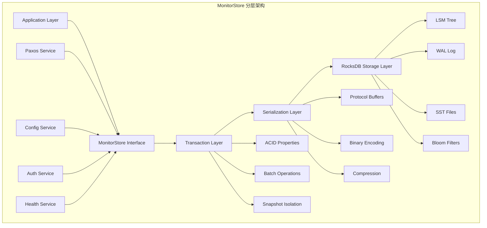

### 1.2 数据存储模型

**键值空间设计**：
```
Store Layout:
├── paxos/                    # Paxos相关数据
│   ├── first_committed       # 第一个已提交的提案号
│   ├── last_committed        # 最后一个已提交的提案号
│   ├── last_pn               # 最后的提案号
│   └── accepts/              # 接受的提案数据
├── cluster_map/              # 集群映射数据
│   ├── osdmap/               # OSD映射
│   ├── monmap/               # Monitor映射  
│   ├── crushmap/             # CRUSH映射
│   ├── mdsmap/               # MDS映射
│   └── pgmap/                # PG映射
├── config/                   # 配置数据
│   ├── global/               # 全局配置
│   ├── mon/                  # Monitor配置
│   ├── osd/                  # OSD配置
│   └── mds/                  # MDS配置
├── auth/                     # 认证数据
│   ├── keys/                 # 用户密钥
│   ├── caps/                 # 权限信息
│   └── profiles/             # 权限配置文件
└── health/                   # 健康检查数据
    ├── checks/               # 健康检查结果
    ├── history/              # 历史记录
    └── summary/              # 状态摘要
```

### 1.3 事务处理机制

**事务生命周期**：
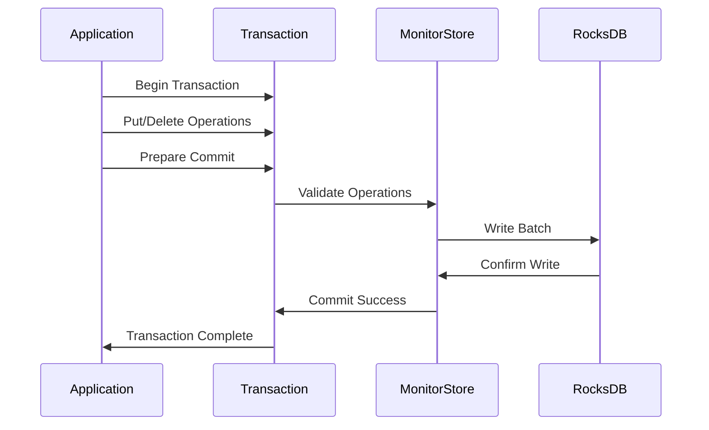

**事务隔离级别**：
- **快照隔离**：每个事务看到一致的数据快照
- **读已提交**：只能读取已提交的数据
- **写冲突检测**：防止并发写入冲突

### 1.4 压缩与优化策略

**数据压缩算法**：
```cpp
// 压缩配置示例
class MonitorStore {
    RocksDBStore backend;
    
    // 压缩选项
    Options opts;
    opts.compression = kLZ4Compression;
    opts.compression_per_level = {
        kNoCompression,      // Level 0
        kLZ4Compression,     // Level 1
        kZSTDCompression,    // Level 2+
    };
    
    // 压缩触发条件
    opts.level0_file_num_compaction_trigger = 4;
    opts.max_bytes_for_level_base = 256MB;
};
```

---

## 2. Paxos一致性引擎内部机制

### 2.1 Paxos算法实现

**三阶段协议**：
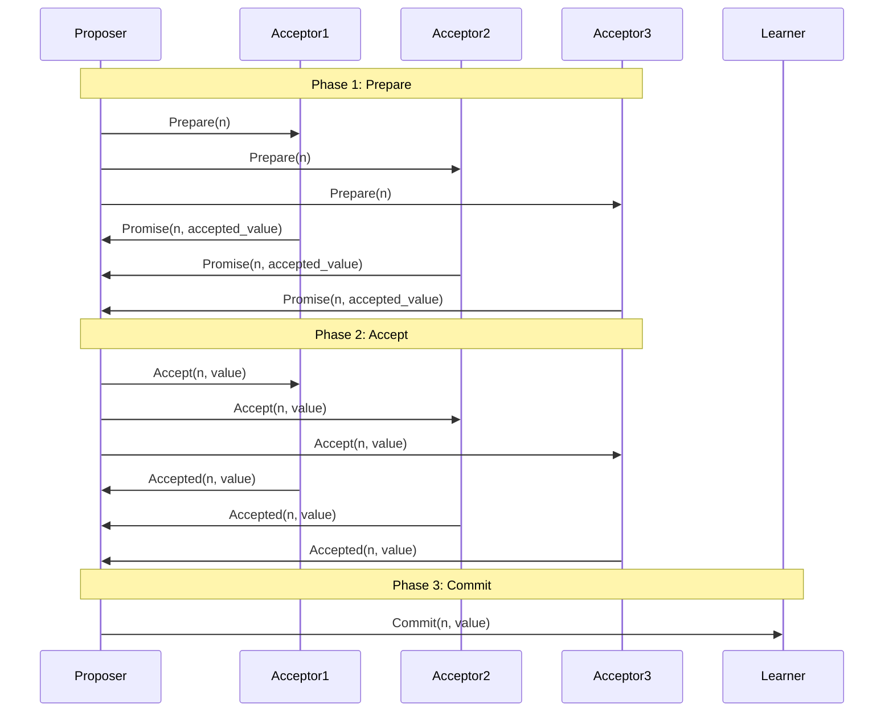

### 2.2 提案编号生成机制

**提案号结构**：
```cpp
struct ProposalNumber {
    uint64_t epoch;        // 选举轮次
    uint64_t counter;      // 递增计数器  
    int32_t monitor_rank;  // Monitor排名
    
    // 比较操作
    bool operator<(const ProposalNumber& other) const {
        if (epoch != other.epoch) return epoch < other.epoch;
        if (counter != other.counter) return counter < other.counter;
        return monitor_rank < other.monitor_rank;
    }
};
```

### 2.3 状态机复制

**状态机接口**：
```cpp
class PaxosService {
public:
    virtual void update_from_paxos(bool *need_bootstrap) = 0;
    virtual void init() = 0;
    virtual void shutdown() = 0;
    virtual bool should_propose(double& delay) = 0;
    virtual void encode_pending(MonitorDBStore::TransactionRef t) = 0;
    virtual version_t get_last_committed() = 0;
    virtual void on_active() = 0;
    virtual void on_restart() = 0;
};
```

### 2.4 故障检测与恢复

**故障检测机制**：
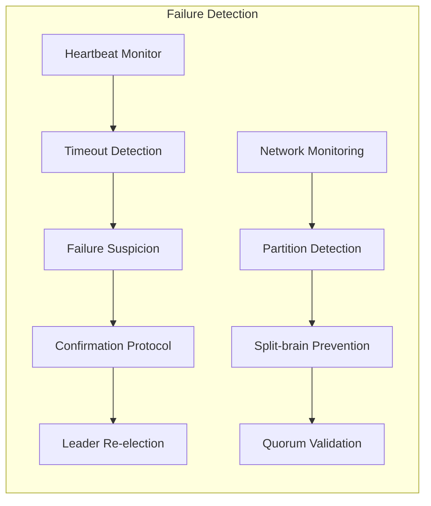

---

## 3. 选举模块详细机制

### 3.1 选举策略对比

**策略架构对比**：
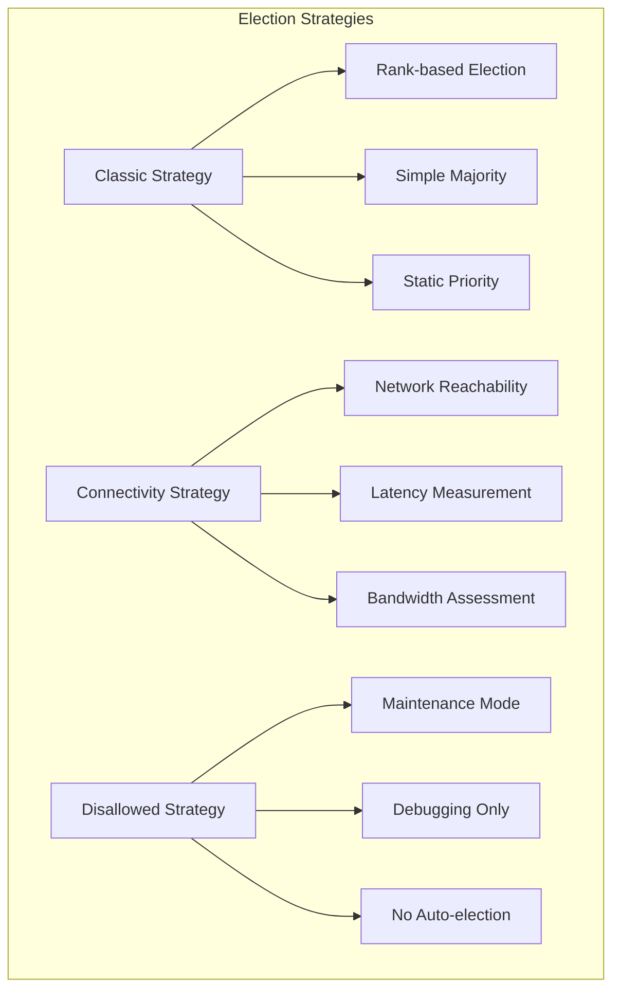

### 3.2 连接性策略详解

**网络连接性评估**：
```cpp
class ConnectivityStrategy {
public:
    struct ConnectionScore {
        double reachability;    // 0.0-1.0 可达性
        double latency_score;   // 延迟评分
        double bandwidth_score; // 带宽评分
        double stability_score; // 稳定性评分
        
        double total_score() const {
            return (reachability * 0.4 + 
                   latency_score * 0.3 + 
                   bandwidth_score * 0.2 + 
                   stability_score * 0.1);
        }
    };
    
    void evaluate_connections();
    void select_leader_candidate();
    void update_connectivity_matrix();
};
```

### 3.3 选举状态机

**状态转换图**：
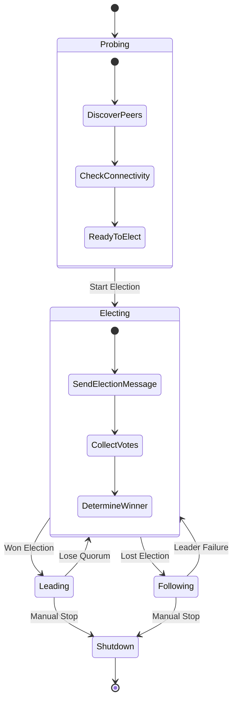

---

## 4. 健康监控模块架构

### 4.1 健康检查框架

**检查器架构**：
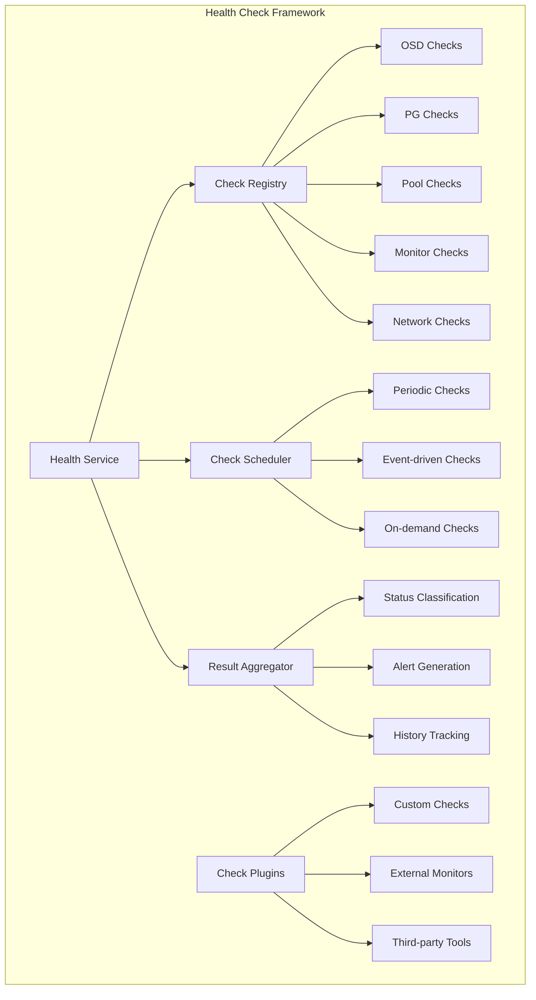

### 4.2 健康检查类型

**内置检查类型**：
```cpp
enum HealthCheckType {
    HEALTH_CHECK_OSD_DOWN,           // OSD离线检查
    HEALTH_CHECK_OSD_FULL,           // OSD存储满检查
    HEALTH_CHECK_PG_DEGRADED,        // PG降级检查
    HEALTH_CHECK_PG_STUCK,           // PG卡住检查
    HEALTH_CHECK_POOL_FULL,          // 存储池满检查
    HEALTH_CHECK_MON_DOWN,           // Monitor离线检查
    HEALTH_CHECK_CLOCK_SKEW,         // 时钟偏移检查
    HEALTH_CHECK_AUTH_ISSUES,        // 认证问题检查
    HEALTH_CHECK_NETWORK_ISSUES,     // 网络问题检查
    HEALTH_CHECK_DISK_ISSUES,        // 磁盘问题检查
};
```

### 4.3 告警分级机制

**告警级别定义**：
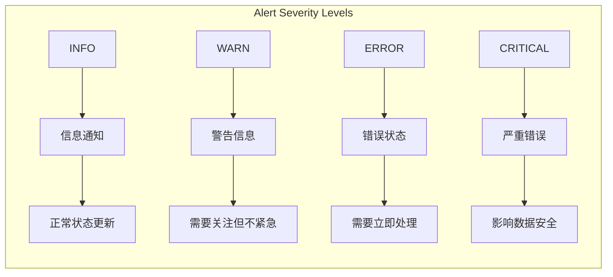

---

## 5. 配置管理子系统

### 5.1 配置存储模型

**配置层次结构**：
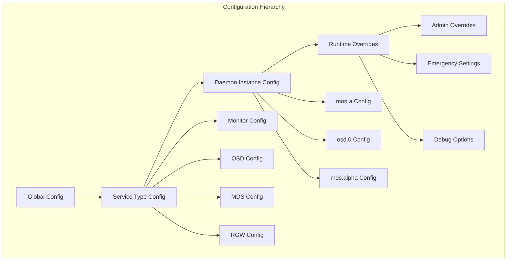

### 5.2 配置更新机制

**配置推送流程**：
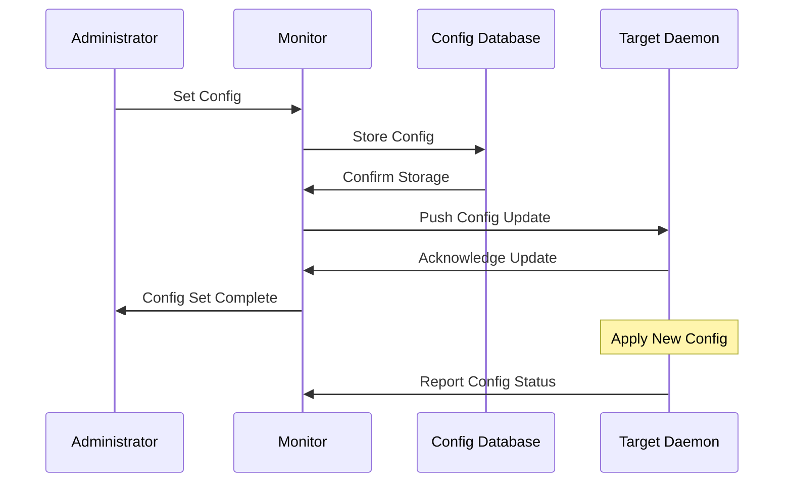

### 5.3 配置验证框架

**验证规则引擎**：
```cpp
class ConfigValidator {
public:
    struct ValidationRule {
        string option_name;
        function<bool(const string& value)> validator;
        string error_message;
        bool requires_restart;
    };
    
    bool validate_option(const string& name, const string& value);
    bool validate_compatibility(const map<string, string>& config);
    vector<string> get_validation_errors();
    
private:
    map<string, ValidationRule> rules_;
    void register_builtin_rules();
    void register_custom_rules();
};
```

---

## 6. 认证授权子系统

### 6.1 CephX协议实现

**认证流程**：
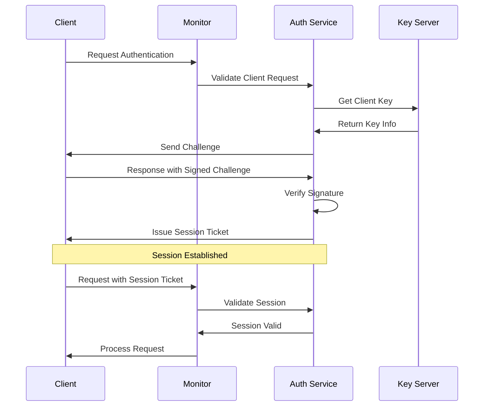

### 6.2 权限控制模型

**权限系统架构**：
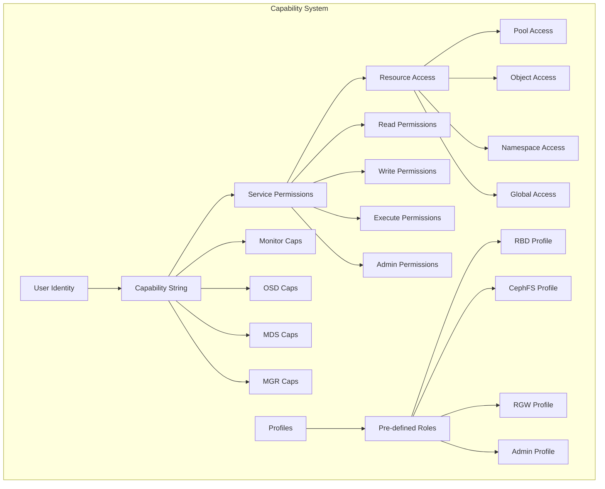

### 6.3 密钥管理机制

**密钥生命周期**：
```cpp
class CephXKeyManager {
public:
    struct KeyInfo {
        EntityName entity;
        CryptoKey secret;
        utime_t created;
        utime_t expires;
        uint64_t auid;
        map<string, bufferlist> caps;
    };
    
    bool generate_key(EntityName& entity);
    bool revoke_key(EntityName& entity);
    bool rotate_key(EntityName& entity);
    bool validate_key(EntityName& entity, const CryptoKey& key);
    
private:
    map<EntityName, KeyInfo> keyring_;
    void cleanup_expired_keys();
    void audit_key_usage();
};
```

---

## 7. 网络通信模块

### 7.1 网络架构设计

**通信层次**：
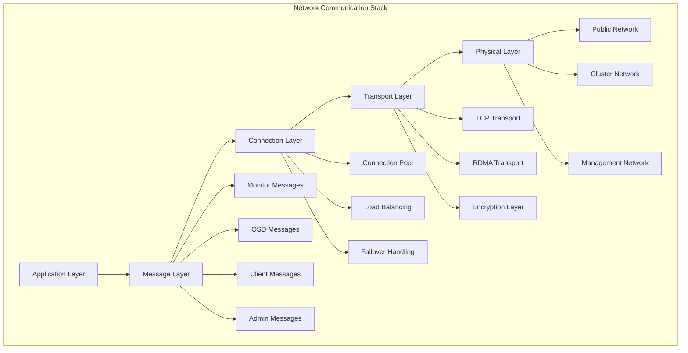

### 7.2 消息处理机制

**消息分发架构**：
```cpp
class MonitorNetworkHandler {
public:
    void dispatch_message(Message* msg, Connection* con);
    void handle_monitor_message(Message* msg);
    void handle_client_message(Message* msg);
    void handle_admin_message(Message* msg);
    
private:
    map<int, function<void(Message*)>> message_handlers_;
    ThreadPool dispatcher_pool_;
    MessageQueue pending_queue_;
    
    void register_handlers();
    void process_message_queue();
};
```

### 7.3 连接管理

**连接状态管理**：
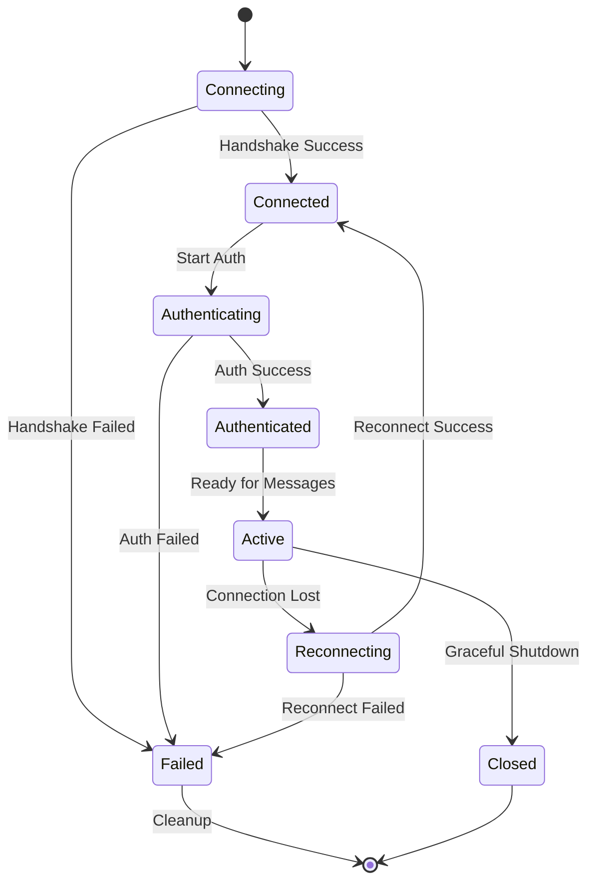

---

## 8. 性能监控与度量

### 8.1 性能计数器系统

**计数器架构**：
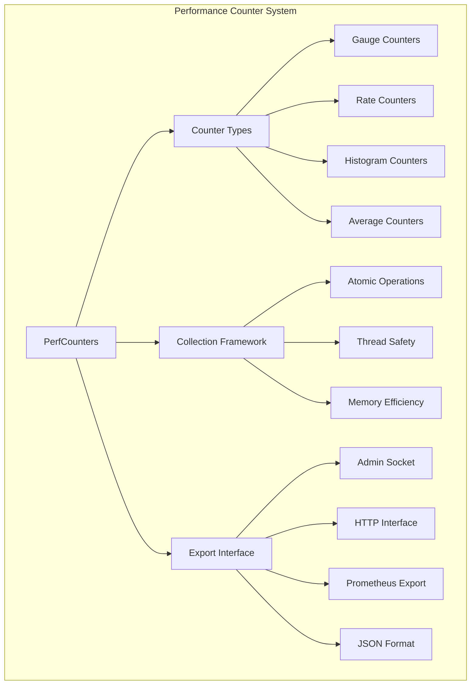

### 8.2 关键性能指标

**Monitor性能指标**：
```cpp
enum MonitorPerfCounters {
    // Paxos性能
    l_mon_num_sessions,          // 活跃会话数
    l_mon_session_add,           // 会话创建速率
    l_mon_session_rm,            // 会话删除速率
    l_mon_session_trim,          // 会话清理次数
    
    // 存储性能  
    l_mon_store_write_time,      // 存储写入时间
    l_mon_store_read_time,       // 存储读取时间
    l_mon_store_sync_time,       // 存储同步时间
    
    // 网络性能
    l_mon_bytes_rx,              // 接收字节数
    l_mon_bytes_tx,              // 发送字节数
    l_mon_messages_rx,           // 接收消息数
    l_mon_messages_tx,           // 发送消息数
    
    // 选举性能
    l_mon_election_call,         // 选举调用次数
    l_mon_election_win,          // 选举获胜次数
    l_mon_election_lose,         // 选举失败次数
};
```

---

## 9. 调试与诊断工具

### 9.1 调试接口

**管理套接字命令**：
```bash
# Monitor调试命令
ceph daemon mon.$(hostname) help
ceph daemon mon.$(hostname) config show
ceph daemon mon.$(hostname) perf dump
ceph daemon mon.$(hostname) status
ceph daemon mon.$(hostname) mon_status
ceph daemon mon.$(hostname) quorum_status
ceph daemon mon.$(hostname) sync_status
```

### 9.2 日志系统

**日志级别配置**：
```ini
# Monitor调试日志配置
[mon]
debug_mon = 10/10              # Monitor核心调试
debug_paxos = 10/10            # Paxos算法调试
debug_auth = 5/5               # 认证系统调试
debug_perfcounter = 5/5        # 性能计数器调试
debug_ms = 1/1                 # 消息系统调试
```

### 9.3 故障诊断流程

**诊断决策树**：
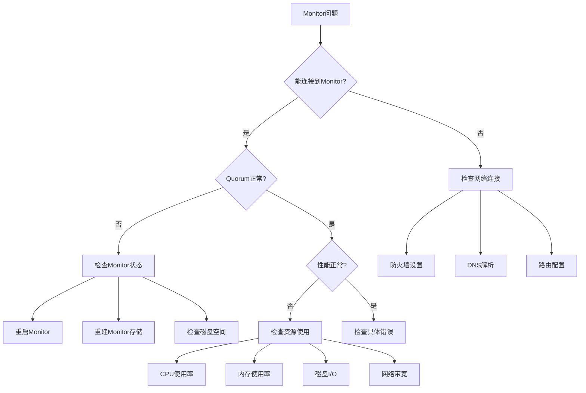

---

## 10. 模块间通信接口

### 10.1 内部API设计

**模块间接口**：
```cpp
// Monitor内部服务接口
class MonitorService {
public:
    virtual void init() = 0;
    virtual void shutdown() = 0;
    virtual void on_active() = 0;
    virtual void on_standby() = 0;
    virtual void handle_message(Message* msg) = 0;
    virtual void tick() = 0;
    virtual void get_health_checks(health_check_map_t* checks) = 0;
};

// 服务注册与发现
class ServiceRegistry {
public:
    void register_service(const string& name, MonitorService* service);
    void unregister_service(const string& name);
    MonitorService* get_service(const string& name);
    void broadcast_message(Message* msg);
};
```

### 10.2 事件驱动架构

**事件处理框架**：
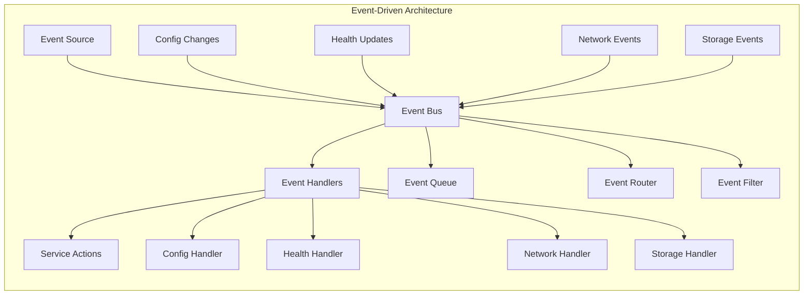

---

## 总结

本文档详细分析了Ceph Monitor的各个核心子模块，每个模块都有其特定的职责和实现机制：

1. **MonitorStore**: 提供可靠的持久化存储和事务支持
2. **Paxos Engine**: 实现分布式一致性和状态机复制
3. **Election Module**: 管理Leader选举和quorum维护
4. **Health Module**: 监控集群健康状态和生成告警
5. **Config Module**: 管理配置分发和运行时更新
6. **Auth Module**: 实现身份认证和权限控制
7. **Network Module**: 处理网络通信和连接管理
8. **Performance Module**: 收集性能指标和监控数据

这些模块通过精心设计的接口协同工作，确保Ceph Monitor能够可靠地履行其作为集群控制中心的职责。理解这些内部机制对于深入掌握Ceph架构和进行高级运维操作至关重要。

---

