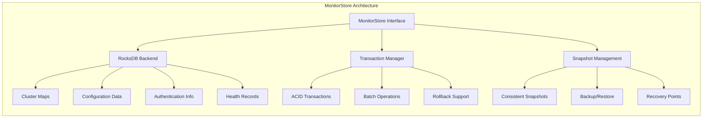
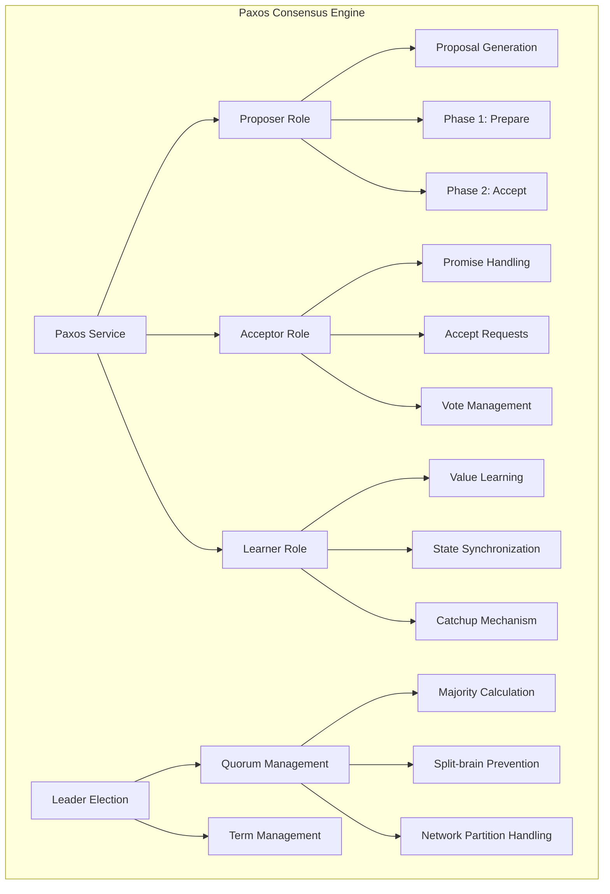
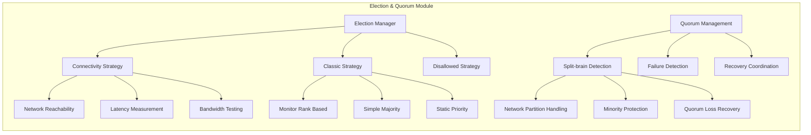
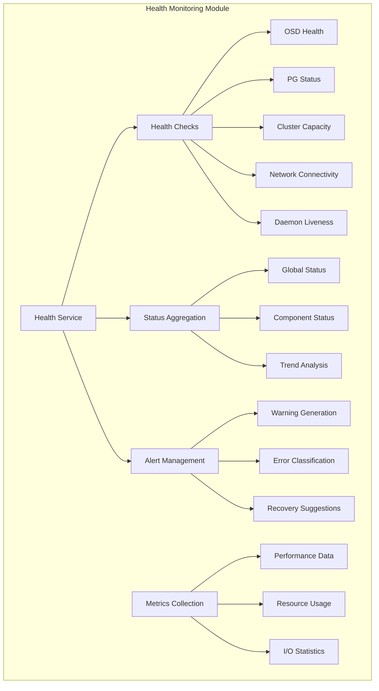
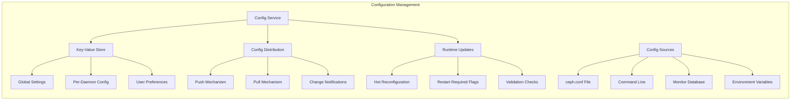
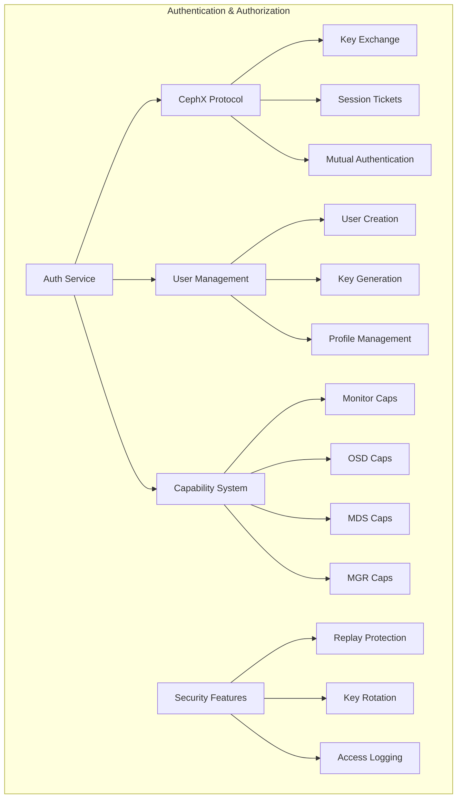
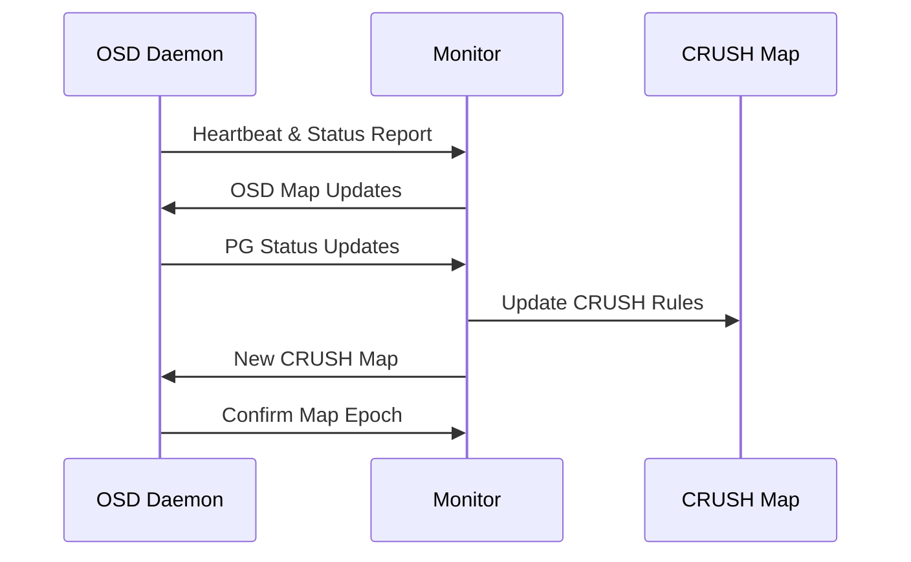
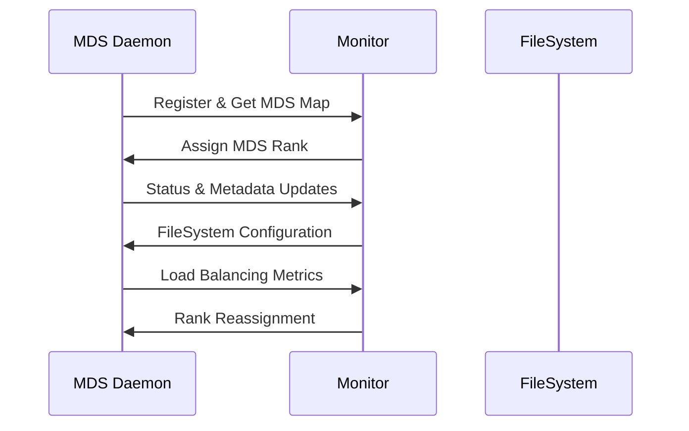
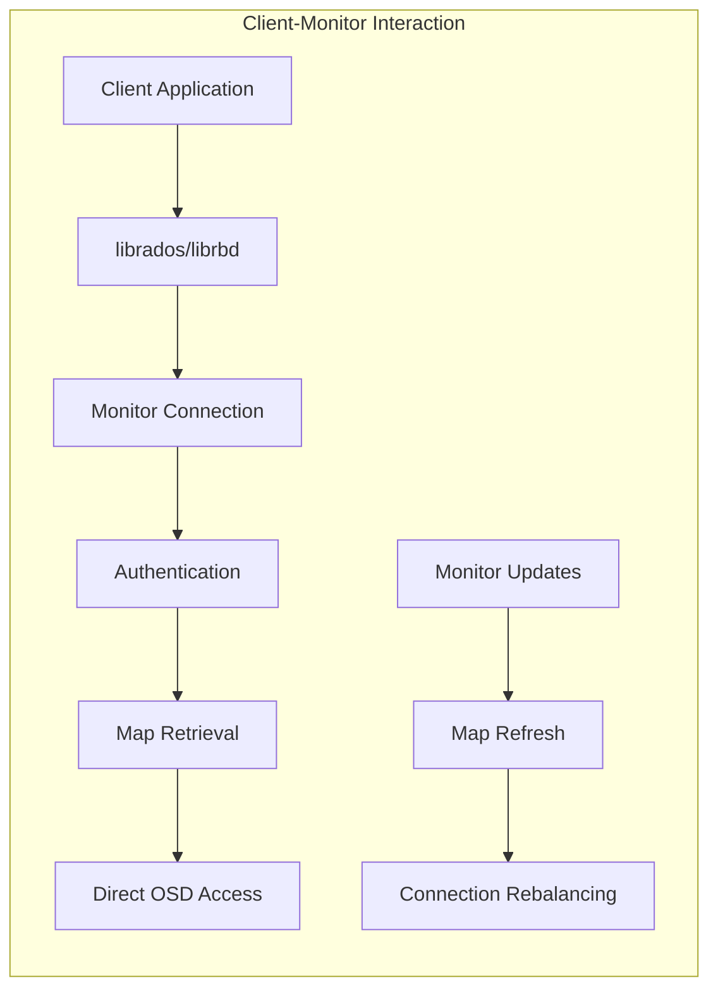

# Monitor 架构深度分析报告

## 1. Monitor总体架构概览

### 1.1 核心功能定位

Ceph Monitor作为集群的控制平面，主要承担以下核心职责：
- **集群映射维护**：管理MonitorMap、OSDMap、CRUSHMap、MDSMap、PGMap等关键映射信息
- **状态监控与健康检查**：实时监控集群状态、生成健康报告
- **分布式一致性保证**：基于Paxos算法确保集群元数据的一致性
- **认证与授权**：管理CephX认证系统和用户权限
- **选举与仲裁**：维护Monitor quorum，处理故障恢复

### 1.2 Monitor架构图

```mermaid
graph TB
    subgraph "Ceph Monitor 核心架构"
        A[Monitor Daemon] --> B[MonitorStore]
        A --> C[Paxos Engine]
        A --> D[Election Module]
        A --> E[Health Module]
        A --> F[Config Module]
        A --> G[Auth Module]
        
        B --> B1[ClusterMap Storage]
        B --> B2[Configuration DB]
        B --> B3[Transaction Log]
        
        C --> C1[Proposal Processing]
        C --> C2[Leader Election]
        C --> C3[Consensus Coordination]
        
        D --> D1[Connectivity Strategy]
        D --> D2[Quorum Management]
        D --> D3[Split-brain Prevention]
        
        E --> E1[Health Checks]
        E --> E2[Status Reporting]
        E --> E3[Alert Generation]
        
        F --> F1[Config Key-Value Store]
        F --> F2[Runtime Configuration]
        F --> F3[Config Distribution]
        
        G --> G1[CephX Authentication]
        G --> G2[User Management]
        G --> G3[Capability Control]
    end
    
    subgraph "外部交互"
        H[OSD Daemons] --> A
        I[MDS Daemons] --> A
        J[Client Applications] --> A
        K[Admin Tools] --> A
        L[Dashboard/Grafana] --> A
    end
```



---

## 2. Monitor核心子模块分析

### 2.1 MonitorStore存储引擎

**功能概述**：
MonitorStore是Monitor的持久化存储引擎，基于RocksDB实现，负责存储所有关键的集群元数据。

**核心架构**：


**关键技术特征**：
- **事务支持**：确保元数据更新的原子性
- **版本控制**：维护集群映射的版本历史
- **快照机制**：支持一致性备份和恢复
- **压缩优化**：自动清理过期数据，优化存储空间

**数据存储结构**：
```ini
# Monitor存储的主要数据类型
[MonitorStore]
cluster_maps = MonitorMap, OSDMap, CRUSHMap, MDSMap, PGMap
configuration = Global config, Per-daemon config
authentication = User keys, Capabilities, Profiles  
health_data = Health checks, Warning history
transaction_log = Paxos proposals, Commit records
```

### 2.2 Paxos一致性引擎

**功能概述**：
Paxos引擎是Monitor最核心的模块，实现分布式一致性算法，确保集群元数据在所有Monitor节点间保持一致。

**架构设计**：


**核心运行机制**：

1. **提案阶段（Proposal Phase）**：
```bash
# 检查当前quorum状态
ceph quorum_status
```

2. **选举策略配置**：
```bash
# 设置连接性选举策略（适用于stretch模式）
ceph mon set election_strategy connectivity
```

3. **一致性保证流程**：
   - **Phase 1（准备阶段）**：Leader向所有Acceptor发送Prepare请求
   - **Phase 2（接受阶段）**：收集多数派响应后发送Accept请求
   - **Commit（提交阶段）**：达成一致后向所有节点广播提交消息

### 2.3 选举与仲裁模块

**功能概述**：
负责Monitor集群的Leader选举、quorum维护和故障检测，确保集群在各种网络条件下的可用性。

**选举策略架构**：


**关键配置参数**：
```ini
# Monitor选举相关配置
[mon]
mon_election_timeout = 5
mon_lease = 5
mon_lease_renew_interval_factor = 0.6
mon_lease_ack_timeout_factor = 2.0
mon_accept_timeout_factor = 2.0
```

**选举触发条件**：
- Monitor节点启动或重启
- 网络分区或连接断开
- Leader节点故障或无响应
- 手动触发选举（运维操作）

### 2.4 健康监控模块

**功能概述**：
实时监控集群各组件的健康状态，生成告警信息，并提供详细的诊断数据。

**监控架构**：


**健康检查命令示例**：
```bash
# 获取集群整体状态
ceph status
ceph -s

# 查看详细健康信息
ceph health detail

# 监控集群状态变化
ceph -w

# 查看特定组件状态
ceph pg stat
ceph osd stat
ceph mon stat
```

**健康状态分类**：
- **HEALTH_OK**：集群运行正常
- **HEALTH_WARN**：存在警告但不影响数据安全
- **HEALTH_ERR**：存在错误需要立即处理

### 2.5 配置管理模块

**功能概述**：
管理集群和守护进程的配置参数，支持运行时配置更新和分发。

**配置管理架构**：


**配置操作命令**：
```bash
# 设置全局配置
ceph config set global public_network 192.168.160.0/24

# 查看特定守护进程配置
ceph config show osd.0
ceph config show-with-defaults osd.0

# 设置配置键值
ceph config-key set <key> <value>

# 生成最小配置文件
ceph config generate-minimal-conf > /etc/ceph/ceph.conf
```

### 2.6 认证授权模块

**功能概述**：
实现CephX认证协议，管理用户身份验证和权限控制。

**认证架构**：


**认证配置示例**：
```ini
# 启用CephX认证
[global]
auth_cluster_required = cephx
auth_service_required = cephx
auth_client_required = cephx
```

**用户管理命令**：
```bash
# 创建具有特定权限的用户
ceph auth get-or-create client.john mon 'allow r' osd 'allow rw pool=liverpool'

# 创建管理员用户
ceph-authtool /path/to/keyring --gen-key -n client.admin \
  --cap mon 'allow *' --cap osd 'allow *' --cap mds 'allow'

# 查看所有用户和权限
ceph auth ls

# 获取用户信息
ceph auth get client.john
```

---

## 3. Monitor与其他组件的交互关系

### 3.1 Monitor-OSD交互

**交互模式**：


**关键交互内容**：
- **心跳检测**：OSD定期向Monitor报告存活状态
- **状态更新**：PG状态、容量信息、性能指标
- **映射分发**：OSD Map、CRUSH Map更新通知
- **故障处理**：OSD故障检测和标记

### 3.2 Monitor-MDS交互

**交互架构**：


### 3.3 Monitor-Client交互

**客户端交互流程**：


**交互特点**：
- **初始连接**：客户端首先连接Monitor获取集群映射
- **认证过程**：通过CephX协议完成身份验证
- **映射获取**：下载OSD Map、CRUSH Map等必要信息
- **直接I/O**：后续数据操作直接与OSD通信
- **状态同步**：定期更新集群映射信息

---

## 4. Monitor部署与配置最佳实践

### 4.1 Monitor集群部署

**推荐部署拓扑**：
```ini
# 生产环境Monitor配置示例
[global]
fsid = a7f64266-0894-4f1e-a635-d0aeaca0e993
mon_initial_members = mon1, mon2, mon3
mon_host = 192.168.1.10, 192.168.1.11, 192.168.1.12
public_network = 192.168.1.0/24
cluster_network = 192.168.2.0/24

auth_cluster_required = cephx
auth_service_required = cephx
auth_client_required = cephx

[mon.mon1]
host = ceph-mon1
mon_addr = 192.168.1.10:6789

[mon.mon2]
host = ceph-mon2
mon_addr = 192.168.1.11:6789

[mon.mon3]
host = ceph-mon3
mon_addr = 192.168.1.12:6789
```

**部署检查命令**：
```bash
# 检查Monitor状态
ceph mon stat
ceph mon dump

# 验证quorum
ceph quorum_status

# 查看Monitor映射
ceph mon getmap -o monmap.bin
monmaptool --print monmap.bin
```

### 4.2 监控与运维

**性能监控指标**：
```bash
# Monitor关键性能指标
- Monitor响应时间
- Paxos提案处理速度
- 存储I/O延迟
- 网络连接状态
- 内存使用情况
```

**常用运维命令**：
```bash
# Monitor管理
ceph mon add <name> <addr>
ceph mon remove <name>

# 配置管理
ceph config set mon <option> <value>
ceph config show mon

# 故障诊断
ceph log last 100
ceph crash ls
ceph crash info <crash-id>
```

### 4.3 故障恢复流程

**Monitor存储恢复**：
```bash
# 从OSD数据恢复Monitor存储（极端情况）
# 1. 收集OSD集群映射数据
for osd in /var/lib/ceph/osd/ceph-*; do
    ceph-objectstore-tool --data-path $osd --no-mon-config \
        --op update-mon-db --mon-store-path /tmp/mon-store
done

# 2. 重建Monitor存储
ceph-monstore-tool /tmp/mon-store rebuild \
    --keyring /path/to/admin.keyring

# 3. 替换损坏的存储
mv /var/lib/ceph/mon/mon.*/store.db \
   /var/lib/ceph/mon/mon.*/store.db.corrupted
mv /tmp/mon-store/store.db /var/lib/ceph/mon/mon.*/store.db
```

---

## 5. 性能优化与调优

### 5.1 Monitor性能调优

**关键配置参数**：
```ini
# Monitor性能优化配置
[mon]
# 提案处理优化
mon_max_pool_pg_num = 65536
mon_pg_create_interval = 30.0
mon_osd_max_creating_pgs = 1024

# 存储优化
mon_compact_on_start = true
mon_compact_on_bootstrap = true
mon_compact_on_trim = true

# 网络优化
mon_client_ping_timeout = 30
mon_client_ping_interval = 10
mon_client_hunt_interval = 3.0
```

**性能监控**：
```bash
# Monitor性能诊断
ceph daemon mon.$(hostname) perf dump
ceph daemon mon.$(hostname) config show

# 存储使用情况
ceph daemon mon.$(hostname) mon_status
```

### 5.2 高可用配置

**Stretch模式配置**：
```bash
# 设置连接性选举策略
ceph mon set election_strategy connectivity

# 配置CRUSH拓扑
ceph osd getcrushmap > crush.map.bin
crushtool -d crush.map.bin -o crush.map.txt
# 编辑crush.map.txt添加数据中心拓扑
crushtool -c crush.map.txt -o crush.map.new.bin
ceph osd setcrushmap -i crush.map.new.bin
```

---

## 6. 监控与告警集成

### 6.1 Prometheus集成

**Monitor指标导出**：
```yaml
# Prometheus配置示例
global:
  scrape_interval: 5s

scrape_configs:
  - job_name: 'ceph-monitors'
    static_configs:
      - targets: ['mon1:9283', 'mon2:9283', 'mon3:9283']
  - job_name: 'node-exporter'
    static_configs:
      - targets: ['mon1:9100', 'mon2:9100', 'mon3:9100']
```

**关键监控指标**：
```promql
# Monitor可用性
up{job="ceph-monitors"}

# Quorum状态
ceph_monitor_quorum_count

# 存储使用率
ceph_monitor_store_capacity_bytes / ceph_monitor_store_capacity_total_bytes

# 网络延迟
ceph_monitor_latency_ms
```

### 6.2 Grafana仪表板

**Monitor监控面板**：
- Monitor节点状态和quorum信息
- Paxos提案处理性能
- 存储容量和I/O统计
- 网络连接状态
- 告警历史和趋势分析

---

## 7. 总结与展望

### 7.1 核心架构总结

Ceph Monitor作为集群的控制中心，通过精心设计的模块化架构实现了：

1. **高可用性**：基于Paxos算法的分布式一致性保证
2. **可扩展性**：支持多Monitor节点的水平扩展
3. **故障容错**：完善的选举机制和故障恢复流程
4. **安全性**：CephX认证协议和细粒度权限控制
5. **可观测性**：全面的监控指标和健康检查机制

### 7.2 技术发展趋势

**未来发展方向**：
- **云原生集成**：更好地支持Kubernetes和容器化部署
- **智能运维**：基于机器学习的自动故障诊断和恢复
- **性能优化**：持续优化Paxos算法和存储引擎性能
- **安全增强**：支持更多认证方式和加密传输
- **边缘计算**：适应边缘计算场景的轻量化Monitor

### 7.3 运维建议

1. **监控覆盖**：建立全面的Monitor监控体系
2. **容量规划**：合理规划Monitor节点数量和资源配置
3. **安全管理**：定期更新认证密钥和权限审计
4. **故障演练**：定期进行故障恢复演练
5. **版本管理**：保持Monitor版本与集群其他组件同步


